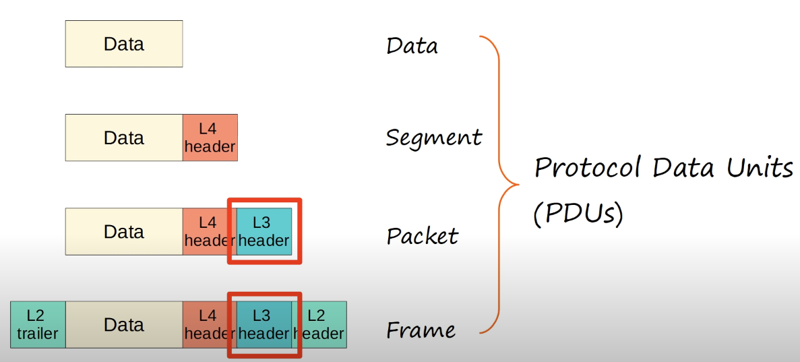

# Day 10 | IPv4 Header

이 글은 Jeremy’s IT Lab의 유튜브 CCNA 200-301 과정을 참고하고 정리한 내용입니다.

[https://www.youtube.com/playlist?list=PLxbwE86jKRgMpuZuLBivzlM8s2Dk5lXBQ](https://www.youtube.com/playlist?list=PLxbwE86jKRgMpuZuLBivzlM8s2Dk5lXBQ)

# IPv4 Header

- 이번 글은 IPv4 헤더로 알려진 인터넷 프로토콜 버전4에 대해 살펴보겠다.
- 이는 계층3에서 사용되어 인터넷을 통해 세계 반대편에 있는 별도의 네트워크에 있는 장치 간에 데이터를 전송하는데 도움이 된다. → 라우팅

- OSI Model - PDUs
    
    
    
    - 레이어3 PDU는 패킷, 레이어2 PDU는 프레임
    - 이번 강의에서는 이 패킷을 대상으로 라우팅하는데 필요한 정보가 포함되어있는 레이어3 헤더에 중점을 둘 것임.

- IPv4 Header
    - 헤더의 각 필드 목적을 알아가는게 좋다.
    - IPv4 Header - Version field
        
        
        
        - 헤더의 이 필드는 항상 4 값을 가짐
    - IPv4 Header - Internet header Length(IHL)
        
        
        
        - 길이는 4비트로 1옥텟의 절반
        - IPv4 헤더의 마지막 필드는 길이가 가변적이므로 헤더의 전체 길이를 나타내기위해 필요
        - 이 필드는 헤더의 길이를 4바이트 단위로 지정
        - 예를들어 이 필드의 값이 5이면 4바이트의 5배가 20이므로 헤더 길이가 20바이트라는 의미
        - 이 필드의 최소값은 5이며 20바이트를 의미, 최대값은 4비트의 최대값인 15이며 15 x 4 = 60바이트와 같다. 이는 IP 옵션 필드의 최대 길이가 40 바이트를 의미한다.
        - 따라서 옵션 필드가 없는 IPv4 헤더의 길이는 20바이트이며 이는 IPv4 헤더의 최소 길이다. 그리고 최대 길이 옵션 필드가 40바이트인 IPv4의 길이는 60바이트이다.
    - IPv4 Header - DSCP field
        
        
        
        - DSCP는 차별화된 서비스 코드 포인트를 포인트를 나타내며 필드 길이는 6비트다.
        - 이 필드는 QoS, 서비스 품질에 사용된다.
        - 스트리밍 음성 및 비디오와 같이 지연에 민감한 데이터의 우선 순위를 지정하는데 사용된다.
        - 우선순위 처리를 받아야하는 트래픽을 식별하는데 사용된다.
    - IPv4 Header - ECN field
        
        
        
        - ECN필드로 명시적인 혼잡 알림을 나타내며 길이는 2비트.
        - 패킷 삭제없이 네트워크 정체에 대한 end to end 알림을 제공
        - 일반적으로 네트워크에서는 네트워크가 매우 사용량이 많거나 정체가 있는 경우 패킷을 삭제하여 이를 알림
        - ECN필드는 패킷을 삭제하지 않고 혼잡한 네트워크에 신호를 보내는 방법을 제공한다. 그러나 이는 이를 지원하기위해 엔드포인트와 기본 네트워크 인프라가 모두 필요한 선택적 필드이다.
    - IPv4 Header - Total Length Field
        
        
        
        - 길이는 16비트, 즉 2옥텟, 2바이트
        - 이는 레이어3 헤더와 데이터를 모두 포함하는 캡슐화된 레이어4 세그먼트를 포함한 패킷의 전체 길이를 나타낸다.
        - 이 필드는 IHL 헤더와 같은 4바이트 단위가 아닌 바이트 단위의 길이를 나타냄. 따라서 이 필드의 값 20은 단순히 20바이트를 의미
        - 이 필드의 최소값은 20바이트(이는 캡슐화된 데이터가 없는 최소 크기의 IPv4 헤더와 같음)
        - 최대값은 65,535이며 이는 16비트 바이너리의 최대값이며 모두 1로 설정
    - IPv4 Header - Identification Field
        
        
        
        - 길이가 16비트인 식별필드
        - 패킷이 너무 커서 조각난 경우 이 필드 사용
        - 조각이 어떤 패킷에 속하는지 식별하고 다시 재조합하여 원래 패킷을 만들 수 있음.
        - 동일한 패킷의 모든 조각에는 이 필드에 동일한 값을 가진 자체 IPv4 헤더가 있으므로 나중에 다시 조립할 수 있음.
        - 최대 전송 단위(Maximum Transmission Unit)를 의미하는 MTU보다 큰 경우 조각화. MTU는 일반적으로 1500바이트
        - 이더넷 프레임의 최대 페이로드 크기는 1500바이트라고 했다. 이는 서로 관련있음.
        - 조각은 수신 호스트에 의해 재조립된다.
    - IPv4 Header - Flags Field
        
        
        
        - 조각을 제어하고 식별하는데 사용
        - 3개의 비트가 있으며 다음과 같이 작동
            - 첫번째 비트인 0은 예약되어 있으며 항상 0으로 설정
            - 비트1은 조각화하지 않은 비트, 즉 DF 비트. 1로 설정되면 패킷이 조각화되지 않아야 함을 의미
            - 비트2는 더 많은 조각, 즉 MF 비트. 패킷에 더 많은 조각이 있으면 1로 설정되고 마지막 조각에 대해서는 0으로 설정
            - 또한, 패킷이 조각화되지 않은 전체 패킷인 경우 조각이 없으므로 MF 비트는 0으로 설정
    - IPv4 Header - Fragment Offset Field
        
        
        
        - 길이가 13비트인 조각 오프셋 필드
        - 이 필드는 조각화되지 않은 원본 IP패킷 내의 조각 위치를 나타내는데 사용. 이를 통해 조각이 순서 없이 도착하더라도 조각화된 패킷을 재조립할 수 있음.
        - 이 필드를 통해 수신자는 조각의 원래 순서를 알 수 있기 때문
    - IPv4 Header - Time to Live Field
        
        
        
        - 길이가 8비트
        - 라우터는 TTL이 0인 패킷을 삭제한다. 따라서 이 필드는 무한 루프를 방지하는데 사용
        - 잘못된 라우팅 구성으로 인해 패킷이 루프에서 지속적으로 전송되어 의도한 대상에 도달하지 못하는 경우, 이와 같은 트래픽이 충분히 축적되면 네트워크 정체가 발생하고 결국에는 오류가 발생할 수 있음.
        - 이 기능은 TTL이 0에 도달할 때 루프 트래픽이 삭제되는 것을 방지한다.
        - 이 필드는 원래 패킷의 최대 수명을 초 단위로 나타내도록 설계되었지만 실제로는 `hop 수`를 나타낸다.
        - 패킷이 목적지로 가는 도중에 라우터에 도착할 때마다 라우터는 패킷이 목적지에 도달하거나 TTL이 0에 도달하여 패킷이 삭제될 때까지 TTL을 1씩 줄입니다.
        - 권장되는 기본 TTL은 64
    - IPv4 Header - Protocol Field
        
        
        
        - 길이가 8비트
        - 캡슐화된 레이어4 PDU의 프로토콜을 나타낸다.
        - 일반적으로 다음 중 하나.
            - 값 6으로 표시되는 TCP
            - 값 17로 표시되는 UDP
            - 값 1: 프로토콜 ping이 사용하는 ICMP에 사용
            - 값 89: OSPF(Open Shortest Path First) - 수동으로 경로를 구성할 필요 없이 라우터가 이웃으로 부터 대상에 대한 경로를 학습할 수 있도록 하는 동적 라우팅 프로토콜
    - IPv4 Header - Header Checksum Field
        
        
        
        - 길이는 16비트
        - IPv4 헤더의 오류를 확인하는데 사용되는 계산된 체크섬
        - 라우터는 패킷을 수신하면 헤더의 체크섬을 계산하고 이를 헤더의 이 필드에 있는 체크섬과 비교. 새로 계산된 체크섬과 IPv4 헤더의 체크섬이 일치하지 않으면 전송에 오류가 발생한 것이므로 라우터는 패킷을 삭제.
        - 이는 캡슐화된 데이터가 아닌 IPv4 헤더의 오류를 확인하는 데만 사용
        - IP는 이를 수행하기 위해 캡슐화된 프로토콜에 의존한다.
        - 캡슐화될 가능성이 가장 높은 두 개의 레이어4 프로토콜인 UDP와 TCP에는 모두 캡슐화된 데이터의 오류를 확인하기 위한 체크섬 필드가 있음.
    - IPv4 Header - Source/Destination IP Address Field
        
        
        
        - 각각의 길이는 IPv4 주소의 길이인 32비트
        - 소스 IP 주소 필드는 패킷을 보낸 사람의 IPv4 주소
        - 대상 IP 주소 필드는 의도된 패킷 수신자의 IPv4 주소
    - IPv4 Header - Options Field
        
        
        
        - 옵션 필드는 선택 사항이며 사용하지 않을 경우 길이가 0비트이거나 최대 320비트, 40바이트일 수 있음.
        - 이 필드는 거의 사용되지 않지만 IHL 필드가 5보다 큰 경우 옵션이 있음을 의미
        

## Quiz 1

정답: d

IPv4 헤더의 첫번 째 필드는 버전필드. 

## Quiz 2

정답: a

TTL은 패킷이 통과하는 각 라우터에서 1씩 감소한다. 0에 도달하면 패킷이 삭제된다. 

## Quiz 3

정답: b

IPv4 헤더 체크섬 필드는 IPv4 헤더 자체의 오류만 확인한다. 그러나 TCP 또는 UDP와 같인 레이어4 프로토콜은 체크섬을 사용해 캡슐화된 데이터의 오류를 확인할 수 있다.

## Quiz 4

정답: a

옵션 필드의 길이는 0비트 ~ 320비트로 다양함. 다른 필드는 고정 길이이다.

Total Length 및 IHL 필드는 IPv4 헤더 및 패킷의 가변 길이를 나타내는데 사용되지만 필드 자체의 길이는 고정되어있다.

## Quiz 5

정답: b

IPv4 헤더의 플래그 필드의 일부인 More Fragments 비트는 현재 조각이 조각화된 패킷의 마지막 조각이 아님을 나타내는데 사용된다. 마지막 조각을 제외한 모든 조각에서 1로 설정되며 0으로 설정된다.