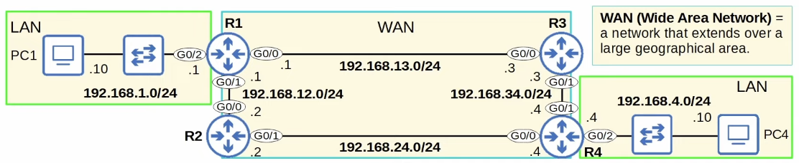

# Day 11 | (Part 1) | Routing Fundamentals

이 글은 Jeremy’s IT Lab의 유튜브 CCNA 200-301 과정을 참고하고 정리한 내용입니다.

[https://www.youtube.com/playlist?list=PLxbwE86jKRgMpuZuLBivzlM8s2Dk5lXBQ](https://www.youtube.com/playlist?list=PLxbwE86jKRgMpuZuLBivzlM8s2Dk5lXBQ)

# Routing Fundamentals

이번 강의에서 다룰 내용 

- 라우팅이란 무엇인가?
- Cisco 라우터의 라우팅 테이블(스위치에는 MAC 주소 테이블이 있고 라우터에는 라우팅 테이블이 있음)
    
    → 라우팅 테이블에 있는 두 가지 유형의 경로인 연결된 경로와 로컬 경로를 살펴보겠다.
    
- 라우팅 기본 사항, 특히 경로 선택에 대해서도 살펴보겠음

- 라우팅이란 무엇인가?
    - 라우터가 패킷을 수신하면 이를 올바른 대상으로 전달하고 전송하는 것이 라우터의 임무
    - 라우팅은 IP패킷이 목적지에 도달하기 위해 네트워크를 거쳐야하는 경로를 결정하기 위해 라우터가 사용하는 프로세스라우터는 알려진 모든 대상에 대한 경로를 라우팅 테이블에 저장한다.
    - 라우터는 패킷을 수신하면 라우팅 테이블을 확인해 해당 패킷을 전달할 최적의 경로를 찾는다.
    - 라우터가 경로를 학습하는데 사용하는 두 가지 주요 라우팅 방법이 존재
        1. Dynamic Routing(동적 라우팅): 라우터들이 OSPF 등의 동적 라우팅 프로토콜을 이용해 자동으로 서로 라우팅 정보를 공유하고 라우팅 테이블을 구축하는 방식
        2. Static Routing(정적 라우팅): 네트워크 엔지니어나 관리자가 라우터에서 경로를 수동으로 구성 
    - 경로는 라우터에게 패킷을 대상 X로 보내려면 패킷을 다음 홉 Y로 보내야 한다고 알려준다. 그리고 다음 홉은 대상으로 가는 경로에 있는 다음 라우터를 의미한다.
    - → or 대상이 라우터에 직접 연결된 경우 패킷을 대상으로 직접 보낸다.
    - → or 대상이 라우터 자체 IP 주소인 경우 패킷을 전달하지 말고 직접 수신한다.
    
    
    
    - 4개의 라우터가 연결되어 있으며 이는 WAN을 의미한다.
        - WAN은 광역 네트워크(Wide Area Network)의 약자로 넓은 지리적 영역에 걸쳐 확장되는 네트워크
        - 예를들어, 이 4개의 라우터는 각각 다른 도시 or 다른 국가에 있을 수 있음
    - R1과 R4에는 LAN이라는 두 개의 LAN이 연결
    
- R1 Pre-config (IP Addresses)

- Routing Table (show ip route)
    
    
    
    - 인터페이스에서 IP주소를 구성하고 no shutdown 명령을 사용해 활성화하면 인터페이스 당 2개의 라우팅이 자동으로 라우팅 테이블에 추가된다. (연결된 경로와 local 경로)
    - 연결된 경로와 로컬 경로는 동적 라우팅, 정적 라우팅의 경우가 아님
    
- Connected and Local routes
    
    
    
    - 두 개의 라우팅, 즉 192.168.1.0/24에 연결된 경로 하나와 192.168.1.1/32에 대한 로컬 경로를 강조 표시했음.
    - 따라서 연결된 경로는 인터페이스가 연결된 네트워크에 대한 경로
    
    
    
    - 로컬 라우팅 네트워크에 속하므로 → match
    
    
    
    - 192.168.1.1/32는 오직 192.168.1.1에만 일치하고 다른 IP 주소는 일치하지 않음.

- Route Selection
    - R1에는 192.168.1.0/24에 대한 연결된 경로와 192.168.1.1/32에 대한 로컬 경로가 있는걸 알 수 있었음.
    - R1이 패킷을 수신하고 대상 IP가 192.168.1.1이라고 가정해보자
        
        
        
        - 여기서 문제는 1.1로 향하는 패킷은 두 경로 192.168.1.0/24 및 192.168.1.1/32와 일치함.
        - 그러면 R1은 1.1로 향하는 패킷에 대해 어떤 경로를 사용해야 하나? (G0/2에서 패킷을 보낼 것인가, 아니면 패킷이 R1 자체용이끼 때문에 패킷을 받을 것인가)
            
            
            
            - → 대답은 가장 구체적인 일치 경로를 선택
            - 192.168.1.0/24에 대한 경로는 192.168.1.0 ~ 192.168.1.255 까지 256개의 서로 다른 IP 주소가 포함되어 있음.
            - 반면 192.168.1.1/32에 대한 경로는 1개만 포함 -? /24 경로보다 구체적
            - → 따라서 192.168.1.1로 향하는 패킷을 수신하면 192.168.1.1/32로의 경로를 선택
            - 이것이 로컬 경로의 목적. 이들은 라우터에게 패킷을 보관하고 전달하지 말라고 지시한다. 이는 R1이 패킷의 캡슐화를 해제하고 내부 내용을 확인한다는 의미(내용이 R1 자체로 전달되기 때문)
    
    
    
    - 첫 번째 줄인 192.168.1.0/24에는 가변적으로 서브넷화 되어 있으며 2개의 서브넷, 2개의 마스크
    - 라우팅 테이블에는 192.168.1.0/24 클래스C 네트워크에 맞는 서브넷에 대한 두 개의 경로가 있고 두 개의 서로 다른 서브넷 마스크(/24 및 /32)가 있음을 의미한다.
    - 다음 두 줄도 마찬가지

- Route Selection Practice(1)
    
    
    
    - R1은 192.168.1.1로 향하는 패킷을 수신
    - 라우팅 테이블을 보면 이 패킷에 대해 어떤 경로를 선택할 것인가 → 이는 로컬 경로이므로 R1이 자체적으로 패킷을 수신
- Route Selection Practice(2)
    
    
    
    - 패킷2의 대상 IP 주소는 192.168.13.3이다. R1은 어떤 경로를 선택?
    - 가장 구체적으로 일치하는 경로, 실제로 이 패킷에 대해 일치하는 유일한 경로는 192.168.13.0/24이다. 따라서 R1은 G0/0인터페이스에 연결된 대상으로 패킷을 보낸다.
- Route Selection Practice(3)
    
    
    
    - 세번째 패킷인 대상 192.168.1.244가 있음 어디로?
    - 192.168.1.0/24과 가장 일치하므로 R1은 이 경로를 사용 → G0/2
- Route Selection Practice(4)
    
    
    
    - 192.168.12.1로 향하는 네번째 패킷
    - 192.168.12.1/32와 가장 일치하므로 R1이 자체적으로 패킷을 수신
- Route Selection Practice(5)
    
    
    
    - 목적지가 192.168.4.10인 패킷5
    - 라우팅 테이블에 일치하는 경로가 없기 때문에 R1은 이 패킷을 삭제해야한다.
    - 목적지를 모르면 프레임을 플러딩하는 스위치와 달리 라우터는 그렇지 않다. 라우터에 패킷 대상까지의 경로가 없으면 패킷이 삭제됨.

## Summary

## Quiz 1

정답: c

인터페이스에서 IP 주소를 구성하면 인터페이스가 활성화된 경우 두 개의 라우팅이 라우터의 라우팅 테이블에 자동으로 추가된다. 인터페이스가 종료되면 경로가 표시되지 않는다. 자동으로 추가되는 라우팅은 네트워크에 연결된 라우팅과 라우터 인터페이스에 구성된 정확한 IP 주소에 대한 로컬 라우팅이다. 

## Quiz 2

정답: b

192.168.3.25/32와 일치하므로 라우터 자체에서 패킷을 수신한다. 

## Quiz 3

정답: b, c

스위치는 대상을 알 수 없는 프레임을 플러딩한다(이를 알 수 없는 유니캐스트 프레임). 라우터는 패킷을 플러딩하지 않고 삭제한다. 

## Quiz 4

정답: a

## Quiz 5

정답: c