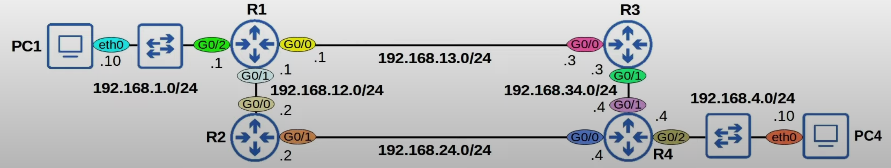

# Day 11 | (Part 2) | Static Routing

이 글은 Jeremy’s IT Lab의 유튜브 CCNA 200-301 과정을 참고하고 정리한 내용입니다.

[https://www.youtube.com/playlist?list=PLxbwE86jKRgMpuZuLBivzlM8s2Dk5lXBQ](https://www.youtube.com/playlist?list=PLxbwE86jKRgMpuZuLBivzlM8s2Dk5lXBQ)

# Static Routing

- 이전에 라우팅의 기본, 즉 라우터가 패킷을 전달할 위치를 결정하는 방법을 알아봤음.
- 그리고 경로 유형에는 로컬 연로와 연결된 경로 두 가지 유형을 살펴보았음.
- 인터페이스에서 IP주소를 구성하면 해당 경로가 라우터의 라우팅 테이블에 자동으로 추가됨.
- 로컬 경로는 라우터의 자체 IP 주소에 대한 경로를 제공하고 연결된 경로는 인터페이스가 연결된 네으퉈크에 대한 경로를 제공함. 그러나, 라우터 자체에 직접 연결되지 않은 대상으로 트래픽을 보낼 수 있도록 하려면 로컬 및 연결된 경로로는 충분하지 않음
- 오늘 주제인 정적 라우팅은 라우터가 라우터 자체에 직접 연결되지 않은 원격 대상으로 패킷을 보낼 수 있도록 함.
- 연결된 경로와 고컬 경로와 달리 정적 라우팅은 라우팅 테이블에 자동으로 추가되지 않으며 수동으로 구성해야함.

## Routing Packets: Default Gateway

- 위와 같은 상황에서 PC4에서 PC1로 패킷을 보내면 R4라우터에서는 대상 IP와 일치하는 경로가 없으므로 삭제해야한다.
- 이제 PC1과 PC4가 통신할  수 있도록 구성하는 방법을 알아보자
    - PC1과 PC4는 Linux 호스트이며 기본 인터페이스 이름은 ‘eht0’, Ethernet0이다.
    - 위와같이 인터페이스에 색상을 사용하면 패킷이 네트워크를 통해 이동하는 방식을 설명할 때 상황을 더 쉽게 이해할 수 있다.
    - PC1 및 PC4와 같은 최종 호스트는 연결된 네트워크의 대상으로 직접 패킷을 보낼 수 있다.
    - PC1은 192.168.1.0/24에 연결되어 있어 해당 네트워크의 다른 호스트와 직접 통신할 수 있고, PC4는 4.0/24에 연결되어 있어 해당 네트워크의 호스트와 직접 통신할 수 있다. 그러나 로컬 네트워크 외부의 대상으로 패킷을 보내려면 `Default Gateway` 로 패킷을 보내야 한다.
    - 게이트웨이는 라우터의 옛말로 `Default Gateway`라는 뜻
    
    
    
    - 위는 PC1과 PC4의 구성. Linux에서는 인터페이스 구성이 편집할 수 있는 텍스트 파일에 저장된다.
    - PC1의 경우 192.168.1.10/24 주소가 있고 아래에 기본 게이트웨이 구성인 gateway 192.168.1.1이 있음. 따라서 PC1은 로컬 네트워크 외부의 대상으로 패킷을 보내기 위해 R1에 패킷을 보냄
    - `default gateway` 구성을 `default route`라고도 함 → 기본적으로는 0.0.0.0/0로 가는 경로. 모든 넷마스크 비트는 0으로 설정되며 주소의 어떤 비트도 고정되지 않음(0.0.0.0/0에는 0.0.0.0 ~ 255.255.255.255 주소가 포함)
    - 내 로컬 네트워크 외부로 패킷을 보내려면 패킷을 내 기본 게이트웨이로 보내야함
    - PC1이 PC4로 패킷을 보내는 경우 IP 헤더의 소스 IP 주소는 아래와 같으며 대상 IP는 PC4의 IP이다.
        
        
        
        - 이제 중요한 점은 다음과 같다. 이더넷 헤더에 소스 및 대상 MAC 주소는 무엇인가? → 여기서 레이어2와 레이어3의 역할을 이해할 수 있음
        - 레이어3에서 PC1은 패킷을 PC4로 보내려고 하므로 대상은 PC4의 IP인 192.168.4.10이다. 그러나 먼저 이 패킷을 기본 게이트웨이인 R1으로 전달해야한다. 따라서 패킷을 프레임으로 캡슐화하고 대상 MAC은 R1 G0/2의 MAC 주소가 된다.
        
        
        
        - 이를 학습하기 위해 PC1은 먼저 R1 G0/2의 IP 주소인 192.168.1.1로 ARP 요청을 보낸다.
        
        
        
        - R1이 프레임을 수신하면 이를 캡슐화 해제한다. 즉, 레이어2 헤더와 트레일러를 제거하고 내부 패킷을 확인한다. 그런 다음 가장 구체적으로 일치하는 경로에 대한 라우팅 테이블을 확인한다.
            
            
            
            - R1의 라우팅 테이블에는 패킷의 대상 IP와 일치하는 경로가 없다. → 그러면 패킷을 삭제하는 것 외에는 방법이 없다. 현재 상태에서 R1은 패킷을 적절하게 전달하는 방법을 모른다. 이를 전달하려면 R1에는 대상 네트워크인 192.168.4.0/24에 대한 경로가 필요
            - R1은 192.168.4.0/24의 대상으로 패킷을 보내려면 패킷을 다음 홉 Y로 전달한다.
            - 실제로 PC1에서 PC4로의 패킷이 취할 수 있는 경로는 두 가지가 있다.
                1. 하나는 R3를 통한 경로 PC1 → R1 → R3 → R4 → PC4 
                2. 다른 하나는 R2를 통한 경로 PC1 → R1 → R2 → R4 → PC4 
        - R3를 통한 경로를 살펴보자.
            
            
            
            - 경로의 각 라우터는 두 개의 경로, 즉 PC1의 네트워크인 192.168.1.0/24에 대한 경로와 PC4의 네트워크인 192.168.4.0/24에 대한 경로가 필요 → 이는 양방향 연결성을 보장.
            - 라우터는 대상 경로에 있는 모든 네트워크에 대한 경로가 필요하지 않다는 점에 주목할 가치가 있다. (예: R1에는 192.168.34.0/24에 대한 경로가 필요하지 않다. 단지 알아야할 점은 4.0/24로 패킷을 보내려면 패킷을 R3로 보내야 한다는 것 → 이후에 R3가 패킷을 처리), (마찬가지로 R4에는 192.168.13/24으로의 경로가 필요하지 않음)
            
            
            
            - PC1과 PC4가 서로 통신할 수 있도록 R1, R3, R4가 필요한 경로에 대한 테이블
            - 파란색은 R1과 R4의 연결된 경로. 다음 홉을 ‘Connected’로 나열함.
            - 빨간색으로 구성해야하는 고정 경로가 있음.
            
            
            

## Static Route Configuration (R1)

- 글로벌 구성 모드에서 `ip route [대상 네트워크 IP] [넷 마스크] [다음 홉]`
- 따라서 R1의 4.0/24 네트워크 경로에 대한 명령은 다음과 같다. `ip route 192.168.4.0 255.255.255.0 192.168.13.3`
    
    
    
    - Static 경로에 대한 코드는 S. [1/0]이라는 것은 경로의 [**Adminstrative Distance/Metric**]를 의미

## Static Route Configuration (R3)

## Static Route Configuration (R4)

- 정적 라우팅이 완료되었고 이제 실제로 서로 통신할 수 있는지 테스트
- 테스트하기 위해 PC1에서 PC4로 ping을 보냈고 ping 성공
    
    
    
    - 5개의 패킷이 전송되고 5개의 패킷이 수신되었으며 0%의 패킷 손실 발생 → ping이 성공하면 양방향 연결이 가능하다는 의미

### Packet traveling form PC1 to PC4

## Static Route Configuration with exit-interface

- `ip route [대상 네트워크 IP] [넷 마스크] [출구 인터페이스]`
- `ip route [대상 네트워크 IP] [넷 마스크] [출구 인터페이스] [다음 홉]`
- 정적 경로의 출구 인터페이스만 지정하면 대상 네트워크가 ‘직접 연결되어 있다’고 나옴
- 종료 인터페이스만 지정하는 정적 라우팅은 ‘Proxy ARP’ 라는 기능을 사용해 작동. 이는 일반적으로 문제가 되지 않지만 일반적으로 다음 홉만 지정하거나 종료 인터페이스와 다음 홉을 모두 지정하는데 집중할 수 있음.

## Defalut Route

- Cisco 라우터에서 기본 경로를 구성하는 방법을 소개
- `default route`는 0.0.0.0/0 (0.0.0.0 ~ 255.255.255.255) → 따라서 0.0.0.0/0은 가능한 가장 구체적인 경로
- 라우터에 패킷의 대상 IP 주소와 일치하는 더 구체적인 경로가 없으면 라우터는 기본 경로를 사용해 패킷을 전달
- 따라서 트래픽을 인터넷으로 전달하는데 기본 경로가 사용되는 경우가 많다.
- 아래 네트워크에서 R1은 동일한 기업이 소유한 다른 라우터인 R2, R3에 연결되어있다.
    
    
    
    - R2 및 R3에 연결된 대상과 같이 내부 회사 네트워크의 대상에는 보다 구체적인 경로가 사용된다.
    - 그러나 내부 네트워크 외부의 대상으로 향하는 트래픽은 기본 경로를 사용해 인터넷으로 전송된다.
    - 이것이 기본 경로를 사용하는 유일한 방법은 아니지만 매우 일반적인 사용 사례이다.

## Quiz 1

정답: a

Cisco 라우터에서 고정 경로를 구성할 때 슬래시로 접두사 길이를 지정할 수 없으며 넷마스크를 작성해야함

## Quiz 2

정답: c

대상 8.8.8.8과 일치하는 유일한 경로는 기본 경로이다. 이 경로는 인터페이스를 지정하지 않지만 다음 홉 203.0.113.2를 명시한다. 그래서 203.0.113.0/24의 경로를 보면 G0/2와 연결된 것을 볼 수 있다. 

## Quiz 3

정답: 

## Quiz 4

정답: d

## Quiz 5

정답: d

R3은 연결된 네트워크인 `192.168.13.0/24` 및 `192.168.34.0/24`를 알고있다. 이 다이어그램의 모든 대산 네트워크를 파악하려면 `192.168.1.0/24`, `4.0/24`, `12.0/24`, `24.0/24` 에 대한 4개의 추가 경로를 구성해야 한다.