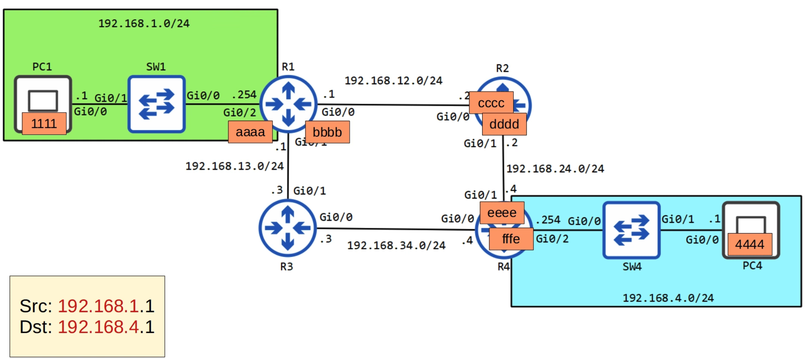

# Day 12 | The Life of a Packet

이 글은 Jeremy’s IT Lab의 유튜브 CCNA 200-301 과정을 참고하고 정리한 내용입니다.

[https://www.youtube.com/playlist?list=PLxbwE86jKRgMpuZuLBivzlM8s2Dk5lXBQ](https://www.youtube.com/playlist?list=PLxbwE86jKRgMpuZuLBivzlM8s2Dk5lXBQ)

# **The Life of a Packet**

- 이번 글은 패킷을 remote 목적지로 보내는 전체 과정을 다루겠음.
- 여기에는 ARP, 캡슐화, 캡슐화 해제 등과 같은 것들이 포함된다.

## Network Topology

- PC1이 네트워크 주소 192.168.4.0/24인 PC4로 가는 패킷을 추적
- 레이어3만 보는게 아니고 이러한 장치에 대한 MAC 주소를 추가하겠음.
- PC1은 일부 데이터를 PC4로 보내고 이 IP 헤더에 캡슐화하려고 한다.
- 소스는 PC1의 IP주소인 192.168.1.1 대상은 PC4의 192.168.4.1
- 위 그림에서는 아직 PC1이 트래픽을 전송하지 않았으므로 ARP 프로토콜을 사용해야함.
    - PC1 → R1
    
    
    
    - 대상 MAC 주소를 모르기 때문에 FFFF.FFFF.FFFF로 브로드캐스트
    - SW1은 프레임이 G0/1 인터페이스에 도착할 때 G0/1 인터페이스에서 PC1의 MAC 주소를 학습한다는 점에 유의
- 브로드캐스트 프레임이 R1에 도착하면 대상 IP가 자신의 IP임을 확인하고 아래 ARP 프레임을 생성해 다시 PC1로 보냄
    
    
    
    - 이제 PC1은 기본 게이트웨이의 MAC 주소를 알고 있으므로 이 이더넷 헤더로 패킷을 캡슐화
    
    
    
    - R1 → R2도 MAC 주소를 모르기 때문에 ARP 요청을 보내야함.
        
        
        
        
        
        - 소스필드에 R1의 G0/0 인터페이스 MAC 주소를 삽입해 R2로 보냄.
        - 프레임을 수신한 후 R2는 이더넷 헤더를 제거
        - R2는 라우팅 테이블에서 대상 IP 주소를 조회하고 가장 구체적으로 일치하는 항목은 192.158.4.0/24에 대한 것이며 다음 홉은 192.168.24.4
        - 192.168.24.4는 R2에 연결된 네트워크이지만 R4의 MAC 주소를 모름
    - R2 → R4도 똑같음
        
        
        
    - R4 → PC4도 ARP
        
        
        

### Reply from PC4 to PC1

- 한 가지 큰 차이점이 존재함.
- 이러한 장치들은 이미 ARP 프로세스를 거쳤으므로 ARP 요청 및 응답이 필요하지 않음. 패킷은 단순히 장치에서 장치로 전달되고 캡슐화 해제된 다음 장치에서 수신될 때 다시 캡슐화 된다. 그런 다음  각 라우터에서 전달

## Quiz 1

정답: fffe

## Quiz 2

정답: cccc

## Quiz 3

정답: aaaa

## Quiz 4

정답: 192.168.1.1 

각 라우터는 패킷을 전달할 때 이더넷 헤더의 소스 및 대상 MAC 주소는 수정하지만 원본 패킷 자체는 수정하지 않는다.

## Quiz 5

정답: 192.148.4.1

위 퀴즈4와 같은 이유