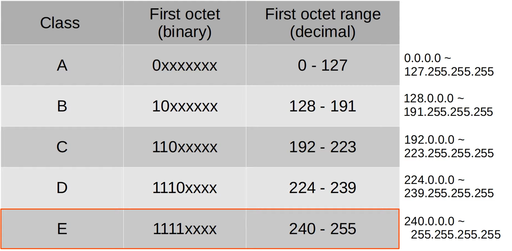

# Day 13 | Subnetting (Part 1)

이 글은 Jeremy’s IT Lab의 유튜브 CCNA 200-301 과정을 참고하고 정리한 내용입니다.

[https://www.youtube.com/playlist?list=PLxbwE86jKRgMpuZuLBivzlM8s2Dk5lXBQ](https://www.youtube.com/playlist?list=PLxbwE86jKRgMpuZuLBivzlM8s2Dk5lXBQ)

# Subnetting (Part 1)

이번 글에서 다룰 것들

- CIDR(Classless Inter-Domain Routing)
- 서브네팅 과정

## IPv4 Address Classes

- Class A - /8
- Class B - /16
- Class C - /24
- IANA(Internet Assigned Numbers Authority)라는 비영리 미국 기업에 의해 회사나 조직에 할당.
- IANA는 규모에 따라 기업에 IPv4주소와 네트워크를 할당한다
- 클래스 방식으로 낭비되는 IP가 많아 이거를 해결하기 위한 방법으로 CIDR가 있음.

## CIDR

- CIDR에서는 ~~클래스 A 주소는 /8 네트워크 마스크를 삭제해야 하고, 클래스 B는 /16을 사용해야 하며, 클래스 C는 /24를 사용해야 한다~~. → 이 요구사항이 제거. 이를 통해 더 큰 네트워크를 더 작은 네트워크로 분할할 수 있어 효율성 향상
- 이러한 소규모 네트쿼으를 `subnetworks` 나 `subnets`라고 함.

- 위 경우는 252개를 낭비하고 있음.

- 그러나 CIDR를 사용하면 다양한 prefix 할당 가능 → 반드시 /24일 필요 x
    
    
    
    - /25
    
    
    
    - /26
    
    
    
    - /27
        
        
        
    - /28
        
        
        
    - /29
        
        
        
    - /30
        
        
        
        - 위 경우 /30을 쓰는게 젤 좋음
        
        
        
        - 203.0.113.4 ~ 203.0.113.255는 다른 서브넷에서 사용할 수 있음. 이것이 바로 서브네팅의 마법
    - /31
        
        
        
        - 0개의 주소를 사용할 수 있으므로 /31 네트워크 prefix를 사용할 수 없다.
        - 그러나 위와 같은 지점 간 연결의 경우 실제로 /31 마스크를 사용할 수 있다.
        
        
        
        - 일반적으로 네트워크 주소와 브로드캐스트 주소를 뺀 후 사용 가능한 주소가 남지 않기 때문에 문제가 되지만, 이와 같은 지점 간 네트워크, 즉 두 라우터 간의 전용 연결에서는 실제로 네트워크 주소와 브로드캐스트 주소가 필요하지 않다.
        - 따라서 이 경우 규칙을 깨고 이 네트워크에 있는 두 개의 주소만 라우터에 할당할 수 있음.
        - 그러므로 203.0.113.2 ~ 203.0.113.255는 다른 서브넷에서 사용할 수 있다.
        - /31 마스크는 /30 보다 더 효율적이므로 이 방법을 권장한다.
    - /32
        
        
        
        - 이 경우 -1을 가짐. /32 마스크를 사용할 수 없으며 실제 인터페이스를 구성하는데 /32 마스크를 사용하지 않을 수도 있음.
        - 그러나 몇가지 용도가 있다. (예: 네트워크가 아닌 하나의 특정 호스트에 대한 고정 경로를 생성하려는 경우)
    
    ## CIDR Notation
    
    
    

## Subnetting

- 47(45 호스트 + 1네트워크 + 1브로드캐스트) * 4 = 188 이므로 클래스 C 네트워크에는 문제가 없다.
- 4개의 서브넷으로 나누기
    - /30의 경우
        
        
        
        - 4개를 이용할 수 있으므로 45명의 호스트를 수용할 공간이 없음 → 불가
    - /29
        
        
        
        - 불가
    - /28
        
        
        
        - 불가
    - /27
        
        
        
        - 불가
    - /26
        
        
        
        - 64 → 45명의 호스트에게 할당 가능

## Quiz

정답: 

Subnet 2: `192.168.1.64/26` 

Subnet 3: `192.168.1.128/26`

Subnet 4: `192.168.1.192/26`