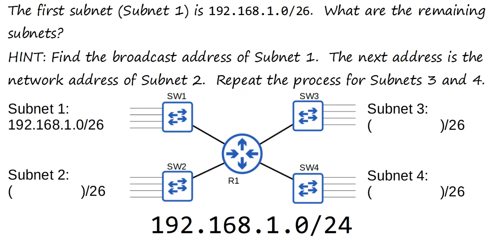

# Day 14 | Subnetting (Part 2)

이 글은 Jeremy’s IT Lab의 유튜브 CCNA 200-301 과정을 참고하고 정리한 내용입니다.

[https://www.youtube.com/playlist?list=PLxbwE86jKRgMpuZuLBivzlM8s2Dk5lXBQ](https://www.youtube.com/playlist?list=PLxbwE86jKRgMpuZuLBivzlM8s2Dk5lXBQ)

# Subnetting (Part 2)

## **Previous Lecture** Quiz answer

- 힌트: 서브네1의 브로드캐스트 주소를 찾고 그 다음이 서브넷2의 네트워크 주소
- Subnet 1의 주소 범위
    
    
    
- Subnet 2
    
    
    
- Subnet 3
    
    
    
- Subnet 4
    
    
    

## Another example Subnetting

- 동일한 크기의 5개 서브넷으로 나누라는 요청
- 이 경우 각 서브넷의 호스트 수는 지정되지 않았으므로 최대한 큰 5개의 서브넷을 만들어 보겠음.
    - /25로 할 경우
        
        
        
        - 2개의 서브넷밖에 만들지 못함
    - /26
        
        
        
        - 4개의 서브넷밖에 만들지 못함
    - /27
        
        
        
        - 우리가 원하는 답
    
    
    
    
    

## Identify the subnet

- 문제 1
    
    
    
    - Host `192.168.5.57/27`은 어떤 서브넷에 속합니까?
        
        
        
        - 따라서 Host는 서브넷 `192.168.5.32/27`에 속한다.
- 문제 2
    
    
    
    - `192.168.29.219/29` 는 어떤 서브넷에 속합니까?
        
        
        
        - `192.168.29.216/29` 에 속한다

## Sunbets/Hosts (Class C)

## Subnetting Class B Networks

- 네트워크 규모가 클 수록 가능한 서브넷도 많음.
- 그러나 서브넷 프로세스는 동일함.
- Class B 의 서브네팅 몇가지 예시
    - 예시 1
        
        
        
        - /23을 사용해야 80개의 서브넷을 만들 수 있음.
            
            
            
    - 예시 2
        
        
        
        - 500개의 서브넷을 만들어야 하므로 /25를 사용해야함.
            
            
            
    - 예시 3
        
        
        
        - 250개의 서브넷과 동일한 호스트 수를 고려해야함. → /24
            
            
            

## Subnets/Hosts (Class B)

## Quiz 1

정답: /23

## Quiz 2

정답: `172.21.96.0/20`

## Quiz 3

정답: `192.168.91.127/26`

## Quiz 4

정답: 

network address: `172.16.64.0/18`

broadcast address: `172.16.127.255/18`

## Quiz 5

정답: 64개의 서브넷