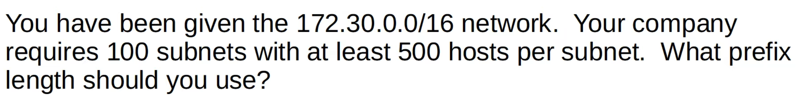

# Day 15 | Subnetting (Part 3 - VLSM)

이 글은 Jeremy’s IT Lab의 유튜브 CCNA 200-301 과정을 참고하고 정리한 내용입니다.

[https://www.youtube.com/playlist?list=PLxbwE86jKRgMpuZuLBivzlM8s2Dk5lXBQ](https://www.youtube.com/playlist?list=PLxbwE86jKRgMpuZuLBivzlM8s2Dk5lXBQ)

# Subnetting (Part 3 - VLSM)

이번 글에서 다룰 것들 

- 지난 강의 퀴즈 답
- Class A 네트워크 서브네팅
- VLSM(Variable-Length Subnet Masks) - 가변 길이 서브넷 마스크

## **Previous Lecture** Quiz answer

### Quiz 1

정답: /23

### Quiz 2

정답: `172.21.96.0/20`

### Quiz 3

정답: `192.168.91.127/26`

### Quiz 4

정답: 

network address: `172.16.64.0/18`

broadcast address: `172.16.127.255/18`

### Quiz 5

정답: 64개의 서브넷 

## Subnetting Class A Networks

- Class A 서브네팅 예제ㅊ1
    
    
    
    - 2000개의 서브넷을 만들어야한다.
    - prefix 길이와 각 서브넷의 host의 수는?
        
        
        
        - prefix: /19
        - 각 서브넷의 호스트 수는 8190
- 예제 2
    
    
    
    - Network address
        
        
        
    - Broadcast address
        
        
        
    - First usable address
        
        
        
    - Last usable address
        
        
        
    - Number of host addresses
        
        
        
    
    
    

## Variable-Length Subnets Masks(VLSM)

- 지금까지 우리는 FLSM(Fixed-Length Subnet Masks)을 이용한 서브네팅을 해왔음.
    - 이는 모든 서브넷이 동일한 prefix 길이를 사용
- 그러나 VLSM은 네트워크 주소를 보다 효율적으로 사용할 수 있도록 다양한 크기의 서브넷을 생성
- VLSM은 FLSM보다 더 복잡하지만 단계를 올바르게 따르면 쉽다.
- VLSM
    
    
    
    - 모든 호스트에 IP주소를 제공하려면 이를 5개의 서브넷으로 나눠야한다.
    - FLSM으로 이를 시도하려면 충분한 서브넷(4개를 만들어야 함으로)을 만들기 위해 3비트를 빌려야한다.
        - 그러면 5개의 호스트 비트가 남게됨. 5개의 호스트 비트는 30개의 호스트 주소만 허용하므로 Tokyo LAN A와 Toronto LAN B는 충분하지 않음
        - → VLSM을 사용하면 각 LAN에 서로 다른 서브넷 크기를 할당할 수 있으므로 각 LAN에 충분한 주소가 있는지 확인할 수 있음.
- VLSM - Steps
    1. 먼저 주소 공간의 시작 부분에 가장 큰 서브넷을 할당
    2. 다음 두 번째로 큰 것을 할당 
    3. 가장 큰 것부터 가장 작은 것까지 모든 서브넷이 헐당될 때까지 프로세스를 반복
    
    
    
    - 도쿄 LAN A, 토론토 LAN B, 토론토 LAN A, 도쿄 LAN B, 두 라우터 간의 point-to-point 연결 순으로 할당
    - Tokyo LAN A
        
        
        
        - 110개의 호스트를 할당해야하므로 /25 사용
    - Toronto LAN B
        - 도쿄 랜 A의 브로드캐스트 주소 `192.168.1.127` 다음으로 할당해야함
        - 따라서 `192.168.1.128`  단, prefix의 길이는? → /26 사용 `192.168.1.128/26`
        
        
        
    - Toronto LAN A
        - 토론토 랜 B의 브로드캐스트 주소 `192.168.1.191` 다음으로 할당
        - 따라서 `192.168.1.192` → prefix? /27 `192.168.1.192/27`
        
        
        
    - Tokyo LAN B
        - 토론토 랜 A의 브로드캐스트 다음 주소인  `192.168.1.224` 와 접두사 /28 사용
        
        
        
    - Point-to-point connection
        - 지점 간 연결에는 주소가 2개만 필요
        - 도쿄 랜 B의 브로드캐스트 주소 `192.168.1.239` 이므로 `192.168.1.240` 사용
        - 앞에서 /31을 사용해 두 개의 호스트만 필요한 서브넷에 사용이 가능하지만, CCNA 시험의 경우 두 개의 호스트가 필요한 서브넷에 사용할 prefix 길이를 묻는 경우 /31을 사용하지 않는 것이 좋다.
        - 따라서 /30 사용
        
        
        
    - VLSM 최종 결과
        
        
        
        - 각 서브넷은 서로 다른 접두사 길이를 사용