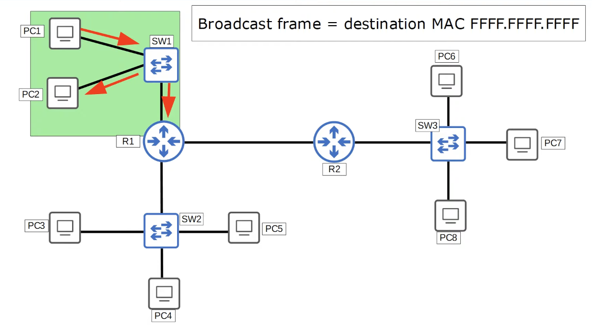

# Day 16 | VLANs (Part 1)

이 글은 Jeremy’s IT Lab의 유튜브 CCNA 200-301 과정을 참고하고 정리한 내용입니다.

[https://www.youtube.com/playlist?list=PLxbwE86jKRgMpuZuLBivzlM8s2Dk5lXBQ](https://www.youtube.com/playlist?list=PLxbwE86jKRgMpuZuLBivzlM8s2Dk5lXBQ)

# VLANs (Part 1)

VLAN은 가상 LAN, 가상 근거리 통신망을 나타낸다. 

오늘은 아래 내용들을 다룰 것이다. 

- LAN이란?
- LAN과 VLAN에 대한 이해를 돕기 위해 Broadcast domain
    - 브로드캐스트란 컴퓨터 네트워킹, 정보통신 및 방송 등 모든 수신자에게 동시에 메시지를 전송하는 방법.
- VLAN이란?
- VLAN의 기본과 목적
- Cisco 스위치의 VLAN 구성 기본 사항

## What is a LAN?

- 이전 내용들에서 LAN은 집이나 사무실과 같은 단일 위치에 있는 장치(PC, 서버, 라우터, 스위치)의 그룹
- 보다 구체적인 정의, LAN은 단일 브로드캐스트 도메인임.
    - 브로드캐스트 도메인은 멤버 중 어느 하나가 보낸 브로드캐스트 프레임(즉, 모든 F MAC 주소)을 수신할 장치 그룹
- 브로드캐스트 도메인
    
    
    
    - R1은 프레임을 수신하지만 다른 네트워크로는 보내지 않음.(라우터는 네트워크 간의 트래픽을 라우팅하는 장치로, 서로 다른 네트워크를 연결하고 데이터를 전달. 그러나 라우터는 브로드캐스트 트래픽을 한 네트워크에서 다른 네트워크로 전달하지 않습니다. 이는 네트워크 분할 및 트래픽 격리의 기본 원칙 중 하나)
    - → PC1, PC2, SW1 및 R1 인터페이스 중 하나를 포함하는 하나의 브로드캐스트 도메인을 의미
    
    
    
    
    
    - 3개의 브로드캐스트 도메인을 찾음.
    - 하지만 하나가 더 존재함.
        - R1이 R2에 연결된 인터페이스에서 브로드캐스트 프레임을 전송하면 어떻게 될까?
        
        
        
        - 브로드캐스트 도메인임
    - 즉, 브로드캐스트 도메인은 구성원 중 하나가 보낸 브로드캐스트 프레임을 수신할 장치 그룹이다.

## What is VLAN?

- 엔지니어링 부서의 PC의 브로드캐스트 프레임을 라우터뿐만 아니라 모든 PC가 브로드캐스트를 수신하게 된다. → 보안 및 네트워크 성능 측면에서 문제가 된다.

- 성능과 관련해 불필요한 브로드캐스트 트래픽이 많으면 네트워크 성능이 저하될 수 있음.
- 보안의 경우, 같은 사무실 내에서도 누가 무엇에 접근할 수 있는지 제한하고 싶다. 라우터나 방화벽에 보안 정책을 적용할 수 있다. 이는 하나의 LAN이므로 트래픽이 라우터를 통과하지 않고도 PC간에 직접 연결할 수 있다.
    - 따라서 보안 정책을 구성하더라도 아무런 영향을 미치지 않는다. 누가 네트워크의 무엇에 액세스할 수 있는지 결정하는 보안 정책을 적용할 수 있도록 이러한 호스트를 분리해야한다.
- 따라서 이러한 부서를 별도의 서브넷으로 분할해보겠다.
    
    
    
    - PC1에서 PC2로 보낼경우 PC1은 PC2가 자신의 서브넷과 다른 서브넷에 있음을 인식해 대상 MAC 주소를 기본 게이트웨이 R1으로 설정한다.
    
    
    
    - 소스 MAC을 자체 MAC으로 변경하고 대상 MAC을 PC2의 MAC으로 변경한다. 그런 다음 프레임을 다시 스위치로 전달하고 스위치는 이를 대상인 PC2로 전달한다.
    - PC1이 PC2로 트래픽을 직접 보내는 대신 R1을 통해 트래픽을 보내도록 했다. 이러한 서브넷 간에 통과할 수 있는 트래픽을 정확히 제어하기 위해 몇가지 보안 정책을 구성했을 것이다.
    - 그러나 여전히 문제가 존재한다. 프레임이 broadcast or unknown unicast frame인 경우 어떻게 될까? → 스위치는 모든 인터페이스에서 프레임을 플러딩한다.
        
        
        
        - 소스 MAC은 PC1이고, 대상 MAC은 FFFF.FFFF.FFFF(브로드캐스트). 스위치는 레이어2까지만 인식한다는 점을 기억.(소스 및 대상 MAC 주소와 같은 레이어2 정보만 봄, 레이어3, 4는 신경쓰지 않음)
        - 따라서 PC1은 프레임을 스위치로 보내고 대상 MAC 주소인 FFFF.FFFF.FFFF을 확인한 후 프레임을 Flooding
            
            
            
            - 다시 한번 말하지만, 이는 네트워크 성능과 보안측면에서 모두 좋지 않음.
            - 즉, 레이어3에서 분리되어 있음에도 불구하고 여전히 동일한 브로드캐스트 도메인, 동일한 레이어2 네트워크 또는 동일한 LAN에 있음을 보여줌.
                - → 가능한 해결책 중 하나는 각 부서마다 별도의 스위치를 구입. 그러나 이는 유연하지 않고 네트워크 장비의 가격이 저렴하지 않으므로 각 부서마다 하나 이상의 스위치를 구입하는 것은 특히 소규모 기업의 경우 너무 비쌀 수 있음.
                - → 그래서 VLAN이 필요
                - 위와같은 PC는 모두 동일한 LAN에 있지만 VLAN을 사용해 레이어2에서 분리할 수 있다.
- 엔지니어링 부서를 VLAN10, HR 부서를 VLAN20, Sales 부서를 VLAN30으로 설정하겠다.
- 이러한 호스트를 VLAN에 정확히 어떻게 할당하는가?
    - 스위치에서 구성. 정확하게 말하자면 스위치 인터페이스
    - 특정 VLAN에 있도록 스위치 인터페이스를 구성하면 해당 인터페이스에 연결된 최종 호스트가 해당 VLAN의 일부가 된다.
    - 스위치는 각 VLAN을 별도의 LAN으로 간주하고 broadcast or unknown unicast 트래픽을 포함해 VLAN간에 트래픽을 전달하지 않는다.
    - 따라서 이러한 VLAN을 설정한 경우 PC1이 동일한 브로드캐스트 프레임을 전송하면 프레임이 스위치에 도착한 후 동일한 VLAN에 있는 모든 인터페이스로 전달된다.
        
        
        
        - 브로드캐스트가 VLAN10에 구성된 인터페이스에 도착했기 때문에 스위치는 프레임을 VLAN10의 다른 인터페이스로만 전달한다.
        - PC1이 동일한 유니캐스트 프레임을 PC2로 전송하려는 경우 이전과 동일하게 작동한다.
        
        
        
        - 라우터는 VLAN 간 라우팅에 사용된다.
        - 스위치는 이러한 VLAN 간 라우팅을 수행하지 않는다. 라우터를 통해 트래픽을 전송해야함.
- VLAN에 대한 요약
    - VLAN은 인터페이스별로 스위치에 구성된다.
    - VLAN은 레이어2에서 최종 호스트를 논리적으로 분리한다.
        - 우리가 살펴본 토폴로지의 호스트는 물리적으로 동일한 스위치에 연결되어 동일한 브로드캐스트 도메인에 있지만 VLAN을 사용해 논리적으로 분리하고 별도의 브로드캐스트 도메인에 배치했다.
    - 스위치는 서로 다른 VLAN에 있는 호스트 간에 트래픽을 직접 전달하지 않는다.
        - 앞서 보여준 것처럼 스위치는 트래픽을 라우터로 전달해야한다.
        - 실제로 VLAN 간 라우팅에는 몇가지 다른 방법이 있다.

## VLAN Configuration

- 다이어그램에 인터페이스 번호를 추가했다.
- VLAN10의 인터페이스는 G1/0 ~ G1/3
- VLAN20은 인터페이스는 G2/0 ~ G2/2
- VLAN30은 인터페이스는 G3/0 ~ G3/3
- CLI에서 VLAN 배치
    
    
    
    - `show vlan brief`
    - VLAN을 구성하지 않더라도 처음에 모든 인터페이스는 기본적으로 VLAN1에 있다.
    - 아래 1002 ~ 1005는 FDDI 및 토큰 링에 사용되는 다른 VLAN. 기본적으로 존재하며 삭제할 수 없음.
    
    
    
    - `interface range` 명령어를 사용해 모든 VLAN10 인터페이스를 한 번에 구성함.
    - 인터페이스를 액세스 포트로 사용하려면 `switchport mode access`
        - **access port**란? 단일 VLAN에 속하는 스위치 포트이며 일반적으로 PC와 같은 최종 호스트에 연결된다.
        - 트렁크 포트라고 불리는 또 다른 스위치 포트가 존재한다. 여러 VLAN을 전달하는 스위치 포트를 **trunk ports**라고 한다.
    - 최종 호스트에 연결된 스위치 포트는 기본적으로 액세스 모드로 들어가야 하지만 항상 설정을 명시적으로 구성하고 port 유형의 자동 협상에 의존하지 않는 것이 좋다.
    - `switchport mode access` 다음의 명령어는 `switchport access vlan10` 이다. 실제로 해당 포트에 VLAN을 할당하는 명령어
    
     
    
    
    
    - `vlan 10` 명령을 사용해 VLAN10의 구성모드로 진입
        - 그런데 이 명령도 VLAN을 생성하는 명령어임
    - 다음으로 `name ENGINEERING` 명령을 사용해 이름 지정
    - VLAN20, 30도 동일하게
    
    
    
    - 이름이 변경된 것을 볼 수 있다.
- 대상 MAC 주소가 FFFF.FFFF.FFFF인 브로드캐스트와 함께 ping을 보내는 PC1에서 `Ping 255.255.255.255` 명령을 사용하면 브로드캐스트는 VLAN10 호스트에만 도달한다.
    
    
    
- 마찬가지로 PC2에서도 동일한 명령을 사용하면 브로드캐스트는 VAN30의 PC에만 도달한다.
    
    
    

## Summary

- LAN이 뭔지 다룸.
- 그룹의 다른 구성원이 보낸 브로드캐스트 프레임을 수신하는 장치 그룹인 브로드캐스트 도메인을 정의했다.
- VLAN이 무엇인지 다룸.
- VLAN의 목적 - 네트워크 성능과 보안
- Cisco 스위치에 VLAN 구성하는 방법

## Quiz 1

정답: 6개 

기본적으로 각 라우터 인터페이스와 여기에 연결된 모든 것은 VLAN이 구성되지 않았기 때문에 하나의 브로드캐스트 도메인에 있음.

## Quiz 2

정답: 5개

구성된 VLAN 각각에 대해 하나씩, 두 라우터 간의 연결도 브로드캐스트 도메인이다.

## Quiz 3

정답: b

스위치가 자동으로 VLAN을 생성함. 

## Quiz 4

정답: 3개 

우선 스위치가 이를 수신한 다음 VLAN20의 모든 인터페이스에서 이를 전송하므로 VLAN20의 라우터와 다른 PC에서 수신한다. 

## Quiz 5

정답: c

VLAN1, 1002, 1003, 1004, 1005는 default