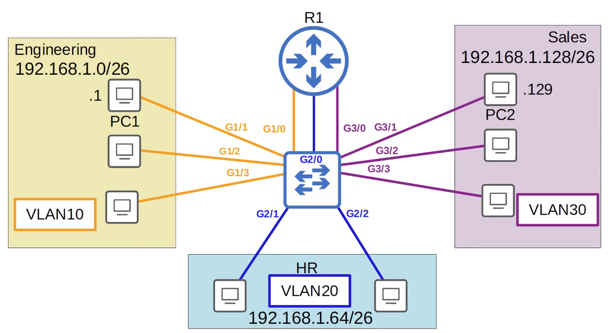

# Day 17 | VLANs (Part 2)

이 글은 Jeremy’s IT Lab의 유튜브 CCNA 200-301 과정을 참고하고 정리한 내용입니다.

[https://www.youtube.com/playlist?list=PLxbwE86jKRgMpuZuLBivzlM8s2Dk5lXBQ](https://www.youtube.com/playlist?list=PLxbwE86jKRgMpuZuLBivzlM8s2Dk5lXBQ)

# VLANs (Part 2)

이번 글에서도 이어서 VLAN에 대해서 다룰 것이다. 

다룰 내용은 아래와 같다.

- trunk port란?
    - access port는 하나의 VLAN에 할당하여 해당 VLAN끼리만 트래픽이 흐를 수 있도록 지정된 Port, trunk port는 단일 인터페이스에서 여러 VLAN의 트래픽을 전달한다.
- trunk port의 용도
- 802.1Q 캡슐화
    - 이는 트렁크에 속한 VLAN 트래픽을 식별하는데 사용되는 이더넷 프레임에 추가되는 추가 태그
- trunk port의 구성
- Router on a Stick(ROAS) - 막대형 라우터
    - 모든 VLAN에 대해 별도의 라우터 인터페이스를 사용하는 대신 VLAN 간 라우팅을 수행하는 보다 효율적인 방법

- 지난 번 강의에서 사용된 network topology
    
    
    
    - 모든 스위치 인터페이스는 단일 VLAN에 속하는 Access Port
    - 각 라우터에 연결하는데는 각 VLAN에 하나씩 세 개의 인터페이스가 사용됨.

## Network Topology

이번 글에서 사용될 네트워크 토폴로지 

- 이번에는 두 개의 스위치를 사용
- 엔지니어링 부서의 VLAN인 VLAN10은 두 스위치 사이에 분할
    - 회사의 부서가 항상 위치별로 정확하게 분할되지는 않기 때문에 이는 매우 일반적임(예: 건물의 한 층에 엔지니어가 있고 다른 층에 있을 수 있음)
- SW1과 SW2 사이에는 두 개의 링크가 있음. 하나는 VLAN10용 다른 하나는 VLAN30용
    - VLAN10 PC는 SW1, SW2 모두에 연결되어 있고 SW1에 연결된 PC는 SW2를 통해 R1에 도달할 수 있어야하기 때문에 두 스위치 사이에 VLAN10 링크가 있어야 한다.
    - VLAN30의 링크는 VLAN30의 PC도 SW2를 통해 R1에 도달할 수 있어야 하기 때문에 필요
- 그러나, SW1과 SW2 사이에는 VLAN20링크가 없음.
    - SW1에 연결된 VLAN20에 PC가 없기 때문
    - VLAN20의 PC는 여전히 SW1에 연결된 PC에 연결할 수 있으며 R1은 VLAN 간 라우팅을 수행
- VLAN20의 PC가 SW1에 연결된 VLAN10 PC 중 하나로 트래픽을 전송한다고 가정해보자.
    
    
    
    - 기본 게이트웨이인 R1의 대상 MAC 주소를 사용해 프레임을 보냄
    - 그런 다음 R1은 이를 다시 SW2로 전달
    - 이 트래픽은 VLAN10 인터페이스의 SW2에 도착했으며 이제 트래픽은 VLAN10에 있으므로 두 트래픽 사이의 VLAN10 연결에서 SW1로 트래픽을 전달
    - SW1이 트래픽을 대상 PC로 전달
    - → 따라서 SW2와 SW1 사이에 VLAN20 연결이 없더라도 라우터가 VLAN 간 라우팅을 수행하므로 VLAN20의 PC는 여전히 VLAN10의 PC로 트래픽을 보낼 수 있음을 알 수 있다.
- VLAN 수가 적은 소규모 네트워크에서는 스위치와 스위치를 연결하고 스위치와 라우터를 연결할 때 VLAN마다 별도의 인터페이스를 사용하는 것이 가능하다.
- 그러나 VLAN 수가 증가하면 이는 불가능하다.
    - 인터페이스가 낭비되고 라우터에 각 VLAN에 대한 인터페이스가 충분하지 않은 경우가 있기때문
- **Trunk Ports**를 사용해 단일 인터페이스를 통해 여러 VLAN의 트래픽을 전달할 수 있다.

## Trunk Ports

- 각 VLAN에 대한 별도의 연결을 SW1과 SW2, SW2와 R1간의 단일 연결로 교체
- VLAN10의 PC가 VLAN10의 다른 PC로 일부 데이터를 전송하려고 한다고 가정해보자.
    
    
    
    - 이 PC는 트래픽을 SW2로 보낸 다음 SW1로 보낸다.
    - SW1은 트래픽이 어떤 VLAN에 속하는지 어떻게 알 수 있을까?
        - VLAN10과 30 모두 트래픽이 수신된 인터페이스에서 허용되지만 SW1은 자신이 속한 VLAN을 어떻게 알 수 있을까? → **VLAN Tagging**
        - 스위치는 트렁크 링크를 통해 보내는 모든 프레임에 Tag를 지정한다. → 이를 통해 수신 스위치는 프레임이 속한 VLAN을 알 수 있다.
        - 실제로 trunk port의 또 다른 이름은 tagged  port이고 access port의 또 다른 이름은 untagged port이다.
            - access port를 통해 전송된 프레임은 태그가 지정되지 않으며 인터페이스가 단일 VLAN에 속하기 때문에 태그를 지정할 필요가 없다.

## VLAN Tagging

- 주요 trunking protocols에는 두 가지가 있음
    - ISL(Inter-Switch Link)
        - 업계 표준 IEEE 802.1Q 이전에 만들어진 오래된 Cisco 독점 프로토콜
    - IEEE 802.1Q
        - ‘dot1q’라고 부름
        - IEEE에서 만든 산업 표준 프로토콜
    - 실제로는 ISL을 절대로 사용하지 않을 것이다.
- Dot1q
    
    
    
    - 이더넷 헤더와 트레일러
    - Dot1q는 아래의 이더넷 헤더의 두 필드 사이에 4바이트(32비트) 필드를 삽입함
        
        
        
        
        
        - 소스 MAC 주소와 이더넷 헤더의 Type/Length 필드 사이에 dot1q 태그가 삽입된다.
        - 태그의 길이는 4바이트, 즉 32비트
        - 태그는 두 개의 주요 필드로 구성된다.
            - TPID(Tag Protocol Identifier) - 태그 프로토콜 식별자
            - TCI(Tag Control Information)  - 태그 제어 정보
                - TCI자체는 세 개의 하위 필드로 구성된다.
- Dot1q 태그의 다이어그램
    
    
    
    - TPID 필드
        - 16비트(2바이트)이며 802.1Q태그 길이의 절반을 차지
        - TPID는 항상 0x8100으로 설정
    - PCP 필드
        - Priority Code Point
        - 필드의 길이는 3비트
        - 혼잡한 네트워크에서 중요한 트래픽에 우선순위를 부여하는 CoS(Class of Service)에 사용됨
    - DEI
        - Drop Eligible Indicator
        - 필드의 길이는 1비트
        - 이는 네트워크가 혼잡할 경우 삭제될 수 있는 프레임을 나타내는데 사용, 이를 통해 더 중요한 네트워크 트래픽이 통과하도록 함.
    - VID
        - VLAN ID
        - 길이는 12비트
        - 식별하는 필드이므로 dot1q태그의 가장 중요한 필드
        - 이 필드의 길이가 2비트이므로 2의 12제곱은 4096이므로 총 VLAN은 4096개
        - 그러나 첫번째와 마지막 VLAN인 0과 4095는 예약되어 사용할 수 없다.
        - 따라서 실제 사용할 수 있는 VLAN 범위는 1 ~ 4094
        - 그런데 트렁크 연결을 통한 VLAN 태깅을 위한 대체 프로토콜인 Cisco의 독자적인 ISL도 1 ~ 4094의 VLAN 범위를 사용함.

## VLAN Ranges

- VLAN은 1부터 4094까지의 두 섹션으로 나뉨
    - 1 ~ 1005: Normal VLANs
    - 1006 ~ 4094: Extended VLANs

- 전송하는 PC에서 트래픽이 SW2로 이동한 다음 트래픽이 VLAN10에 속함을 나타내는 태그와 함께 SW1로 전달됨
- SW1은 프레임을 수신하고 대상도 VLAN10에 있으므로 트래픽을 대상으로 전달
- 표준 레이어2 스위치는 동일한 VLAN의 트래픽만 전달하고 VLAN 간의 트래픽은 전달하지 않음.

## Native VLAN

- Dot1q에는 Native VLAN이라는 기능이 존재(Cisco의 ISL에는 이 기능이 없음)
- 기본 VLAN은 모든 트렁크 포트에서 기본적으로 VLAN1이지만 각 트렁크에서 수동으로 구성할 수 있음.
- 스위치는 기본 VLAN의 프레임에 802.1Q 태그를 추가하지 않는다.
- 태그를 추가하지 않고 프레임을 정상적으로 전달
- 그렇다면, 트렁크 포트에서 태그가 지정되지 않은 프레임을 수신할 때 수신 스위치는 무엇을 할까? → 스위치는 트렁크 포트에서 태그가 지정되지 않은 프레임을 수신하면 해당 프레임이 기본 VLAN에 속하는 것으로 가정
    - 따라서 스위치 간에 기본 VLAN이 일치하는 것이 매우 중요
    - 기본 VLAN 불일치가 있는 경우 스위치는 여전히 트래픽을 전달 하지만 문제가 발생할 수 있다.
    - 예시) SW1과 SW2 사이의 트렁크 링크에 기본 VLAN을 VLAN10으로 구성했다고 가정해보겠음.
        
        
        
        - 위와 같은 경로로 따라가 보자
        
        
        
        - 트래픽을 SW1로 보내지만 기본 VLAN인 VLAN10에 있으므로 VLAN10에 있는 것으로 태그를 지정하지 않는다.
        - 태그가 지정되지 않은 프레임은 SW1에 도착하며 SW1에서는 트래픽이 VLAN10에 속한다고 가정하여 대상으로 전달한다.
    - 이번에는 기본 VLAN 불일치 구성 예시) SW2의 인터페이스에서 VLAN10을 기본 VLAN으로 구성, SW1의 인터페이스에서는 VLAN30을 기본 VLAN으로 구성
        
        
        
        - 무슨일이 일어날까
        
        
        
        - 트래픽이 SW1에 도달하는 지점까지는 동일하다.
        - 그러나 SW1이 프레임을 수신하면 이렇게 생각한다.
            - 이 프레임에는 VLAN 태그가 없습니다. 따라서 VLAN30에 속해야 합니다.
            - 하지만 목적지는 VLAN30이 아닌 VLAN10에 있습니다.
            - 그래서 프레임을 전달하지 않겠습니다.
    
    
    
    - 다이어그램에 인터페이스 번호 추가
    - SW1에는 G0/0, SW2에는 G0/0과 G0/1을 트렁크 포트로 구성

## Trunk Configuration

- 캡슐화 유형을 정하는 방법: `switchport trunk encapsulation dot1q`

- Mode on은 인터페이스가 트렁크로 수동으로 구성되었음을 의미
- Encapsulation은 우리가 설정한 대로 dot1q이고 status는 trunking
- Native VLAN은 기본값이 1
- 그 아래에는 트렁크에 허용되는 VLAN들이 표시된다. 기본적으로 트렁크에는 1부터 4094까지의 모든 VLAN이 허용
- 다음은 management domain에서 VLAN이 허용되고 활성화되는 것
- 마지막 줄은 spanning tree forwarding state에 있고 정리되지 않음 VLAN

다음은 트렁크에 허용되는 VLAN을 구성하는 명령어 

- `switchport trunk allowed vlan`

- 트렁크에 허용되는 VLAN 10과 30을 명령어 입력하고 확인하면 VLAN10과 30만 표시하는 것을 위와같이 볼 수 있다.

- `switchport trunk allowed vlan add [ID]`
- 현재 존재하는 목록에 추가하는 명령어

- `switchport trunk allowed vlan remove [ID]`

- `switchport trunk allowed vlan all`
- 기본적으로 모든 VLAN이 허용되므로 이는 기본 상태와 동일

- `switchport trunk allowed vlan except [ID]`
- 지정한 ID 외에 모든 VLAN 허용

- `switchport trunk allowed vlan none`
- 이렇게 하면 트래픽이 트렁크를 통과하는 것이 효과적으로 허용되지 않음

- 위 네트워크 다이어그램대로 구성해보자
- SW1에는 VLAN10과 VLAN30의 호스트가 연결되어 있다.
- VLAN20의 호스트는 연결되어있지 않으므로 SW1과 SW2사이의 트렁크에서 VLAN20을 허용할 필요가 없다.
    - 추가로 VLAN30도 SW2에 없는데 왜 트렁크 허용을 하냐? → 라우터 R1이 모든 VLAN에 대해 라우팅 기능을 제공하는 경우 모든 트래픽에 대한 허용을 해야해서
    
    
    
    - 네트워크 성능을 위해 다른 VLAN의 브로드캐스트 등이 트렁크를 통해 전송되지 않으므로 불필요한 트래픽을 방지
    - 여기서 Native VLAN을 변경 → 보안을 위해 기본 VLAN을 사용되지 않는 VLAN으로 변경하는 것이 좋다.
        
        
        
        - `switchport trunk native vlan [id]`
    - 이 트렁크 포트를 구성한 후 `show vlan brief`
        
        
        
        - G0/0는 어디에도 나열되지 않음.
        - VLAN10 or VLAN30에서는 트렁크에 허용되는 VLAN이더라도 해당되지 않음. → 이는 `show vlan brief` 명령이 각 VLAN을 허용하는 트렁크 포트가 아닌 각 VLAN에 할당된 액세스 포트를 표시하기 때문
            - 트렁크 포트를 확인하려면 `show interfaces trunk`
- 이제 SW2의 구성을 보자. SW2의 G0/0 인터페이스에서는 VLAN10과 30을 허용해야 한다. 그러나 SW2의 G0/1 인터페이스에서는 VLAN20도 허용해야 한다.
- SW1에 연결된 인터페이스인 SW2의 G0/0 인터페이스 구성은 다음과 같다.
    
    
    
- 다음은 G0/1 인터페이스
    
    
    
    - VLAN10 및 30 외에 VLAN20을 허용했다는 점을 제외하면 G0/0과 거의 동일
- 이전 강의에서는 SW2에서 R1으로의 연결을 위해 세 개의 별도 인터페이스를 사용했고 R1에서는 각각의 별도 IP 주소를 할당했다.
- 각각은 각 VLAN에 있는 PC의 기본 게이트웨이 주소 역할을 했다.
- 그러나 이제는 두 장치간에 하나의 물리적 연결만 사용하고 있다.
    - 따라서 R1에서는 하위 인터페이스를 사용해야 한다.
    - → Router on a Stick(ROAS)

## Router on a Stick (ROAS)

- 라우터와 스위치를 연결하는 물리적 인터페이스가 단 하나뿐이고 네트워크 토폴로지 다이어그램에서 ‘막대기’처럼 보이기 때문에 이 VLAN 간 라우팅 방법에 사용되는 이름
- 따라서 이 경우 SW2에 연결하기 위해 사용되는 하나의 물리적 인터페이스는 G0/0이다.
- SW2의 G0/1에 연결된다.
- 그러나 실제로는 이 하나의 물리적 인터페이스를 세 개의 개별 하위 인터페이스로 나눌 수 있으며 이를 통해 단 하나의 물리적 인터페이스만으로 VLAN 간 라우팅을 수행할 수 있다.
    
    
    
    - 이 세 가지 논리적 하위 인터페이스는 실제로 SW2의 G0/1 인터페이스에 연결된 하나의 물리적 인터페이스인 G0/0이지만 세 개의 별도 인터페이스처럼 작동할 수 있다.
    - 라우터 구성을 살펴보기 전에 SW2에서는 추가 구성을 수행할 필요가 없다는 점을 유의
    - 우리는 이미 G0/1을 트렁크로 구성했으며 VLAN 10, 20, 30이 허용되는지 확인했음.
- 라우터 구성
    
    
    
    - 첫 번째 하위 인터페이스.
        - 하위 인터페이스로 들어가는 방법 `interface g0/0.10` → 이 하위 인터페이스 번호는 VLAN 번호와 일치할 필요가 없음.
        - 다음 명령어 `encapsulation dot1q [VLAN 번호]` → 이는 지정된 VLAN 번호로 태그가 지정된 도착 프레임을 마치 이 하위 인터페이스에 도착한 것처럼 처리하도록 라우터에게 지시한다.
            - VLAN10 태그가 지정된 프레임이 도착하면 R1은 마치 인터페이스 G0/0.10에 도착한 것처럼 동작함
        - 또한 dot1q를 사용해 VLAN10으로 이 하위 인터페이스를 떠나는 모든 프레임에 태그를 지정
        - 마지막으로 캡슐화 dot1q 명령 후 IP 주소를 하위 인터페이스에 할당하기만 하면 된다.
    - 다음 두 하위 인터페이스도 동일하게 적용
    
    
    
    - 물리적 인터페이스 자체에는 할당된 IP주소가 없지만 각 하위 인터페이스와 물리적 인터페이스가 나타나는 것을 볼 수 있다.
- 다음은 라우팅 테이블
    
    
    
    - 일반 물리적 인터페이스에 IP주소를 추가할 때와 마찬가지로 연결된 경로와 로컬 경로가 추가된다.
    - R1은 이러한 하위 인터페이스에서 프레임을 보낼 때 하위 인터페이스에 구성된 VLAN 태그를 추가한다.
        - 예를들어, 192.168.1.64/26 서브넷으로 향하는 패킷이 도착하면 VLAN20 태그가 지정된 G0/0 인터페이스에서 패킷이 전송된다.
- ROAS의 중요한 사항 정리
    - ROAS는 라우터와 스위치의 단일 인터페이스를 사용해 여러 VLAN 간에 라우팅하는데 사용된다.
    - 스위치 인터페이스는 일반 트렁크로 구성된다.
    - 라우터 인터페이스는 하위 인터페이스를 사용해 구성된다. 각 하위 인터페이스에서 VLAN 태그와 IP주소를 구성한다.
    - 라우터는 특정 VLAN 태그와 함께 도착하는 프레임이 해당 VLAN 태그로 구성된 하위 인터페이스에 도착한 것처럼 작동한다.
    - 마지막으로 라우터는 하위 인터페이스에 구성된 VLAN 태그를 사용해 각 하위 인터페이스에서 전송된 프레임에 태그를 지정한다.
- 라우팅이 이러한 하위 인터페이스와 어떻게 작동하는지 살펴보자
    
    
    
    - VLAN10의 PC가 VLAN30의 PC에 연결을 시도한다.
    - 프레임이 SW2로 전송되고 SW2는 G0/1 인터페이스의 프레임을 R1으로 전송하고 VLAN10에 있는 것으로 태그를 지정한다.
    - R1은 이를 G0/0 인터페이스에서 수신해 VLAN10 태그 때문에 G0/0.10하위 인터페이스에 도착하는 것으로 식별한다.
    - 대상은 R1의 G0/0.30 하위 인터페이스에 연결된 서브넷 192.168.1.128/26에 있으므로 G0/0 인터페이스 밖으로 프레임을 보낸다.
    - G0/0.30 하위 인터페이스에 구성된 것이기 때문에 VLAN30 으로 태그가 지정된다.
    - 그런 다음 SW2는 SW1에 전달하고 트렁크를 통해 VLAN30으로 태그를 지정
    - 이후 SW1은 프레임을 대상으로 전달

## Quiz 1

정답: d

a - 라우터 하위 인터페이스에서 자신이 속한 VLAN을 지정하는데 사용 

b & c - 트렁크에 허용되는 VLAN을 수정하는데 사용 

d - 기본 VLAN을 지정하는데 사용되며 기본 VLAN은 트래픽 태그 없이 트렁크를 통해 전송된다. 

## Quiz 2

정답: b

b - VLAN 모두를 허용한다. 기본적으로 모든 VLAN은 트렁크 포트에서 허용되므로 `switchport trunk allowed vlan all` 은 기본상태로 돌아간다.

## Quiz 3

정답: c

인터페이스를 수동으로 구성하려면 `switchport trunk encapsulation dot1q` 를 사용해 캡슐화 유형을 수동으로 지정해야함. 

## Quiz 4

정답: b

## Quiz 5

정답: a

스위치에 VLAN이 없으면 트렁크에서 허용되더라도 show interfaces trunk 명령 출력의 management domain에서 허용 및 활성 VLAN 섹션에 표시되지 않는다.