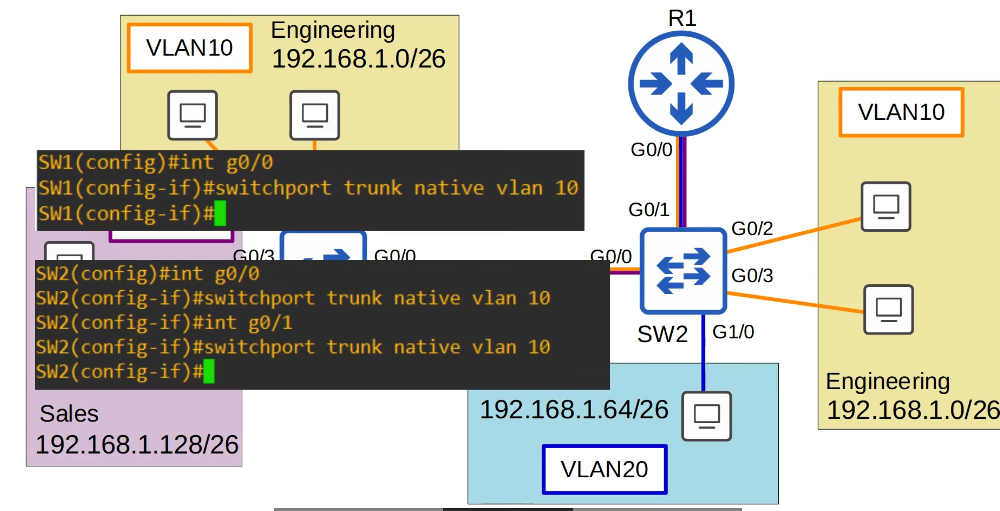

# Day 18 | VLANs (Part 3)

이 글은 Jeremy’s IT Lab의 유튜브 CCNA 200-301 과정을 참고하고 정리한 내용입니다.

[https://www.youtube.com/playlist?list=PLxbwE86jKRgMpuZuLBivzlM8s2Dk5lXBQ](https://www.youtube.com/playlist?list=PLxbwE86jKRgMpuZuLBivzlM8s2Dk5lXBQ)

# VLANs (Part 3)

이번 글에서 다룰 내용들

- 이전 내용에 추가해 VLAN 간 라우팅을 위해 ROAS를 사용할 때 라우터에서 기본 VLAN 개념을 사용하는 방법
- dot1q 태그를 확인하기 위해 몇 가지 Wireshark 분석(Wireshark는 네트워크 엔지니어를 위한 도구)
- VLAN 간 라우팅의 마지막 방법인 Layer3 Switching.Multilayer Switching(항상 스위치가 레이어2 장치이고 IP주소를 사용하지 않는다고 했지만, 많은 최신 스위치는 실제로 레이어3도 지원한다)

## Native VLAN on a router(ROAS)

- Native VLAN 기능은 일부 보안 문제를 일으킬 수 있으므로 기본 VLAN을 사용하지 않는 VLAN으로 설정하는 것이 좋은 방법이라고 말했었음.

- 이 데모에서는 모든 트렁크에서 사용된 VLAN인 VLAN10으로 다시 설정하겠음.
- 기본 VLAN을 구성하는 방법에는 두 가지가 존재
    1. `encapsulation dot1q [vlan-id] native` 명령어 
        - 이는 하위 인터페이스가 기본 VLAN에 속하며 스위치의 기본 VLAN처럼 작동한다는 것을 라우터에게 알려준다. 태그가 지정되지 않은 프레임은 기본 VLAN에 속한다고 가정하고 기본 VLAN으로 정송된 프레임은 태그가 지정되지 않는다.
        
        
        
        - SW2에서 R1 으로 보내는 핑
            
            
            
        - R1에서 다시 SW2로 보내는 핑
            
            
            
            
            
            - 여기에는 dot1q 태그가 없음
            - R1과 SW2는 모두 태그가 지정되지 않은 프레임이 VLAN10에 속한다는 것을 이해하므로 각 프레임에 dot1q로 태그를 지정할 필요가  없다.
            - VLAN10 이 모든 장치에서 기본 VLAN으로 구성되어 있으므로 해당 ICMP 에코 요청은 태그가 지정되지 않은 대상까지 계속된다.
            - VLAN10의 PC가 ICMP 에코 응답을 보내면 R1에 도달할 때까지 태그가 해제되며, R1은 VLAN 20에 태그를 지정하고 요청을 보낸 PC로 다시 보낸다.
    2. 하위 인터페이스를 전혀 사용하지 않고 라우터의 물리적 인터페이스에서 기본 VLAN에 대한 IP주소를 구성하는 것 이 경우 `encapsulation dot1q` 명령은 필요하지 않음.
        
        
        
        - `no interface` → 하위 인터페이스 삭제
        
        
        

## Layer 3 (Multilayer) Switches

- 멀티레이어 스위치의 기능
    - 스위칭과 라우팅이 모두 가능
    - 레이어3을 인식(일반 레이어2 스위치는 레이어3을 인식하지 않음 주소나 레이어2 이상의 항목에 대해 전혀 생각하지 않음.)
    - 라우터와같은 인터페이스에 IP 주소를 할당가능. 레이어3 스위치를 사용하면 라우터의 인터페이스처럼 작동하는 라우팅된 포트를 구성할 수 있음.
    - 물리적 인터페이스뿐만 아니라 각 VLAN에 대하 가상 인터페이스를 생성하고 해당 인터페이스에 IP주소를 할당할 수도 있음.
    - 라우터와 마찬가지로 멀티레이어 스위치에서도 정적 경로와 같은 경로를 구성할 수 있음.
    - VLAN 간 라우팅에 사용할 수 있음.
    - 

## Inter-VLAN Routing via SVI

- SW2와 R1 사이의 트렁크 링크를 지점 간 레이어3 링크로 교체했으며 더 이상 이 링크를 통해 VLAN을 실행하지 않는다.
- VLAN20의 PC가 VLAN10에 있는 PC에 핑을 보내는 경우
    
    
    
    - PC에서 SW2로, SW2 → R1, VLAN20으로 태그가 지정되고 R1 → SW2, VLAN10으로 태그가 지정되고 SW2 → SW1로, VLAN10으로 태그 지정, 마지막으로 대상 PC로 이동한다.
    - 그러나 SW2는 다층 스위치이다. VLAN 간 라우팅을 위해 트래픽을 R1으로 보낼 필요는 없다. **Switch Virtual Interfaces(SVIs)** 이라는 기능을 사용하면 할 수 있다.
        - SVIs: 멀티레이어 스위치에 IP 주소를 할당할 수 있는 가상 인터페이스
        - SVI(라우터 x)를 게이트웨이 주소로 사용하도록 각 PC를 구성한다. ROAS를 사용할때 라우터는 PC의 게이트웨이로 사용되었다.
        - 트래픽을 다른 서브넷/VLAN으로 보내기 위해 PC는 스위치로 트래픽을 보내고 스위치는 트래픽을 라우팅한다.
        
        
        
        - 이것이 SW2에서 구성한 SVI
        - 이는 ROAS에서 수행할 때 R1에 구성한 것과 동일한 IP 주소이며 각 서브넷에서 마지막으로 사용 가능한 IP 주소이다. 따라서 이는 이미 각 PC에 게이트웨이 주소로 구성되어 있으므로 PC 구성을 변경할 필요가 없다.
        - 두 PC 사이의 트래픽이 이동하는 경로를 살펴보자.
            
            
            
            - 대상은 192.168.1.0/26 서브넷에 있다.
            - 이제 SW2에는 자체 라우팅 테이블이 있으므로 라우팅 테이블에서 대상을 조회하고 대상이 VLAN10 SVI에 연결되어 있는지 확인한다. 따라서 이제 트래픽이 VLAN10으로 라우팅된다.
            - SW2의 MAC 주소 테이블에 대상 MAC 주소가 없으면 모든 VLAN 10 인터페이스에 프레임이 플러딩 된다.
            - 그러나 이미 MAC 주소를 학습했기 때문에 이를 VLAN10이라는 태그가 붙은 트렁크 인터페이스를 통해 SW1로 전달한다고 가정해보겠음.
            - 그런다음 SW1은 이를 대상으로 전달한다.
        - 이제 호스트가 LAN 외부의 대상에 도달하려고 하면 어떻게 될까? (예를들어 인터넷을 표현하기위해 R1에 연결된 클라우드를 추가함.
            
            
            
            - SW2는 기본 게이트웨이이므로 서브넷 외부로 향하는 모든 패킷은 SW2로 전송됨
            - 그러나 SW2와 R1간의 연결을 위한 ROAS는 더 이상 작동하지 않음.
            - 멀티레이어 스위치에서 가상 인터페이스인 SVI를 구성하는 것 이외에도 스위치 포트가 아닌 라우터 인터페이스처럼 작동하도록 물리적 인터페이스를 구성할 수도 있음.
            - 따라서 SW2와 R1 사이의 이 지점 간 링크에 서브넷 192.168.1.192/30을 할당할 수 있음.
            - SW2의 G0/1 인터페이스에는 IP 주소가 192.168.1.193이고 R1의 G0/0 인터페이스에는 192.168.1.194
            - 그런 다음 R1을 가리키는 SW2의 기본 경로를 구성해 LAN 외부로 향하는 모든 트래픽이 R1으로 전송된다.
            
            
            
            - 먼저 ROAS 구성에서 R1의 라우터를 제거하고 G0/0에서 새 IP 주소를 구성
            
            
            
            - `ip routing` → 스위치에서 레이어3 라우팅을 활성하하고 라우터처럼 자체 라우팅 테이블을 구축할 수  있음.
            - `no switchport` 인터페이스를 레이어2 스위치 포트에서 레이어3 라우팅 포트로 변경하는 명령어
            
            
            
            
            
            
            
            - SVI가 up/up이 되기 위해 필요한 조건
                - 먼저 스위치에 VLAN이 존재해야함.
                - 스위치에는 up/up 상태의 VLAN에 최소한 하나의 액세스 포트가 있어야 하며 up/up 상태에 있는 VLAN을 허용하는 and/or 하나 트렁크 포트가 있어야한다.
                - VLAN은 종료되어서는 안된다.
                - SIV 자체가 종료되면 당연히 up/up되지 않으므로 SVI를 생성한 후에는 기본적으로 종료되므로 no shutdown 명령을 사용해야 한다.
            
             
            
            
            
            - 우리가 생성한 SVI에 대한 경로 테이블에 연결된 경로와 로컬 경로가 추가된 것을 볼 수 있으며 모두 각 VLAN의 SVI에 직접 연결된 것으로 표시된다.

## Quiz 1

정답: b, c

b는 하위 인터페이스에서 `encapsualtion dot1q native` 명령을 사용한다. 이는 라우터에서 기본 VLAN을 구성하기 위한 하나의 옵션

c는 하위 인터페이스가 아닌 물리적 인터페이스에서 IP주소를 간단히 구성하는 명령어 이 경우 `encapsualtion dot1q` 명령이 필요하지 않음. 

## Quiz 2

정답: a, d

SVI가 up/up 상태가 되려면 스위치에 VLAN이 있어야 하며 up/up 상태인 VLAN에 액세스 인터페이스가 있거나 다음을 허용하는 트렁크 인터페이스가 있어야한다. `switchport mode trunk` 또는 `switchport access vlan` 명령을 실행할 필요가 없다.

## Quiz 3

정답: a

`no swtichport` → 인터페이스가 라우팅된 포트로 구성되고 인터페이스에서 IP 주소를 구성할 수 있다. 

c는 스위치에서 IP 라우팅을 활성화하는데 사용되지만 개별 인터페이스를 라우팅 포트로 설정하지는 않는다. 

## Quiz 4

정답: b

switchport mode trunk native vlan 44 명령을 실행했기 때문에 기본 VLAN의 트래픽은 트렁크 인터페이스를 통해 전송될 때 태그가 지정되지 않는다. 따라서 VLAN 44 트래픽에는 태그가 지정되지 않을 것이다.