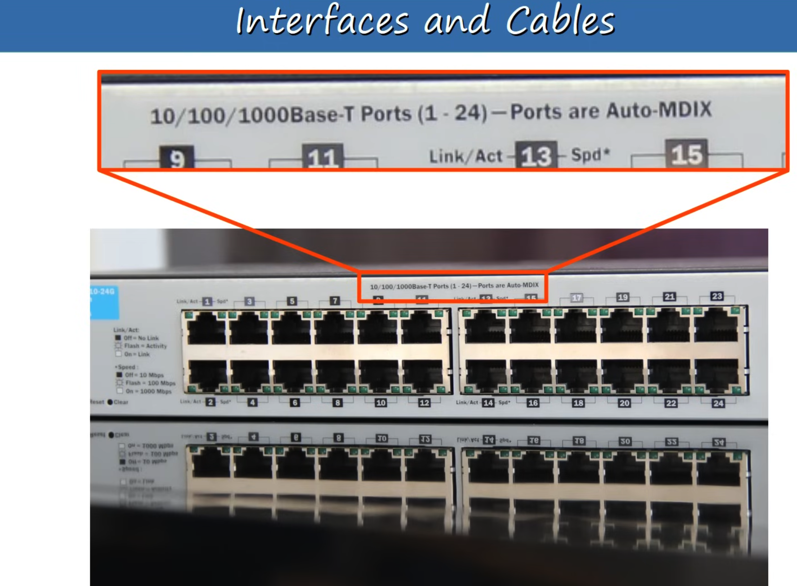

# Day 2 | Interfaces and Cables | Connecting Devices | Lab

이 글은 Jeremy’s IT Lab의 유튜브 CCNA 200-301 과정을 참고하고 정리한 내용입니다.

[https://www.youtube.com/playlist?list=PLxbwE86jKRgMpuZuLBivzlM8s2Dk5lXBQ](https://www.youtube.com/playlist?list=PLxbwE86jKRgMpuZuLBivzlM8s2Dk5lXBQ)

# Interfaces and Cables

RJ-45 커넷터는 구리 이더넷 케이블 끝에 사용된다. 

- 이더넷이란?
    - 단순한 단일 프로토콜이 아닌 네트워크 프로토콜 및 표준의 모음

한 사람은 영어로 소통하고 다른 사람은 일본어로 소통한다면 의사소통이 어려울 것이다. 네트워크 프로토콜은 네트워크 장치에 대한 이러한 목적을 제공한다. 

컴퓨터는 0과 1로 동작한다. 전기 신호 또한 0과 1로 동작 

8비트 = 1바이트. 속도는 초당 비트 단위로 측정된다. 

이더넷 표준 

- IEE 802.3에 정의되어있음(1983)
    
    
    
- 이더넷 표준에 사용되는 구리 케이블은 `UTP 케이블`이다.
    - UTP는 비차폐 연선 쌍을 나타냄.
        
        
        
    - 4쌍의 케이블이 서로 꼬여있음 → 8개의 전선
    - 10BASE-T, 100BASE-T의 경우
        
        
        
        - PC는 1, 2번 핀에서 데이터를 전송하고 스위치의 인터페이스는 1, 2번 핀에서 데이터를 수신
        - 스위치에서 핀 3과 6은 전송하는데 사용하고 PC는 이를 수신하는데 사용
        - 동시에 데이터를 전송하는데 문제가 없음 → Full - Duplex
        
        
        
        - 구리 이더넷 케이블에는 양쪽 끝에 하나씩 2개의 RJ-45 커넥터가 있다는 것을 기억하자.
        - 라우터는 1, 2번 핀을 통해 전송하고 3, 6번 핀을 통해 받는데 만약 라우터와 라우터의 경우에는 어떻게 하나? 한쪽이 1, 2번이 전송이면 다른쪽은 수신인데 다른쪽도 라우터 이므로 전송을 해야하는데..? (스위치의 경우에도 3번, 6번 핀)
        - Crossover cable의 경우 동일한 핀 번호에 직접 연결되지 않음.
        
        
        
        
        
        
        
- 현재는 직선 or 교차 케이블에 대해 걱정할 필요가 없는 수준으로 네트워크가 발전함. Auto MDI-X기술
    - 1000BASE-T, 10GBASE-T의 경우
        - 8개의 와이어가 모두 사용된다.
            
            
            
        - 각 쌍은 양방향임. 매우 빠름
        
- 구리 UTP 배선은 최대 100미터까지 사용할 수 있음. LAN에서는 가능하지만 대규모 네트워크에선?
    
    
    
    스위치 
    
- 노란색 박스 → RJ45 커넥터용 포트 24개(구리 UTP 케이블을 열견할 포트), 빨간색 박스 →
    
    
    
    라우터 
    
    - SFP 트랜시버를 인터페이스에 삽입 후 아래 케이블을 연결
        
        
        
        - 각 끝에는 두개의 커넥터가 있는데 각각 데이터를 수신, 송신
        
        
        
        - 구리 UTP 케이블의 경우 케이블 내에서 별도의 와이어 쌍을 사용해 데이터를 전송하고 수신했음.
        - 위와같이 광섬유 케이블은 전송 및 수신을 위한 별도의 케이블을 사용
        
        
        
        1. 유리섬유 코어 자체: 빛은 이 코어 아래로 전송되어 현 장치에서 다른 장치로 데이터를 전송 
        2. 빛을 반사하는 클래딩 
        3. 유리섬유가 파손되지 않도록 보호하는 보호 버퍼 
        4. 케이블의 외부재킷
        
        광섬유 케이블의 종류
        
        - Single-mode
        - Multi-mode
        
        
        
        
        
- 광섬유 표준
    
    
    
- UTP vs 광섬유 케이블링
    
    
    
    - UTP
        - 광섬유 케이블 보다 저렴
        - 거리가 최대 100m
        - EMI(전자기 인터페이스)에 취약할 수 있지만 케이블 쌍의 꼬임이 이를 방지하는데 도움
        - UTP 케이블이 연결되는 RJ45포트는 광섬유 연결에 사용되는 SFP보다 저렴
        - UTP 케이블은 케이블 외부에서 희미한 신호를 방출하거나 누출하여 데이터를 복사하는데 사용될 수 있음. 보안 위험.
    - Fiber-Optic
        - UTP 보다 비쌈
        - UTP보다 최대 길이가 김
        - SFP포트는 RJ45 포트보다 비쌈
        - 단일모드 광섬유는 다중모드 보다 비쌈
        - 케이블 외부로 신호를 방출하지 않으므로 보안 위험이 없음
        

## Quiz 1

정답: a

## Quiz 2

정답: c

UTP는 비용을 절감하지만 100m가 최대. 단일 모드 광섬유는 150보다 더 긴걸 제공하지만 다중모드보다 비쌈 

## Quiz 3

정답: b

UTP는 100미터 거리까지밖에 지원 x, 다중 모드 광섬유는 3km 지원 x

## Quiz 4

정답: a

제대로 작동하고 있음. Auto MDI-X가 활성화 되어있다. 따라서 직선 케이블로 연결되어있어도 통신이 가능하다. 

## Quiz 5

정답: a

# Connecting Devices | Lab

- 동일한 유형의 장치에서는 Crossover cable이 필요
- R1과 R2의 경우 50M 이므로 구리 케이블 사용, 하지만 R3와 R4는 250m이므로 광섬유 사용, R1과 R3의 경우는 3 km이므로 단일 모드 광섬유를 사용