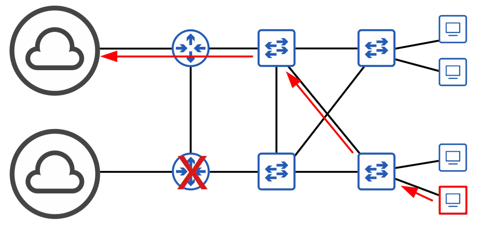

# Day 20 | Spanning Tree Protocol (Part 1)

이 글은 Jeremy’s IT Lab의 유튜브 CCNA 200-301 과정을 참고하고 정리한 내용입니다.

[https://www.youtube.com/playlist?list=PLxbwE86jKRgMpuZuLBivzlM8s2Dk5lXBQ](https://www.youtube.com/playlist?list=PLxbwE86jKRgMpuZuLBivzlM8s2Dk5lXBQ)

# **Spanning Tree Protocol (Part 1)**

이번에 다룰 내용들 

- 네트워크의 중복성과 왜 중요한지
- STP(Spanning Tree Protocol)

## Network Redundancy

- 중복성은 네트워크 설계의 필수 부분
- 현대 네트워크는 하루 24시간/주 7일/1년 365일 운영된다. 짧은 시간 중단되어도 비즈니스에 재앙이 될 수 있다.
- 하나의 네트워크 구성 요소에 장애가 발생하면  가동 중지 시간동안 다른 구성 요소가 이를 이어받도록 해야함.
- 가능한 한 네트워크의 모든 지점에서 중복성을 구현해야함.

- 위와같은 라우터에 하드웨어 오류가 발생해 다운되더라도 다른 대체 경로를 통해 인터넷에 연결할 수 있다.

- 하지만 위 스위치가 고장나면 스위치에 연결된 모든 호스트의 연결이 끊어진다.
- 대부분의 PC에는 단일 네트워크 인터페이스 카드(NIC)만 있으므로 단일 스위치에만 연결할 수 있다.
- 그러나 중요한 서버에는 일반적으로 여러개의 NIC가 있으므로 중복성을 위해 여러 스위치에 연결할 수 있다.

- 스패닝 트리는 레이어2 포로토콜이며 중복 레이어2 네트워크를 활성화하므로 여기 LAN 내에서는 인터넷으로 라우팅되지 않고 레이어3의 네트워크 간에 라우팅된다.

### Broadcast Storms

- PC1이 PC2로 일부  트래픽을 전송하려고 한다. 그러기 위해서는 PC2의 MAC 주소를 알아야한다.
- 따라서 PC1이 브로드캐스트 프레임인 ARP 요청 프레임을 보낸다고 가정하면 FFFF.FFFF.FFFF 브로드캐스트 MAC 주소를 Layer2로 사용한다.

- PC2가 ARP 요청을 수신하고 응답을 보냈지만 이러한 브로드캐스트 프레임은 여전히 네트워크에 남아있다.
- 무한으로 Flooding이 일어남. IP 헤더의 TTL(Time To Live) 필드 → Layer3에서 무한 루프를 방지하기 위해 사용
- 그러나 이더넷 헤더에는 TTL 필드가 없음. 이러한 브로드캐스트 프레임은 네트워크를 무한정 반복한다. → 루프된 브로드캐스트가 네트워크에 충분히 축적되면 네트워크가 너무 혼잡해 합법적인 트래픽이 네트워크를 사용할 수 없게 된다. → **Broadcast Storms**
    
    
    
    - 결국 이런식으로 될 것이다.
- 그러나 네트워크 정체만이 유일한 문제는 아님.
- 프레임이 스위치 포트에 도착할 때마다 스위치는 소스 MAC 주소 필드를 사용해 MAC 주소를 학습하고 MAC 주소 테이블을 업데이트 한다. 동일한 소스 MAC 주소를 가진 프레임이 다른 인터페이스에 반복적으로 도착하면 스위치는 MAC 주소 테이블에서 인터페이스를 지속적으로 업데이트한다. → **MAC Address Flapping**
- 그렇다면 레이어2 루프가 발생하지 않는 중복 경로가 있는 네트워크를 어떻게 설계할 수 있을까? → Spanning Tree Protocol

## Spanning Tree Protocol

- 현재 우리가 부르는 STP는 Classic Spanning Tree Protocol은 IEEE 802.1D이다.
- 레이어2 루프를 방지하는 것이 매우 중요하기 때문에 모든 공급업체의 스위치는 기본적으로 STP를 실행한다.
- STP는 중복 포트를 차단 상태로 설정해 레이어2 루프를 방지해 본질적으로 인터페이스를 비활성화한다.
- 이러한 인터페이스는 활성 인터페이스, 즉 현재 전달 중인 인터페이스에 장애가 발생할 경우 forwarding stat로 들어갈 수 있는 백업 역할을 한다.
- forwarding state 의 인터페이스는 정상적으로 작동한다.
- 그러나 blocking state의 인터페이스는 STP 메세지(BPDUs = Bridge Protocol Data units) 및 기타 특정 트래픽만 보내고 받는다.

- SW3의 주황색 인터페이스는 blocking state에 있어 SW2와 SW3간의 연결을 효과적으로 비활성화할 수 있다.
- 사실상 그 링크는 존재하지 않으며 이것이 토폴로지이다.
    
    
    
    
    
    - 더이상 무한 루프가 발생하지 않음.
    - 그러나 어느 시점에서 다른 인터페이스가 실패하면 아마도 SW2의 인터페이스가 실패할 것이다.
    - 스위치는 자동으로 토폴로지를 조정하고 브로드캐스트 프레임은 이와같이 flooding 되며 다시 루프가 발생하지 않는다.
        
        
        
- 어떤 포트가 전달되고 어떤 포트가 차단되는지 선택함으로써 STP는 네트워크의 각 지점에 대한 단일 경로를 생성한다. 이렇게하면 레이어2 루프가 방지된다.
- 어떤 포트를 전달해야하고 어떤 포트를 차단해야 하는지 결정하기 위해 STP가 사용하는 설정된 프로세스가 존재한다.
- STP 지원 스위치는 모든 인터페이스에서 Hello BPDU를 보낸다. 기본 타이머는 2초이므로 2초마다 한 번씩 모든 인터페이스에서 Hello BPDU를 보낸다.
- 스위치는 인터페이스에서 Hello BPDU를 수신하면 인터페이스가 다른 스위치에 연결되어 있음을 알고 라우터, PC등은 STP를 사용하지 않으므로 Hello BPDU를 보내지 않는다.
- 토폴로지로 돌아가서 이러한 스위치는 다음과 같이 각 인터페이스에서 BPDU를 보낸다.
    
    
    
    - 이들은 이러한 BPDU를 사용해 자신을 다른 스위치에게 알리고 다른 스위치에 대해 학습한다.
- 그렇다면 이 BPDU는 정확이 어떤용도로 사용되나?
    - 우선 스위치는 STP BPDU의 Bridge ID 필드 중 하나를 사용해 네트워크의 root bridge를 선택한다.
    - 가장 낮은 Bridge ID를 가진 스위치가 루트 브리지가 된다.
    - 루트 브리지의 모든 포트는 전달 상태가 되며 토폴로지의 다른 스위치에는 루트 브리지에 도달할 수 있는 경로가 있어야한다. 따라서 STP는 네트워크 레이어2 루프를 방지하기 위해 포트를 blocking or forwarding state로 설정한다.
    - 그러나 방금 말한 것처럼 루트 브리지에서는 모든 포트가 포워딩되고 다른 모든 스위치에서는 루트 브리지에 도달할 수 있는 경로가 있어야한다.
    - 전통적으로 스패닝 트리의 BPDU의 브리지 ID 필드는 다음과 같다.
        
        
        
        - 길이가 16비트인 브리지 우선순위 필드가 있고 , 이미 알고 있듯이 길이가 48비트인 스위치의 MAC 주소가 있다.
        - 모든 스위치에서는 기본 브리지 우선순위는 32768이므로 기본적으로 MAC 주소가 순위 결정자로 사용된다.

- 각 스위치의 우선순위와 MAC 주소를 기록했다.
- MAC 주소는 16진수 12자리인데 쉽게하기위해 3자리로 줄임.
- 인터페이스가 forwarding 인지 blocking인지 표시하기위해 포트 표시등도 추가
- 각 스위치의 G0/2인터페이스는 PC에 연결되어 있으므로 BPDU를 수신하지 않기 때문에 forwarding 모드로 전환하는 것이 안전하다는 것을 알고 레이어2 루프를 생성할 위험이 없으므로 이러한 포트가 켜진다.
- 가장낮은 MAC 주소는 A.A.A이므로 SW1이 루트 브리지가 됨. 루트 브리지의 모든 포트가 지정 포트가 됨.

- 브리지 우선순위에 VLAN ID를 포함하는 이유는  Cisco 스위치는 Per-VLAN Spanning Tree(PVST)를 의미하는 STP 버전을 사용한다. PVST는 각 VLAN에서의 별도 STP 인스턴스를 실행하므로 각 VLAN에서 서로 다른 인터페이스가 전달되거나 차단될 수 있다.
- 하나의 인터페이스는 VLAN1에서는 전달되지만 VLAN2에서는 차단될 수 있다.
- VLAN ID를 브리지 우선순위에 추가하면 스위치는 각 VLAN에서 다른 브리지 ID를 갖게 된다.
- Bridge Priority 필드
    
    
    
    - 왜 32768이 기본 브리지 우선순위일까? 아마 이 필드의 길이는 16비트이고 기본적으로 최상위 비트는 1로 설정되어 있기 때문
    - 그러나 Extended System ID가 추가되면서 브리지 우선순위에 VLAN ID 번호가 추가되면서 변경되었다.
    - 따라서 기본 VLAN ID는 1이므로 총 브리지 우선순위는 실제로 32768이 아니라 32769이다.
    - VLAN 번호를 변경하지 않고 스위치의 브리지 우선 순위를 높이려면 증가/감소의 최소 단위는 얼마일까?
        
        
        

- root bridge의 모든 인터페이스는 지정 포트이며 지정 포트는 전달 상태이다. designated ports는 스패닝 트리의 포트 역할 중 하나이다.
- 스위치의 전원이 켜지면 해당 스위치를 root bridge로 가정한다.
- ‘superior BPDU’를 수신한 경우레먼 위치를 포기하며 superior는 브리지 id가 낮은 스위치로부터 BPDU를 의미한다.
- 토폴로지가 수렴되고 모든 스위치가 루트 브리지에 동의하면 루트 브리지만 BPDU룰 보낸다. 모슨 스위치가 처음에 BPDU를 보내는 이유는 모두 자신이 루트 브리지라고 생각하기 때문이다.
- 네트워크의 다른 스위치는 루트 브리지에서 BPDU를 전달하지만 자체 원래 BPDU를 생성하지는 않는다.

### Spanning Tree Quiz 1

- 4개로 구성된 네트워크에서 루트 브리지는 무엇인가?
    - 답: SW3
        
        SW1과 SW3 우선순위가 모두 12289로 동일하지만 SW3의 MAC 주소가 더 낮다.
        

### Spanning Tree Quiz 2

- 4개로 구성된 네트워크에서 루트 브리지는 무엇인가?
    - 답: SW4

스패닝 트리 

- 1단계: 가장 낮은 브리지 ID를 가진 스위치가 루트 브리지로 선택. 루트 브리지의 모든 포트는 designated ports 이므로 포워딩 상태
- 2단계: 다른 모든 스위치는 해당 포트 중 하나를 root port로 선택. 즉, 루트 브리지를 제외하고 네트워크의 각 스위치에 하나의 루트포트가 있음을 의미. 루트 비용이 가장 낮은 인터페이스가 루트 포트가 된다.
- 3단계:

- 루트 비용은 루트 브리지 경로를 따라 나가는 인터페이스의 총 비용이다.

- SW1은 루트 브리지므로 모든 인터페이스에서 비용이 0이다.
- 그러면 SW2가 어떤 포트를 루트 포트로 선택할까?
    - 위 빨간색 박스를 바탕으로 G0/1을 루트포트로
    
    
    
    - 위는 SW3의 루트 포트 선택
- 그러나 스위치에 루트 비용이 동일한 포트가 여러개 있을 경우 어떻게 해야할까?
    - 이 경우 가장 낮은 브리지ID를 가진 인터페이스가 루트 포트로 선택된다.

### Spanning Tree Quiz 3

- 4개로 구성된 네트워크에서 루트 브리지는 무엇인가?
    - 답: SW2
- 어떤 포트가 루트 포트일까?
    
    
    
    - 답:
        
        
        
        모든 인터페이스는 기가비트 이더넷이므로 비용은 4이다. 루트비용이 동일하면 스위치는 브리지 ID가 가장 낮은 인접항목에 연결된 인터페이스를 선택한다. 
        
        SW3에서는 비용이 동일하지만 SW1이 SW4보다 낮은 브리지 ID므로 G0/0이 루트포트 
        
    
- 루트비용이 동일하고 인접 브리지 ID도 동일하면 어떻게 될까?
- → 포트 ID가 가장 낮은 인접 스위치의 인터페이스에 연결된 인터페이스가 루트포트가 된다.

### Spanning Tree Quiz 4

- SW1과 SW3 사이에는 두 개의 연결이 있다 SW3는 어떤 포트를 루트포트로 사용하나?
    - 답: G0/2
        
        이웃 스위치 SW1의 낮은 포트 ID에 연결되어 있기 때문 
        

### Spanning Tree Quiz 5

- 루트 브리지를 식별하고 네트워크의 각 스위치에서 각 인터페이스 역할을 식별해 어떤 인터페이스가 루트 포트인지, 지정된 포트인지, 지정되지 않은 포트인지 확인
    - 답:
    - 루트 브리지: SW3
    
    
    
    - SW1의 루트포트: G0/1, SW2의 루트포트: G0/2, SW4의 루트포트: G0/0

### Spanning Tree Quiz 6

- 루트 브리지를 식별하고 네트워크의 각 스위치에서 각 인터페이스 역할을 식별해 어떤 인터페이스가 루트 포트인지, 지정된 포트인지, 지정되지 않은 포트인지 확인
    - 답:
    - 루트 브리지: SW4
    
    
    
    - SW1의 루트포트: G0/1, SW2의 루트포트: G0/0, SW3의 루트포트: G0/1