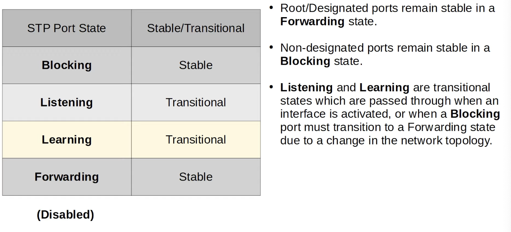

# Day 21 | Spanning Tree Protocol (Part 2)

이 글은 Jeremy’s IT Lab의 유튜브 CCNA 200-301 과정을 참고하고 정리한 내용입니다.

[https://www.youtube.com/playlist?list=PLxbwE86jKRgMpuZuLBivzlM8s2Dk5lXBQ](https://www.youtube.com/playlist?list=PLxbwE86jKRgMpuZuLBivzlM8s2Dk5lXBQ)

# **Spanning Tree Protocol (Part 2)**

1부에서는 스패닝 트리의 기본 목적과 스패닝 트리 토폴로지를 계산하는 방법에 중점을 두었음. 2부에서는 스패닝 트리의 동작에 대해 자세히 살펴보겠다.

다룰 내용들

- STP states/times
- STP BPDU
- STP optional features
- STP configuration
    - 스패닝 트리 구성은 기본적으로 실행되므로 실제로 구성할 필요는 없다. 어떤 스위치가 루트 스위치가 되는지 변경하는 방법을 알아야 트래픽이 최상의 경로를 따르도록 할 수 있다.

## Spanning Tree port States

- Blocking과 forwarding은 안정적인 상태이다.
- Root 및 Designated 포트는 Forwarding 상태에서 안정적으로 유지되고, Non-designated 포트는 Blocking 상태에서 안정적으로 유지
- Listening and Learning은 인터페이스가 활성화될 때 또는 네트워크 토폴로지 변경으로 인해 차단 포트가 전달 상태로 전환되어야 할 때 통과되는 전환 상태이다.
- **Blocking State**
    
    
    
    - 지정되지 않은 포트는 Blocking state
    - Blocking state의 인터페이스는 루프를 방지하기 위해 효과적으로 비활성화된다.
    - 이것이 스패닝 트리를 작동하게 하고 루프를 피하기위해 중복 인터페이스를 비활성화하는 것
    - Blocking state의 인터페이스는 일반 네트워크 트래픽을 보내거나 받지 않음. 이 상태의 인터페이스에 도착하는 모든 일반 트래픽은 삭제된다.
    - 그러나 Blocking state의 인터페이스는 STP BPDU를 수신한다. 전달은 하지 않음.
    - MAC 주소를 학습하지 않는다.
- Blocking 상태 이후 Designated 또는 Root 역할이 있는 인터페이스가 **Listenging state**로 들어간다
    
    
    
    - Designated 또는 Root 포느만 수신대기 상태로 들어가고 Non-designated port는 항상 차단된다.
    - Listening은 최종적으로 Forwarding 상태로 이어지는 과도기적 상태이기 때문에 Non-designated 포트가 이 상태로 진입할 필요가 없다.
    - Listening 상태의 기본 길이는 15초
    - Listening 상태의 인터페이스는 스패닝 트리 BPDU만 전달/수신 한다.
    - 인터페이스에 도착하는 일반 트래픽에서 MAC 주소를 학습하지 않는다.
        - 프레임이 스위치 인터페이스에 도착하면 스위치는 소스 MAC 주소 필드를 사용해 해당 MAC 주소를 학습하고 MAC 주소, 인터페이스 및 VLAN 정보로 MAC 주소 테이블을 업데이트한다.  그러나 인터페이스가 스패닝 트리 Listening 상태에 있으면 이 작업을 수행하지 않는다.
- Listening state 이후에는 Designated or Root 포트가 **Learning state**로 들어간다.
    
    
    
    - 학습 상태는 기본적으로 15초
    - 기본적으로 Listening, Learning state를 모두 거쳐 Forwarding state로 들어가는데 총 30초가 걸린다.
    - Listening과 마찬가지로 Learning state의 인터페이스는 STP BPDU만 수신/송신. 또한 일반 트래픽을 받거나 보내지 않음.
        - 그러나 여기에 차이가 존재한다. Learning state의 인터페이스는 인터페이스에 도착하는 일반 트래픽에서 MAC 주소를 학습한다. → 따라서 MAC 주소 테이블 중 일부를 미리 구축해 트래픽 전달을 준비하고 있다.
- **Forwarding state**
    
    
    
    - Root 및 Designated port는 안정되면 Forwarding state에 있다.
    - Forwarding state의 포트는 정상적으로 동작한다. → BPDU를 보내고 받는다.
    - 일반적인 트래픽을 보내고 받는다.
    - 도착하는 프레임에서 MAC 주소를 학습해 MAC 주소 테이블에 추가한다. 따라서 정상적으로 작동하는 스위치 포트이다.
- Spanning Tree Port 요약
    
    
    

## Spanning Tree Timers

- Hello 타이머
    - 루트 브리지가 Hello BPDU를 보내는 빈도를 결정, 기본적으로 2초
    - 네트워크의 다른 스위치는 자체 BPDU를 생성하지 않지만 수신한 BPDU를 전달한다.
    - 스위치는 지정된 포트에서만 BPDU를 전달한다.
    
     
    
    
    
- Forward delay 타이머
    - 포트가 forward로 이동할때 거치는 Listening과 Learning state의 길이, 이는 두 상태를 합친 길이가 아니라 각 상태의 길이
- Max Age 타이머
    - 이 타이머는 인터페이스가 BPDU 수신을 중단한 후 스패닝 트리 토폴로지를 변경하기까지 기다리는 시간을 나타냄.
    - Max Age 타이머가 0으로 카운트다운 되기 전에 또 다른 BPDU가 수신되면 시간은 20초로 재설정 되고 변경사항이 발생하지 않음.
    - 그러나 다른 BPDU가 수신되지 않으면 Max Age 타이머는 0으로 카운트다운 되고 스위치는 루트 브리지, 로컬 루트, 지정 및 비지정 포트를 포함한 STP 선택을 다시 평가한다.
    - 이러한 결정 후 지정되지 않은 포트가 지정 또는 루트 포트가 되도록 선택되면 차단 상태에서 청취 상태, 학습 상태로 전환된 후 마지막 전달 상태가 된다. → 따라서 blocking state가 forwarding state로 전환되는데 총 50초가 걸릴 수 있음.
    - 이러한 타이머와 전환상태는 너무 빨리 Forwarding state로 전환되는 인터페이스로 인해 루프가 실수로 생성되지 않도록 오래걸리는 것이다.
    - 하지만 Blocking state는 인터페이스를 차단해 루프를 생성할 염려가 없으므로 바로 blocking state로 이동할 수 있다.
- Spanning Tree BPDU
    
    
    
    - Cisco의 PVST+는 BPDU에 대상 MAC 주소 0100.0cccc.cccd를 사용한다.
        - PVST는 트렁크 캡슐화를 위해 Cisco의 ISL만 지원하는 이전 버전
        - PVST+는 dot1q를 지원하는 최신 버전
    - 일반적으로 STP는 대상 MAC 주소로 0100.0cccc.cccd 사용

## Spanning Tree Optional Features(STP Toolkit)

- 스패닝 트리의 몇 가지 선택적 기능
- Portfast
    
    
    
    - 각 스위치에 G0/2 인터페이스와 같이 최종 호스트에 연결된 인터페이스에서 Portfast를 활성화할 수 있음
    - Portfast를 사용하면 포트가 Listening 및 Learning을 우회해 즉시 Forwarding state로 전활될 수 있다.
    - Portfast를 사용하는 경우 최종 호스트에 연결된 포트에서만 활성화해야한다.
        - 다른 스위치에 연결된 포트에서 활성화되면 레이어2 루프가 발생할 수 있다.
        - Listening 및 Learning state 목적은 루프 발생을 방지하는 것이므로 다른 스위치에 연결되어 있을 때 이를 우회하는 것은 위험하다.
    - 스패닝 트리는 configuration 없이도 기본적으로 동작하기 때문에 아직 다른 스패닝 트리의 구성은살펴보지 않았다.
    - 일반적인 스패닝 트리 구성을 살펴보고 portfast를 살펴보겠다.
        
        
        
- BPDU Guard
    - BPDU Gurad가 활성화된 인터페이스가 스위치로부터 BPDU를 수신하면 루프가 형성되는 것을 방지하기 위해 인터페이스가 종료된다.
        
        
        
- Root Guard & Loop Guard
    - 인터페이스에서 루트 가드를 활성화하면 해당 인터페이스에서 우수한 BPDU를 수신하더라도 스위치는 새 스위치를 루트 브리지로 허용하지 않는다. 인터페이스가 비활성화된다.
    - 인터페이스에서 루프 가드를 활성화하면 인터페이스가 BPDU 수신을 중지하더라도 전달이 시작되지 않는다. 인터페이스가 비활성화된다. 이는 인터페이스가 한 방향으로만 실패할 경우 발생할 수 있는 루프를 방지해 데이터를 수신할 수 없지만 계속 전달할 수 있거나 그 반대인 ‘단방향 링크’를 발생시킨다.

## Configure the Spanning Tree mode

- 기본 루트 브리지를 구성하는 방법 → `spanning-tree vlan [vlan-번호] root primary`

- 두번째 루트 `spanning-tree vlan [vlan-번호] root secondary`

### Spanning Tree Quiz 7

- 이 네트워크에는 두 개의 VLAN10과 20이 활성화 되어있다. 기본적으로 SW3은 두 VLAN의 루트 브리지이다. SW1을 VLAN10의 기본 루트로 구성하고 VLAN20의 보조 루트로 구성한다. SW2를 VLAN20의 기본 루트로 구성하고 VLAN10의 보조 루트로 구성한다. SW1에서 실행해야하는 명령어 두 개와 SW2에서 실행해야하는 명령어 두 개는 무엇인가?
    - 답:
        
        
        
    
    
    
    
    

### Spanning Tree Quiz 8

정답: a, c

a - portfast는 스위치포트가 Listening 및 Learning 스패닝 트리 상태를 우회하고 즉시 전달 상태로 들어갈 수 있도록 한다. 

c - 순방향 지연 타이머는 listening 및 learning 상태의 지속 시간을 결정한다. 

### Spanning Tree Quiz 9

정답: c

포트 ID의 앞부분인 16진수 80이 STP 포트 우선순위이다. 16진수 80은 10진수 128과 같다. 

### Spanning Tree Quiz 10

정답: d

BPDU가드는 인터페이스에서 BPDU가 수신되면 잠재적인 루프를 방지하기 위해 인터페이스를 종료한다. 최종 호스트에 연결된 portfast 지원 스위치 포트에서 활성화되어야한다. 

## Quiz

정답: d

Switch A의 모든 액세스 포트는 Portfast를 사용한다. 이는 액세스 레이어 스위치 포트에 연결된 호스트에 대한 더 빠른 연결을 지원한다. PortFast가 활성화되지 않은 경우 스위치 포트는 전달 상태로 들어가기 전에 STP listening 및 learning 상태를 통해 전환된다. 기본 타이머를 사용하는 경우 이 프로세스는 30초 정도 걸릴 수 있다. 또한, 포트 집계 프로토콜이 활성화된 경우 포트 초기화에는 최대 50초가 걸릴 수 있다.