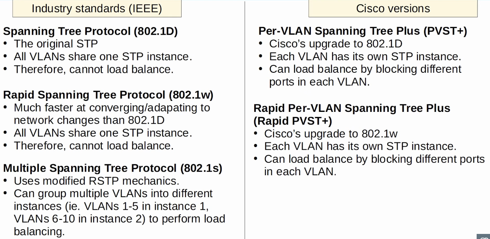
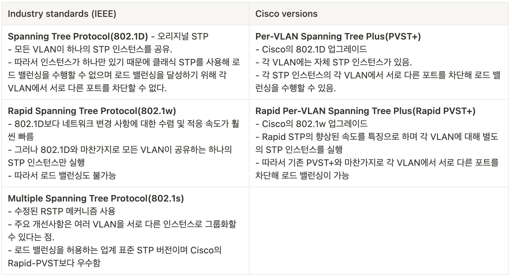

# Day 22 | Rapid Spanning Tree Protocol

이 글은 Jeremy’s IT Lab의 유튜브 CCNA 200-301 과정을 참고하고 정리한 내용입니다.

[https://www.youtube.com/playlist?list=PLxbwE86jKRgMpuZuLBivzlM8s2Dk5lXBQ](https://www.youtube.com/playlist?list=PLxbwE86jKRgMpuZuLBivzlM8s2Dk5lXBQ)

# **Rapid Spanning Tree Protocol**

이전 강의에서 다룬 Classic Spanning Tree는 매우 느릴 수 있으며 토폴로지 변경 후 네트워크가 수렴하는데 최대 50초가 걸릴 수 있음을 확인했다. 

Rapid Spanning Tree는 이 시간을 향상시켜 네트워크 변경 사항에 응답하는데 몇 초 밖에 걸리지 않는다. 

이번 글에서는 다음 내용들을 다룬다. 

- 다양한 STP 버전 비교
- Rapid PVST+

## STP Versions

## Rapid Spanning Tree Protocol

RSTP는 802.1D와 같은 타이머 기반 스패닝 트리 알고리즘이 아니다. 따라서 RSTP는 802.1D가 링크를 전달하는데 걸리는 30초 이상의 시간을 향상시킨다. 프로토콜의 핵심은 포트가 Forwarding으로 직접 이동할 수 있도록 하는 새로운 bridge-bridge handshake 메커니즘이다. 

이것이 바로 RSTP와 802.1D STP의 큰 차이점이다. 802.1D는 긴 타이머를 사용해 다음 상태로 안전하게 이동할 수 있는 시기를 결정하며, 이러한 타이머는 포트가 전달을 시작할 때 실수로 루프가 생성되지 않도록 하기 위해 매우 길다. 원래 STP가 생성되었을 당시에는 포트가 변경사항에 반응하고 트래픽 전달을 시작하는데 30 ~ 50초가 걸릴 수 있다. 그러나 더 이상 그렇지 않다. 

따라서 RSTP는 handshake 메커니즘을 사용함. 이를 통해 스위치는 다른 스위치와 적극적으로 협상하고 적절한 경우 포트를 즉시 Forwarding 상태로 이동할 수 있다.  

- STP와 RSTP의 유사점
    - RSTP는 STP와 동일한 목적을 수행, 특정 포트를 차단해 레이어2 루프를 방지한다.
    - RSTP는 STP와 동일한 규칙으로 루트 브리지를 선택한다.
    - RSTP는 또한 STP와 동일한 규칙을 사용해 루트 포트를 선택한다.
    - RSTP는 STP와 동일한 규칙으로 designated 포트를 선택한다.
        - 따라서 루트 비용이 가장 낮은 스위치의 인터페이스가 지정되고 다른 스위치의 인터페이스는 지정되지 않음.
- STP와 RSTP의 차이점
    
    
    
    
    
    - RSTP는 포트 상태를 단순화해 3개(Blocking, Listening, Disabled)를 하나로 결합해 총 3개로 줄인다. → Discarding
        
        
        
- RSTP에서는 루트 포트 역할이 변경되지 않는다. → 루트 브리지에 가장 가까운 포트가 스위치의 루트 포트가 된다. (’가장 가까운’이란 루트 비용이 가장 낮은 포트를 의미)
- 또한 루트 브리지는 루트 포트가 없는 유일한 스위치.
- Designated port 역할도 RSTP에서 변경되지 않는다.
    - 가장 좋은 BPDU를 보내는 세그먼트(collision domain)의 포트는 해당 세그먼트의 지정 포트이며, 세그먼트 당 지정 포트는 하나만 있을 수 있다. 세그먼트의 다른 포트는 루트 포트이거나 클래식 스태닝 트리의 지정되지 않은 포트이다.
- 그러나 Non-designated 포트 역할은 RSTP에서 두 가지 역할로 나누어져있다.
    - alternate port 역할
        - 다른 스위치로부터 superior  BPDU를 수신하는 discarding 포트
        - alternate 포트는 기본적으로 root 포트에 대한 백업 역할을 한다.
        - root 포트에 장애가 발생하면 스위치는 즉시 최적의 alternate 포트를 새로운 root 포트로 전달하도록 이동할 수 있다.
    - backup port 역할
        - 동일한 스위치의 다른 인터페이스로부터 superior BPDU를 수신하는 discarding 포트
        - 이는 두 인터페이스가 허브를 통해 동일한 collision domain에 연결된 경우에만 발생한다.
        - 그러나 현대 네트워크에선 허브가 사용되지 않으므로 RSTP 백업 포트를 접하지 못할 수도 있음.
        - Designated 포트에 대해 백업 역할

### RSTP Quiz 1

- 네트워크에 있는 각 스위치 인터페이스의 루트 브리지와 RSTP 포트 역할을 식별해라. 허브는 스패닝 트리에 참여하지 않는다. 허브는 스패닝 트리를 사용할 만큼 정교하지 않으므로 수신하는 모든 프레임을 플러딩한다.
- 답:
    - 루트 브리지는 SW1
    - SW2와 SW3의 루트 포트는 명백하며 루트 비용이 가장 낮다. 허브는 STP에 참여하지 않으므로 BPDU에 비용을 추가하지 않는다. 그런데 SW4가 G0/0대신 G0/1을 선택한 이유는 SW2의 MAC 주소가 SW3보다 낮기 때문에 G0/1ㅌ을 통해 Neighbor Bridge ID가 더 낮기 때문이다.
    
    
    

- Rapid STP를 실행하는 모든 스위치는 자체 BPDU를 보낸다.
- 스위치는 또한 BPDU 정보를 훨씬 더 빠르게 ‘age’한다. 클래식 STP에서 스위치는 10회의 Hello 간격(20초)를 기다린다. Rapid STP에서 스위치는 3개의 BPDU(6초)를 놓치면 이웃이 손실한 것으로 간주한다.  그러면 해당 인터페이스에서 학습된 모든 MAC 주소가 삭제된다는 의미로 ‘flush’ 된다.
    - 왜? → 이웃이 다운되었기 때문에 더 이상 해당 인터페이스를 통해 아무 것도 연결할 수 없다는 것을 알고 있다.

## RSTP Link Types

- RSTP는 세 가지 다른 link types을 구별한다.
    1. Edge: 에지 포트는 최종 호스트에 연결되는 포트이다. 협상 없이 바로 forwarding으로 넘어간다. 
        
        
        
    2. Point-to-point: 이는 두 스위치 간의 직접 연결에 사용된다. 
        
        
        
    3. Shared: 허브에 대한 연결. 충돌을 방지하려면 이러한 연결이 반이중으로 작동해야gka
        
        
        

## Summary

### RSTP Quiz 2

- 답: b, d, e
    
    b - portfast는 최종 호스트에 연결된 에지 포트가 forwarding state로 빠르게 이동할 수 있도록 한다. 
    
    d, e - 인터페이스 오류가 발생하는 경우 포트가 빠르게 forwarding state로 이동할 수 있다.
    

### RSTP Quiz 3

- 답: d
    
    edge는 RSTP의 링크 유형이지만 이를 구성하기 위해 `spanning-tree link type` 명령을 사용하지 않으며 명령에 edge라는 단어도 포함되지 않는다. RSTP 에지 포트를 구성하려면 `spanning-tree portfast`명령을 사용해 인터페이스에서 portfast를 구성하기만 하면 된다.
    

### RSTP Quiz 4

- 답:
    
    SW4가 아닌 SW2를 Designated port를 사용한이유: SW2의 루트비용이 더 낮기 때문 
    
    
    

### RSTP Quiz 5

- 답: c