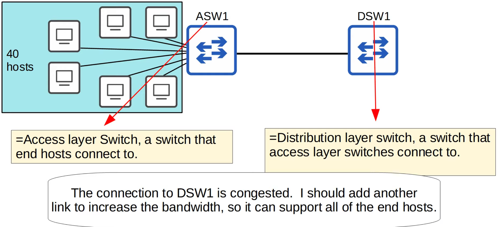

# Day 23 | EtherChannel

이 글은 Jeremy’s IT Lab의 유튜브 CCNA 200-301 과정을 참고하고 정리한 내용입니다.

[https://www.youtube.com/playlist?list=PLxbwE86jKRgMpuZuLBivzlM8s2Dk5lXBQ](https://www.youtube.com/playlist?list=PLxbwE86jKRgMpuZuLBivzlM8s2Dk5lXBQ)

# EtherChannel

EtherChannel을 사용하면 여러 물리적 인터페이스를 단일 논리적 인터페이스로 작동하는 그룹으로 그룹화해 마치 단일 인터페이스인 것처럼 작동할 수 있다. 

다룰 내용들

- EtherChannel이 무엇인지, 그리고 어떤 문제를 해결하는지
- Layer2 및 Layer3 EtherChannel을 구성하는 다양한 방법
    - 레이어2 이더넷 채널은 단일 인터페이스로 작동하는 스위치 포트 그룹이고 레이어3 이더넷 채널은 레이어3이기 때문에 IP주소를 할당하는 단일 인터페이스로 작동하는 라우팅된 포트 그룹이다.

## EtherChannel

- ASW는 액세스 스위치의 약자로 PC나 서버 등 최종 호스트가 연결하는 스위치
- DSW는 분배 레이어 스위치를 의미하며 액세스 레이어 스위치가 연결되는 스위치
- 위 데모에서는 ASW1에 연결된 많은 최종 호스트(40개)가 있고 모두 작업을 수행하기 위해 인터넷에 액세스하려고 한다고 가정해보겠다.
- 네트워크 관리자는 DSW1에 대한 연결이 혼잡하다는 것을 알아차리고 모든 최종 호스트를 지원할 수 있도록 대역폭을 늘리기위해 다른 링크를 추가해야 한다고 결정한다.
    - → 그래서 네트워크 관리자는 또 다른 링크를 추가하고 상황을 모니터링한다. 그러나 도움이 크게되진 않음.
        
        
        
    - 그래서 또 다른 링크 추가
        
        
        
    - 최종 호스트에 연결된 인터페이스의 대역폭이 배포 스위치에 대한 연결의 대역폭보다 큰 경우 이를 **oversubscription**이라고 한다. 일부 oversubscription은 허용되지만 너무 많으면 혼잡이 발생할 수 있다.
    - 그러나 DSW1에 대한 링크가 3개 있어도 혼잡이 더 나아지지 않는 것 같아 또 다른 링크를 추가
        
        
        
        - 문제가 존재한다.
            
            
            
        - 두 개의 스위치를 여러 링크로 연결하면 스패닝 트리에 의해 하나를 제외한 모든 스위치가 비활성화된다.
        - ASW1의 모든 인터페이스가 전될되는 경우 ASW1과 DSW1 사이에 레이어2 루프가 형성되어 boradcast storms 이 발생한다.
        - 활성 링크가 실패하지 않는 한 다른 링크는 사용되지 않는다. 이 경우 비활성 링크 중 하나가 전달을 시작한다.
        - 따라서 백업 링크가 있다는 것은 좋은 일이지만 다양한 이유로 장애가 발생할 수 있기 때문에 이 세 가지 인터페이스를 비활성화하고 트래픽을 전달하지 않는 것은 대역폭 낭비다.
            - 그러나 이러한 4개의 물리적 인터페이스를 하나의 논리적 인터페이스로 구성함으로써 EtherChannel은 이 문제를 해결해 중복성과 대역폭 증가를 모두 제공할 수 있다.

- EtherChannel은 여러 인터네이스를 그룹화해 단일 인터페이스처럼 작동한다.
- STP는 이 그룹을 단일 인터페이스로 처리한다. 따라서 이러한 인터페이스를 이더넷 채널로 그룹화한 후 네트워크 관리자는 다시 한 번 링크 표시등을 확인한다. 이번에는 모두 녹색
- EtherChannel은 이러한 4개의 물리적 인터페이스를 단일 인터페이스로 만든다. ASW1은 단일 인터페이스에서 동일한 브로드캐스트 프레임의 복사본 4개를 보내지 않는다.
- EtherChannel을 사용하는 트래픽은 그룹의 물리적 인터페이스 간에 로드 밸런싱된다.
- EtherChannel의 다른 세 인터페이스에서 프레임을 전달하지 않은 이유는 무엇인가? → 비록 이 EtherChannel에는 4개의 개별 물리적 인터페이스가 포함되어 있지만 이들은 단일 인터페이스처럼 작동한다. DSW1은 수신된 동일한 인터페이스에서 브로드캐스트 프레임을 다시 보내지 않는다.
- EtherChannel의 다른이름
    - Port Channel
    - LAG(Link Aggregation Group)

## EtherChannel Load-Balancing

- ‘flows’기반으로 로드 밸런싱을 수행
    - flows: 네트워크의 두 노드 간의 통신
- 동일한 흐름의 프레임이 동일한 물리적 인터페이스를 사용해 전달된다.
- 동일한 흐름의 프레임이 서로 다른 물리적 인터페이스를 사용해 전달된 경우 일부 프레임의 순서와 맞지않게 대상에 도착해 문제가 발생할 수 있다.

- Configuration
    
    
    
    
    
    - `show etherchannel load-balance` - 사용중인 로드 밸런싱 방법 확인
    - `port-channel load-balance method` - 로드 밸런싱 구성
- EtherChannel 구성하는 방법에는 3가지가 존재
    1. PAgP(Port Aggregation Protocol)
        - Cisco 독점 스위치
        - EtherChannel의 생성 및 유지 관리를 동적으로 협상(like DTP)
    2. LACP(Link Aggregation Control Protocol)
        - 업계 표준 프로토콜 (IEEE 802.3ad)
        - PAgP와 동일한 기능 수행(EtherChannel의 생성 및 유지 관리를 동적으로 협상)
    3. Static EtherChannel
        - 이 경우 EtherChannel을 구성해야 하는지 여부를 결정하는데 프로토콜이 사용되지 않는다.
        - 대신 인터페이스는 EtherChannel을 형성하도록 정적으로 구성된다.
        - 스위치가 EtherChannel을 동적으로 유지하기를 원하기 때문에 이는 일반적으로 피한다.
            - 예: 인터페이스에 문제가 있는 경우 스위치가 EtherChannel에서 인터페이스를 제거하기를 원한다.
    - 하나의 EtherChannel에 외대 8개의 인터페이스를 구성할 수 있다. 실제로 LACP는 최대 16개까지 혀용하지만 8개만 활성화되고 나머지 8개는 대기 모드에 있어 활성 인터페이스가 실패할 때까지 기다린다.

### PAgP Configuration

### LACP Configuration

### Static EtherChannel Configuration

### EtherChannel Configuration

- 물리적 인터페이스인 멤버 인터페이스에는 일치하는 구성이 있어야한다.
    - → Same duplex (full/half)
    - → Same speed
    - → Same switchport mode (access/trunk)
    - → Same allowed VLANs/native VLAN (for trunk interfaces)
- 개별 인터페이스의 구성이 다른 구성과 일치하지 않으면 EtherChannel에서 제외된다.
- `show etherchannel summary`
    
    
    

## Layer 3 EtherChannel

- ASW1과 DSW1을 멀티레이어 스위치로 교체, 이들 간의 레이어2 연결 대신 레이어 3 연결을 사용
- EtherChannel을 사용하더라도 여러 스위치가 루프로 함께 연결되면 레이어2 루프가 계속 발생할 수 있음
    
    
    
    - 스위치 간의 모든 연결은 EtherChannel을 사용하지만 포트 채널 인터페이스를 차단하지 않으면 브로드캐스트가 아래와 같이 스위치 주변을 계속 반복해 broadcast storms을 일으킬 수 있다.
        
        
        
    - 따라서 스패닝 트리는 이러한 포트 채널 인터페이스 중 하나를 차단한다.
        
        
        
        - 그러나 이러한 스위치 간 연결이 모두 레이어2 스위치 포트가 아닌 라우팅된 포트를 사용해 이루어진 경우에는 스패닝 트리를 실행할 필요가 전혀 없다.
        - 라우팅된 포트는 레이어2 브로드캐스트를 전달하지 않으므로 레이어2 루프가 형성될 수 없다.
- Layer 3 EtherChannel 구성방법
    
    
    
    - `channel-group` 명령을 사용하기 전  `no switchport` 명령을 사용해 레이어3 라우팅 인터페이스로 만든다.
        - `no switchport` 명령어는 Cisco 스위치의 인터페이스에서 사용되는 명령어로, 해당 인터페이스를 레이어 2 모드(스위치 포트)에서 레이어 3 모드(라우팅 포트)로 변경하는 데 사용. 이 명령어는 일반적으로 다중 계층 스위치(멀티레이어 스위치)에서 사용
        
        ### 역할 및 기능
        
        - **레이어 2 모드 (스위치 포트)**:
            - 기본적으로 Cisco 스위치의 인터페이스는 레이어 2 모드로 설정.
            - 이 모드에서는 인터페이스가 VLAN 트래픽을 처리하고 MAC 주소 학습 및 브리징을 수행
            - `switchport` 명령어로 인터페이스를 레이어 2 모드로 설정할 수 있다.
        - **레이어 3 모드 (라우팅 포트)**:
            - `no switchport` 명령어를 사용하면 인터페이스가 레이어 3 모드로 전환
            - 이 모드에서는 인터페이스가 라우팅 기능을 수행하며, IP 주소를 할당받고 레이어 3 트래픽을 처리할 수 있다.
            - 스위치가 라우터처럼 동작하게 되어, 각 포트가 개별적인 라우팅 인터페이스가 된다.
        
        
        
    
    
    

## Command Review

## Quiz 1

정답: a, c, g

a) on - on 은 EtherChannel을 협상하기 위해 PAgP 또는 LACP를 사용하지 않는 정적 EtherChannel을 생성한다. 

c) desirable - auto는 PAgP를 사용해 EtherChannel을 생성 

g) active - active는 LACP를 사용해 EtherChannel을 생성 

## Quiz 2

정답: b

인터페이스는 포트 채널에 번들로 제공된다. EtherChannel의 멤버 인터페이스 옆에 표시하려는 플래그이다.

## Quiz 3

정답: c, d

이는 인터페이스가 EtherChannel을 형성하기위해 일치해야하는 두 가지 설정이다. 

## Quiz 4

정답: b