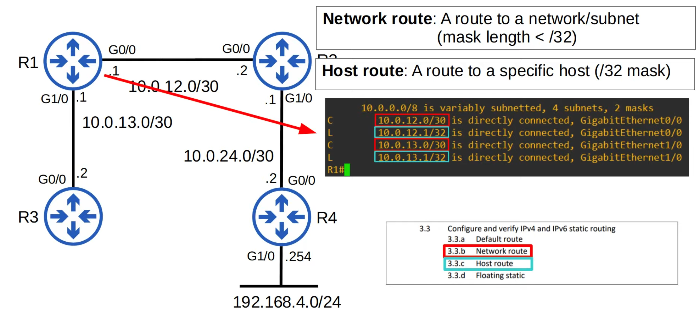

# Day 24 | Dynamic Routing

이 글은 Jeremy’s IT Lab의 유튜브 CCNA 200-301 과정을 참고하고 정리한 내용입니다.

[https://www.youtube.com/playlist?list=PLxbwE86jKRgMpuZuLBivzlM8s2Dk5lXBQ](https://www.youtube.com/playlist?list=PLxbwE86jKRgMpuZuLBivzlM8s2Dk5lXBQ)

# **Dynamic Routing**

Layer2에서는 VLAN, DTP, VTP, 스패닝 트리 및 EtherChannel을 공부했고 Layer3에 대해 공부하려고한다. 

이 글은 동적 라우팅에 관한 내용이다.

Dynamic Routing은 11일차에 배운 Static Routing과 대조된다. 정적 라우팅에는 `ip route` 명령으 사용해 각 대상에 대한 경로를 수동으로 구성하는 작업이 포함된다.  반면 동적 라우팅은 라우터에서 동적 라우팅 프로토콜을 구성한 다음 라우터가 대상 네트워크에 대한 최상의 경로를 찾도록 하는 작업이 포함된다. 고정되어 있지 않기 때문에 동적 라우팅이라고 한다. 

새 LAN을 추가하면 라우터는 새 대상 네트워크에 도달하는 방법을 서로 자동으로 알려준다. 

대상에 대한 하나의 경로를 사용할 수 없게되면 라우터는 자동으로 차선책 경로를 사용하기 시작한다. 

이번에 다룰 내용들은 다음과 같다.

- Dynamic routing protocols에 대한 소개
- Dynamic routing protocols의 유형
- Dynamic routing protocols metrics
    - metrics는 스패닝 트리 프로토콜의 루트 비용과 같이 대상이 얼마나 멀리 있는지 측정하는 방법이며 대상까지의 최적 경로를 결정하는데 사용된다.
- Administrative distance

## Dynamic Routing

- 인터페이스에 IP 주소가 구성될 때 자동으로 추가된 연결된 로컬 경로
- 각 라우터에 정적 경로를 구성하는 대신 동적 라우팅 프로토콜을 활성화할 수 있다.
    
    
    
- 오류가 발생해 R4의 G0/0 인터페이스가 다운된다면 어떨까?
    
    
    
    - 다른 라우터는 경로 테이블에서 경로를 자동으로 조정하고 제거한다.
    - 위를 보면 알 수 있듯이 R1은 경로를 제거했다. → 이렇게 하면 R1이 계속해서 트래픽을 막다른 골목으로 보내는 것을 방지할 수 있다.
    - 정적 라우팅을 사용할 때도 동일한 상황이 발생하면 어떻게 되나?
        
        
        
        - 동일한 장애가 발생하면 사용중인 동적 라우팅 프로토콜이 없기 때문에 R1은 더 이상 192.168.4.0 네트워크에 연결할 수 없다는 사실을 인식하지 못한다.
        - 해당 네트워크로 향하는 패킷을 수신하면 R2가 더 이상 네트워크에 도달할 수 없다는 사실을 인식하지 못한 채 해당 패킷을 R2로 계속 전달한다.
        - → 이것이 동적 라우팅의 이점이다. (유효하지 않은 경로를 제거)
        - 그러나 백업 경로가 있는지 확인해야 하므로 라우팅 테이블에서 대상 네트워크를 완전히 제거하는 대신 차선 경로로 교체한다.
- R3와 R4에 링크를 추가
    
    
    
    - G0/0 인터페이스를 비활성화 하면?
        
        
        
        - 자동으로 R3을 통한 경로로 대체되었다. (10.0.13.2를 통해)
        - 따라서 192.168.4.0에 대한 기본 경로를 잃었지만 트래픽은 여전히 이 경로를 따를 수 있다.
        - 이제 R3를 통한 경로보다 R2를 통한 경로가 선호되는 이유를 알아보자.
            
            
            
            - 위 연결은 기가비트 이더넷이 아닌 Fast 이더넷 연결이기 때문이다.
            - 우리는 루트 브리지로 가는 최적의 경로를 결정하는데 사용되는 루트 비용인라는 스패닝 트리 개념에 익숙하다.
            - 동적 라우팅 프로토콜은 유사한 개념을 사용해 대상에 대한 최상의 경로를 결정한다.
            - R1은 R2와 R3 모두에서 192.168.4.0/24 네트워크에 대해 배웠지만 R2를 통한 경로가 cost가 적기 때문에 더 우수하다고 판단함.
- 라우터는 동적 라우팅 프로토콜을 사용해 연결된 경로뿐만 아니라 다른 장치에서 학습한 경로에 대한 정보를 광고할 수 있다.
- 그들은 이 정보를 교환하기 위해 인접한 라우터와 adjacencies/neighbor relationships/neighborships을 형성한다.
- 목적지까지 여러 경로가 학습되면 라우터는 어떤 경로가 더 우수한지 결정하고 이를 라우팅 테이블에 추가한다. metric을 사용해 어느 것이 우수한지 결정한다.(낮은 metric이 우수함)

## Types of Dynamic Routing Protocols

- 동적 라우팅 프로토콜은 내부 gateway 프로토콜을 나타내는 **IGP(Interior Gateway Protocol)**과 외부 gateway 프로토콜을 나타내는 **EGP(Exterior Gateway Protocol)**의 두 가지 주요 범주로 나눌 수 있다.
    - IGP
        - 단일 조직인 단일 자율 시스템(AS) 내에서 경로를 공유하는데 사용된다.
    - EGP
        - 서로 다른 자율 시스템 간에 경로를 공유하는데 사용된다.
    
    
    

- **Distance Vector Routing Protocols**
    - Distance Vector 프로토콜은 Link State 프로토콜 이전인 1980년대 초에 발명
    - 거리 벡터 프로토콜 초기 예는 RIPv1과 Cisco의 독점 프로토콜 IGRP이며 나중에 업데이트 되어 EIGRP
    - 거리 벡터 프로토콜은 직접 연결된 이웃에게 다음 정보를 전송하여 작동
        - known destination 네트워크
        - known destination 네트워크에 도달하기 위한 메트릭
    - 이러한 경로 정보 공유 방식을 흔히 ‘routing by rumor’이라고 함. (라우터는 이웃 이외의 네트워크에 대해 알지 못하기 때문. 이웃이 알려주는 정보만 알고 있음.)
    - 거리 벡터라고 이름 붙인 이유는 라우터가 각 경로의 메트릭인 거리와 트래픽을 보내는 방향인 벡터만 학습하기 때문
    - 거리 벡터 프로토콜은 경로 테이블 또는 그 일부를 이웃과 공유해 작동한다.
    
    
    
- **Link State Routing Protocols**
    - 모든 라우터는 네트워크의 ‘연결 맵’을 생성한다.
    - 이 맵은 각 라우터에서 동일하다. 이를 허용하기 위해 각 라우터는 인터페이스, 연결된 네트워크에 대한 정보를 이웃에게 알린다. 이러한 광고는 네트워크의 모든 라우터가 동일한 네트워크 맵을 개발할 때까지 다른 라우터로 전달된다.
    - 그런 다음 각 라우터는 이 지도를 독립적으로 사용해 각 목적지에 대한 최적의 경로를 계산한다.
    - 이것이 Distance Vector 프로토콜의 ‘routing by rumor’과 어떻게 다른지 알 수 있을 것이다.
    - 링크 상태 프로토콜에서 각 라우터는 네트워크의 전체 그림을 가져와 최상의 경로를 계산할 수 있다. 링크 상태 프로토콜은 더 많은 정보가 공유되므로 라우터에서 더 많은 리소스, 더 많은 CPU 성능 및 메모리를 사용한다.
    - 그러나 링크 상태 프로토콜은 거리 벡터 프로토콜보다 네트워크 변화에 더 빠르게 반응하는 경향이 있다.
    - 현재 사용되는 두 가지 링크 상태 프로토콜은 OSPF와 IS-IS이다.

## Dynamic Routing Protocol Metrics

- 라우터의 라우팅 테이블에는 자신이 알고 있는 각 대상 네트워크에 대한 최상의 경로가 포함되어 있다.
- 동적 라우팅 프로토콜을 사용하는 라우터가 동일한 대상에 대한 두 개의 다른 경로를 학습하는 경우 어느 것이 ‘best’인지 어떻게 결정할까? → 경로의 메트릭 값을 사용해 가장 좋은 경로를 결정한다. 측정항목이 낮을 수록 더 나은 것으로 간주
- 각 라우팅 프로토콜은 서로 다른 측정항목을 사용해 어떤 경로가 가장 좋은지 결정한다.
    
    
    
    - 위 그림에서는 Fast 이더넷을 사용하기 때문에 비용이 높으므로 R2경로를 이용하지만 기가비트 이더넷을 사용하면 어떻게 될까?
        
        
        
        - R1의 라우팅 테이블에는 두 경로가 모두 테이블에 추가된 것을 볼 수 있다.
        - 따라서 라우터가 동일한 라우팅 프로토콜을 통해 동일한 대상, 동일한 메트릭을 사용하는 두 개 이상의 경로를 학습하면 둘 다 라우팅 테이블에 추가된다. 트래픽은 두 경로 모두에 걸쳐 부하 분산된다. 대상 네트워크 주소 및 prefix 길이가 정확히 동일해야한다.
            
            
            
            - 위 이미지는 동적 라우팅 프로토콜을 사용한 동일 비용 다중 경로 로트 밸런싱인 ECMP
            - OSPF의 AD는 110

- RIP
    - 가장 간단한 측정 기준인 hop 수를 사용.
    - 대상으로 가는 경로의 각 라우터는 하나의 hop으로 계산되며 총 측정항목은 대상에 도달하기 위한 총 hop 수
    - 가장 큰 단점은 모든 속도의 링크가 동일하며 모두 하나의 hop으로 간주된다.
- EIGRP
    - 기본적으로 대역폭과 지연을 기반으로 계산하는 가장 복잡한 IGP 측정항목을 사용
    - 하지만 구성을 다르게 사용하면 다른 요소도 계산할 수 있음.
    - 주목할 점은 경로에 있는 가장 느린 링크의 대역폭만 메트릭을 계산하는데 사용되지만 경로에 있는 모든 링크의 총 지연 값이 사용된다는 것
    - 이 ‘지연’값은 기본적으로 대역폭을 기반으로 인터페이스에 할당되는 값이므로 약간의 오해의 소지가 있다.
- OSPF
    - 해당 측정항목을 ‘cost’이라함
    - 각 링크의 비용은 대역폭을 기준으로 계산되며 경로에 있는 링크의 총 대역폭이 경로의 metric을 구성한다.
    - 이는 메트릭을 계산하는 매우 간단한 방법이지만 링크 속도를 고려하지 않는 RIP보다 더 좋다.
- IS-IS
    - 측정항목 - ‘cost’
    - 그러나 각 링크의 비용은 대역폭에 따라 자동으로 계산되지 않는다.
    - 모든 링크의 비용은 기본적으로 10이다. 따라서 아무런 구성 없이도 RIP와 동일하게 작동하며 단순한 hop 수 측정 기준이다.

- RIP는 홉 수만 고려한다.
    - R1은 한 경로가 더 느리더라도 트래픽을 부하를 분산한다.
- OPSF는 metric cost를 고려하므로 대역폭을 고려한다.
    - 따라서 R3와 R4 간의 연결 속도가 느려지면 메트릭 값이 높아지고 선호도가 낮아진다.
    - 따라서 위 빨간색 경로만 라우팅 테이블에 입력되고 R1은 R2를 통해 192.168.4.0/24 네트워크로 향하는 모든 트래픽을 보낸다.

## Administrative distance

- 대부분의 경우 회사는 네트워크에 단일 IGP(주로 OSPF or EIGRP)만 사용하지만 Cisco 장비만 사용하는 경우 EIGRP도 사용한다.
- 그러나 드문 경우에는 두 개를 사용할 수도 있다.
    - 예를들어, 두 회사가 정보를 공유하기 위해 네트워크를 연결하는 경우 두 개의 서로 다른 라우팅 프로토콜이 사용될 수 있다. OSPF를 실행하는 네트워크를 EIGRP를 실행하는 네트워크에 연결할 수 있다.
- Metric은 동일한 라우팅 프로토콜을 통해 학습된 경로를 비교하는데 사용된다.
    - 라우터가 OSPF를 통해 동일한 대상으로 향하는 두 개의 경로를 학습하면 메트릭을 사용해 어느 경로가 더 나은지 선택한다.
    - 그러나 서로 다른 라우팅 프로토콜을 사용하면 완전히 다른 측정항목을 사용하므로 비교할 수 없다.
        - 예를들어, 192.168.4.0/24에 대한 OSPF 경로의 메트릭은 30일 수 있지만 동일한 대상에 대한 EIGRP 경로의 메트릭은 33280일 수 있다. 어떤 경로가 더 좋을까? 어떤 경로를 라우팅 테이블에 넣어야할까? → OSPF와 EIGRP는 다른 측정항목을 사용하므로 질문에 답할 수 없다.
- 따라서 **Administrative distance** (AD)는 어떤 라우팅 프로토콜이 선호되는지 결정하는데 사용된다. 낮은 AD가 선호되며 라우팅 프로토콜이 더 ‘신뢰할 수 있는’ 것으로 간주되어 좋은 경로를 선택할 가능성이 더 높다는 것을 의미한다.

- AD가 255인 경로는 사용할 수 없다.
- 관리거리가 255인 경우 라우터는 해당 경로의 소스를 믿지 않으며 라우팅 테이블에 해당 경로를 설치하지 않는다.

## Quiz 1

정답: b

## Quiz 2

정답: c

## Quiz 3

정답: a

두 경로 모두 hop 수가 같기 때문 

## Quiz 4

정답: b

이들은 모두 prefix 길이가 다르기 때문에 동일한 목적지가 아니다. 따라서 위에 나타나있는 AD와 Metric번호는 관련이 없다. → 11일차에 말했듯이 가장 구체적으로 일치하는 항목을 사용 → 가장 구체적이란 가장 긴 Prefix를 의미한다. 즉 /28이 가장 길기 때문에 답은 B이다.