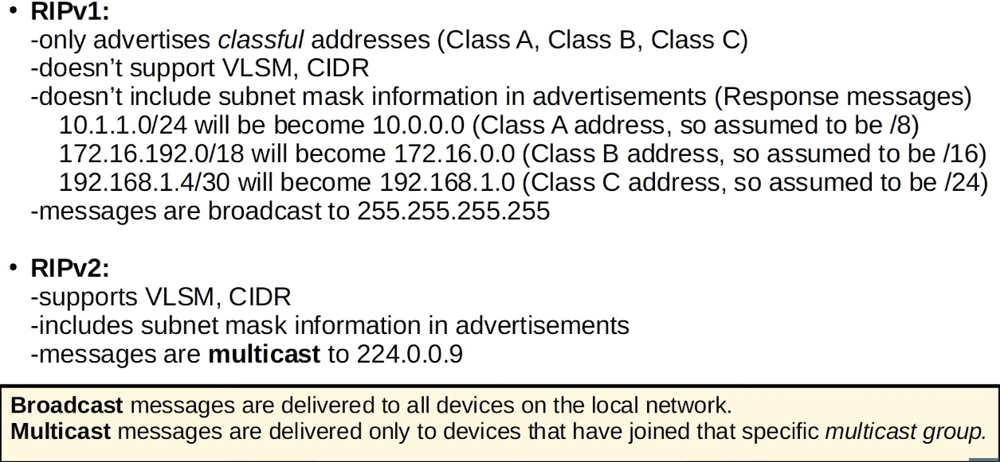

# Day 25 | RIP & EIGRP

이 글은 Jeremy’s IT Lab의 유튜브 CCNA 200-301 과정을 참고하고 정리한 내용입니다.

[https://www.youtube.com/playlist?list=PLxbwE86jKRgMpuZuLBivzlM8s2Dk5lXBQ](https://www.youtube.com/playlist?list=PLxbwE86jKRgMpuZuLBivzlM8s2Dk5lXBQ)

# **RIP & EIGRP**

이번에 다룰 내용들

- Routing Information Protocol(RIP)
- Enhanced Interior Gateway Routing Protocol(EIGRP)

## Routing Information Protocol(RIP)

- Cisco 독점 프로토콜이 아닌 업계 표준 프로토콜
- Distance vector IGP(routing-by-rumor 논리를 사용해 경로를 학습하고 공유)
- hop 수를 측정 기준으로 사용하며 대상 경로에 있는 각 라우터는 하나의 hop으로 계산되며 대역폭은 관련이 없다.
- 최대 hop 수는 15 → 대규모 네트워크에 사용할 수 없음.
- 3가지 버전 존재
    - RIPv1과 RIPv2는 IPv4에 사용된다.
    - RIPng는 IPv6에 사용
- RIP는 두 가지 메세지 유형을 사용해 라우팅 정보를 학습하고 공유
    - RIP-enabled 이웃 라우터에게 라우팅 테이블을 보내도록 요청
    - 응답 메세지로, 로컬 라우터의 라우팅 테이블을 인접 라우터로 보냄
- 기본적으로 RIP 지원 라우터는 30초마다 라우팅 테이블을 공유한다.

### RIPv1 and RIPv2

- `show ip protocols`

## Enhanced Interior Gateway Routing Protocol(EIGRP)

- 이전 IGRP의 향상된 버전
- Cisco의 소유였지만 이제 Cisco는 이를 공개적으로 게시해 다른 공급업체가 자사 장비에 EIGRP를 구현할 수 있도록 함
- 이는 advanced/hybrid 거리 벡터 라우팅 프로토콜로 간주됨
- 네트워크에 반응하는 속도는 RIP보다 훨씬 빠르다.
- 15개의 hop 수 제한이 없으므로 매우 큰 네트워크를 지원
- 멀티캐스트 주소 224.0.0.10을 사용해 메세지를 보냄
- 비용이 다른 로드 밸런싱을 수행할 수 있는 유일한 IGP이다.
    - 기본적으로 RIP와 같은 4개의 경로에 대해 ECMP 로드밸런싱을 수행하지만 비용이 동일하지 않은 여러 경로에 대해 로드 밸런싱을 수행하도록 구성할 수 있다.
- EIGRP는 일반 서브넷 마스크 대신 와일드 카드 마스크를 사용한다.

### Wildcard masks

- inverted된 서브넷 마스크

- 와일드카드 마스크의 0은 인터페이스 IP주소와 EIGRP 네트워크 명령 사이의 비트가 일치해야함을 의미한다.
- 와일드카드 마스크의 1은 비트가 일치할 필요가 없음을 의미한다.
    
    
    
    
    
    - match되지 않았으며 EIGRP가 인터페이스에서 활성화되지 않는다.
    
    
    
    
    
- `show ip protocols`

## Quiz 1

정답: a

R1의 기본 경로를 RIP 이웃에게 알리는데 사용된다.

## Quiz 2

정답: a

## Quiz 3

정답: d

수동 구성이 최우선이다. 라우터 ID를 수동으로 구성하지 않으면 루프백 인터페이스의 가장 높은 IP주소가 EIGRP 라우터 ID가 된다. 마지막으로 루프백 인터페이스가 없는 경우 물리적 인터페이스의 가장 높은 IP주소가 EIGRP의 라우터 ID가 된다.

## Quiz 4

정답: d