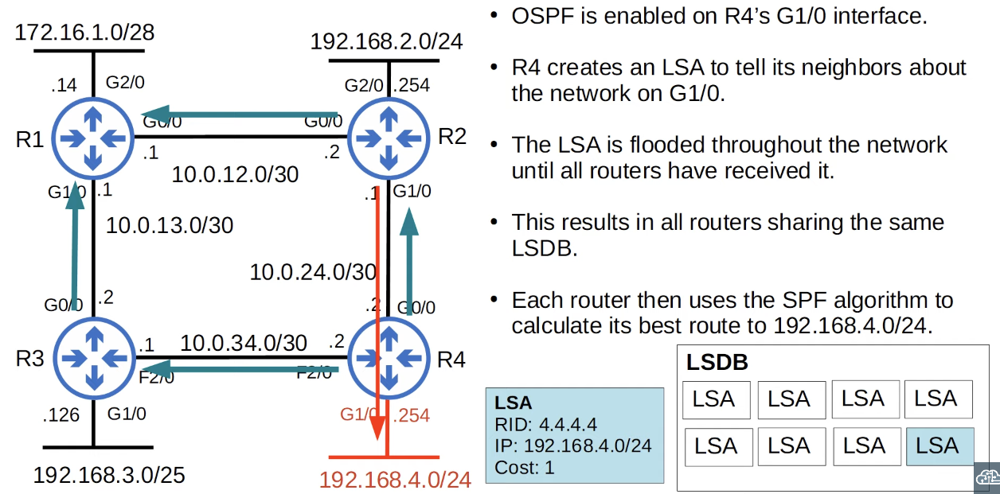

# Day 26 | OSPF Part 1

이 글은 Jeremy’s IT Lab의 유튜브 CCNA 200-301 과정을 참고하고 정리한 내용입니다.

[https://www.youtube.com/playlist?list=PLxbwE86jKRgMpuZuLBivzlM8s2Dk5lXBQ](https://www.youtube.com/playlist?list=PLxbwE86jKRgMpuZuLBivzlM8s2Dk5lXBQ)

# **OSPF Part 1**

이번 글에서 다룰 내용들 

- 기본 OSPF 작동
- OSPF Areas
- Basic OSPF Configuration

## Link State Routing Protocols

- 링크 상태 라우팅 프로토콜을 사용할 때 모든 라우터는 네트워크의 ‘connectivity map’을 생성한다.
- 이를 허용하기 위해 각 라우터는 인터페이스(연결된 네트워크)에 대한 정보를 이웃에게 알린다.
- 모든 라우터는 동일한 전체 네트워크 맵을 갖는다.
- 그런 다음 독립적으로 사용해 각 목지에 대한 최적의 경로를 계산한다.
- 이 프로세스로 인해 링크 상태 프로토콜은 더 많은 정보가 공유되므로 라우터에서 더 많은 리소스를 사용한다.
- 그러나 링크 상태 프로토콜은 거리 벡터 프로토콜보다 네트워크 변화에 더 빠르게 반응하는 경향이 있다.

## OSPF

- 최단 경로 우선 개방을 의미. 다른 이름은 Dijkstra’s algorithm
- 3가지 버전이 존재
    - OSPFv1 - 더이상 사용x
    - OSPFv2 - IPv4에 사용
    - OSPFv3 - IPv6에 사용
- 라우터는 LSDB(링크 상태 데이터베이스)라는 구조로 구성된 LSA(링크 상태 광고)에 네트워크에 대한 정보를 저장한다.
- 라우터는 OSPF영역의 모든 라우터가 동일한 네트워크 맵, 즉 동일한 LSDB를 개발할 때까지 LSA를 플러딩한다.

- 각 개별 LSA에는 기본적으로 30분인 aging timer가 있다.
- LSA는 타미어가 만료된 후 다시 플러딩되므로 기본적으로 30분마다 한 번씩이다.
- OSPF에는 LSA를 공유하고 네트워크의 각 대상에 대한 최상의 경로를 결정하는 프로세스의 세 가지 주요 단계가 있다.
    1. 동일한 세그먼트에 연결된 다른 라우터와 이웃이 되는 것 
    2. 이웃 라우터와 LSA를 교환하는 것 
    3. 각 라우터는 각 대상에 대한 최적의 경로를 독립적으로 계산해 라우팅 테이블에 삽입 

## OSPF Areas

- OSPF는 areas를 사용해 네트워크를 분할한다.
- 소규모 네트워크는 네트워크 성능에 부정적인 영향을 주지않고 단일 영역일 수 있다.
- 대규모 네트워크에서는 단일 영역설계가 일부 부정적인 영향을 미칠 수 있다.
    - SPF알고리즘은 대규모 네트워크에서 경로를 계산하는데 더 많은 시간이 걸린다.
    - 또한, SPF알고리즘은 계산을 수행하려면 각 라우터에서 기하급수적으로 더 많은 처리 능력이 필요하다.
    - 하나의 거대한 링크 상태 데이터베이스를 공유하는 각 라우터는 라우터에서 더 많은 메모리를 차지한다.
    - 네트워크에 작은 변화가 있을 때마다(예: 새 인터페이스) LSA가 500개 라우터에 모두 플러딩되고 해당 라우터 모두 SPF 계산을 다시 수행해야한다.
- 대규모 OSPF 네트워크를 여러 개의 작은 영역으로 나누면 위의 부정적인 영향을 피할 수 있다.

- **Area**란 동일한 LSDB, 링크 상태 데이터베이스를 공유하는 라우터 및 링크 집합이다.
- **backbone area**(area 0)은 다른 모든 영역이 연결되어야하는 특수 영역인 area
    
    
    
    - 예를들어 위와같은 경우 OSPF에서 허용되지 않는다.
- 모든 인터페이스가 동일한 영역에 있는 라우터를 **internal routers**라고 한다.
    
    
    
- 여러 영역에 인터페이스가 있는 라우터를 **area border routers(ABRs)**라고 한다. 서로 다른 OSPF 영역 간의 경계이기 때문
    
    
    
    - ABR은 연결된 각 영역에 대해 별도의 LSDB를 유지한다.
    - ABR은 최대 2개 영역에 연결하는 것을 권장한다.
    - ABR을 3개 이상 영역에 연결하면 라우터에 과부하가 걸릴 수 있다.
- 백본 영역에 연결된 라우터를 **backbone routers**라고 한다.
    
    
    
- **intra-area route**는 동일한 OSPF 영역 내의 목적지로 가는 경로이다.
    
    
    
- **interarea route**는 다른 OSPF 지역의 목적지로 가는 경로
    
    
    

### OSPF Area Rules

- OSPF영역은 연속되어야 한다.
- 모든 OSPF 영역에는 백본영역에 연결된 ABR이 하나 이상 있어야한다.
- 동일한 서브넷의 OSPF 인터페이스가 있어야한다. 같은 지역에 있지 않으면 OSPF 이웃이 되지 않으며 자신이 알고있는 네트워크에 대한 정보를 교환하지도 않는다.

### Basic OSPF Configuration

- OSPF는 EIGRP와 마찬가지로 와일드카드 마스크를 사용한다.

- `passive-interface g2/0`명령은 라우터에게 인터페이스 외부로 OSPF ‘hello’ 메세지 전송을 중지하도록 지시한다.
- 그러나 라우터는 인터페이스에 구성된 서브넷에 대해 이웃에게 알리는 LSA를 계속 보낸다.
- 따라서 R1은 G2/0에서 hello를 보내지 않고 OSPF 이웃을 찾으려고 시도하지만 여전히 다른 이웃에게 172.16.1.0/28 네트워크에 대해 알린다.
- OSPF 이웃이 없는 인터페이스에서 항상 이 명령을 사용해야 한다. 다른 라우터가 연결되지 않은 인터페이스에서 계속 hello 메세지를 보내는 것은 낭비다.
- `show ip protocols`
    
    
    
    - OSPF의 라우터 ID를 결정할 때 우선순위는 다음과 같다.
        1. 수동으로 구성
        2. loopback 인터페이스에서 가장 높은 IP주소 
        3. 라우터에 IP주소가 있는 loopback 인터페이스가 없는 경우 물리적 인터페이스의 가장 높은 IP주소 
    - 수동으로 구성하는 방법 OSPF configuration mode에서 `router-id` 명령 사용
        
        
        
    - **autonomous system boundary router**(ASBR)는 OSPF 네트워크를 외부 네트워크에 연결하는 OSPF 라우터이다.

## Quiz 1

정답: b, f

단일 영역 OSPF에는 area0을 사용하는 것이 일반적이지만 실제로는 모든 영역을 사용할 수 있다. 그리고 OSPF 프로세스 ID는 area 번호와 일치할 필요가 없다.

## Quiz 2

정답: c

c가 해당 범위에 두 IP주소를 포함하는 유일한 옵션이다. 

## Quiz 3

정답: 

1. 4개 
2. 3개
3. 1개

## Quiz 4

정답: b

먼저 기본 경로를 구성한 다음 `default-inforamation originate` 명령을 사용해 이를 OSPF에 알린다. 

## Quiz 5

정답: a

## Quiz 6

정답: a, d