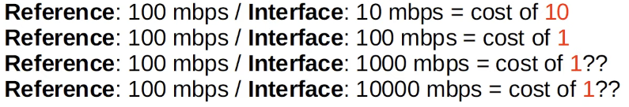

# Day 27 | OSPF Part 2

이 글은 Jeremy’s IT Lab의 유튜브 CCNA 200-301 과정을 참고하고 정리한 내용입니다.

[https://www.youtube.com/playlist?list=PLxbwE86jKRgMpuZuLBivzlM8s2Dk5lXBQ](https://www.youtube.com/playlist?list=PLxbwE86jKRgMpuZuLBivzlM8s2Dk5lXBQ)

# **OSPF Part 2**

이번 글에서 다룰 내용들

- OSPF metric(cost)
- 라우터가 OSPF 이웃이 되는 방법
- OSPF Configuration

## OSPF Cost

- 기본적으로 인터페이스의 속도인 대역폭을 기준으로 자동 계산된다.
- 인터페이스 비용은 **reference bandwidth**라는 값을  인터페이스 대역폭으로 나누어 계산한다.
- 기본 reference bandwidth는 100mbps
    - 예를들어, 초당 10MB속도를 갖는 일반 이더넷 인터페이스의 OSPF 비용은 10이다. 100을 10으로 나눈 값.
    
    
    
- OSPF에서는 1보다 작은 비용은 모두 1로 변환된다.
- 따라서 FastEthernet, Giga Ethernet, 10Gig Ethernet 등은 동일하며 디본적으로 모두 비용이 1임
    
    
    
- OSPF configuration mode에서 `auto-cost reference-bandwidth [megabits-per-second]` 명령을 사용해 참조 대역폭을 변경할 수 있고 변경해야한다.
    
    
    
    - 100000 / 100 = cost of 1000 for FastEthernet
    - 100000 / 1000 = cost of 100 for Gig Ethernet
    - 향후 업그레이드를 허용하려면 네트워크에서 가장 빠른 링크보다 큰 참조 대역폭을 구성해야한다.
    - 네트워크 전체에서 각 인터페이스 대역폭에 대해 일관된 비용을 제공하려면 네트워크의 모든 OSPF 라우터에서 동일한 참조 대역폭을 구성해야한다.
    
    
    
- 인터페이스 속도와 대역폭의 차이
    - 대역폭은 기본적으로 인터페이스 속도와 일치하지만 인터페이스 대역폭을 변경해도 실제로 인터페이스가 작동하는 속도는 변경되지 않는다.
- 대역폭은 OSPF 비용, EIGRP 메트릭 등을 계산하는데 사용되는 값일 뿐이다.
- 인터페이스가 작동하는 속도를 변경하려면 `speed` 명령을 사용
- 대역폭 값은 OSPF 비용뿐만 아니라 다른 계산에도 사용되므로 인터페이스의 OSPF 비용을 변경하기 위해 이 값을 변경하는 것은 권장하지 않는다.

## OSPF Neighbors

- 라우터가 성공적으로 OSPF 이웃이 되도록 하는 것이 OSPF 구성 및 문제 해결의 주요 작업이다.
- 라우터가 이웃이 되면 자동으로 네트워크 정보 공유, 경로 계산 등의 작업을 수행한다.
- 따라서 올바른 인터페이스에서 OSPF가 활성화되고 라우터가 이웃이 될 수 있도록 적절한 조건이 충족되는지 확인하면 된다.
- 라우터는 어떻게 OSPF 이웃이 될까?
    - OSPF가 인터페이스에서 활성화되면 라우터는 일정한 간격(hello 타이머의 의해 결점됨)으로 인터페이스 외부로 OSPF hello 메세지를 보내기 시작
    - hello 메세지를 교환함으로써 OSPF 이웃이 되기에 적합한지 확인한 다음 이웃관계를 협상
    - 기본 Hello 타이머는 이더넷 연결에서 10초이다.
    - OSPF hello 메세지는 모든 OSPF 라우터의 멀티캐스트 주소인 IP주소 224.0.0.5로 멀티캐스트된다. (RIP의 멀티캐스트: 224.0.0.9, EIGRP: 224.0.0.10)
    - 또한 OSPF 메세지는 IP 헤더에 캡슐화되어 있으며, IP 헤더의 protocol필드 값은 89로 OSPF를 나타낸다.

### OSPF Neighbors - State

- OSPF 라우터가 이웃이 되려면 다양한 이웃 상태를 거쳐야한다.
- Down State
    
    
    
- Init State
    
    
    
- 2-way State
    
    
    
    - 양방향 상태는 라우터가 자체 RID가 포함된 Hello 패킷을 수신했음을 의미한다.
    - 두 라우터가 모두 양방향 상태에 도달하면 OSPF 이웃이 되기 위한 모든 조건이 충족되었음을 의미한다.
- Exstart State
    - 양방향 상태 후에 두 라우터는 이제 LSDB에 대한 정보 교환을 준비한다.
    - 그 전에 교환을 시작할 항목을 선택해야한다.
    - 따라서 그들은 어느 것이 마스터 라우터가 될 것인지, 어느 것이 슬레이브 라우터가 될 것인지 결정할 것이다.
    - 이 마스터/슬레이브 관계는 LSDB 정보의 초기 교환에만 필요
    - RID가 더 높은 라우터가 마스터, 낮은 라우터가 슬레이브가 되어 교환을 시작한다.
    - 마스터와 슬레이브를 결정하기 위해 DBD(Database Description) 패킷을 교환한다.
    
    
    
- Exchange State
    - Exchange State에서 라우터는 LSDB에 있는 LSA 목록이 포함된 DBD를 교환한다.
    - 이러한 DBD에는 LSA에 대한 자세한 정보가 포함되어 있지 않으며 이웃엔 LSA가 있는지 알려주는 기본 정보만 포함된다.
    - 기본적으로 라우터는 서로에게 이 LSA가 있다고 말하고 있지만 실제로는 아직 LSA를 보내지 않는다.
    
    
    
    - DBD를 교환한 후 다음 State로 이동
- Loading State
    - 라우터는 LSR(Link State Request) 메세지를 보내 인접 라우터에 없는 LSA를 보내도록 요청한다.
    - Exchange State에서는 DBD 패킷을 교환하므로 이웃이 어떤 LSA를 보유하고 있는지 알 수 있다.
    - 따라서 이러한 LSR은 누락된 LSA를 요청해 각 라우터에 동일한 LSA가 있는지 확인하는데 사용된다.
    - R2는 누락된 LSA에 대해 R1 LSR도 보낸다.
    - 그런 다음 LSA 자체가 Link State Update(LSU) 메세지로 전송된다.
    - R2는 이와같이 LSU에 요청된 LSA를 R1에게 보낸다.
    - R1은 R2에도 동일한 작업을 수행
    - 마지막으로 라우터는 LSA를 수신했음을 확인하기 위해 또 다른 종류의 OSPF 메세지인 LSAck 메세지를 보낸다.
    
    
    
    - 이제 Loading State가 완료되었으며 라우터는 동일한 LSDB를 갖는다.
- Full State
    - 최종 OSPF 상태에 도달
    - Full State에서 라우터는 전체 인접성과 동일한 LSDB를 가진다.
    - 그러나 이것이 모든 것이 완료되었다는 의미는 아니다. 이웃 인접성을 유지하기 위해 기본적으로 10초마다 한 번씩 hello 패킷을 계속 보내고 수신한다.
    - 인접성을 유지하기위해 ‘Dead’ 타이머라는 또 다른 타이머가 사용된다 (기본값은 40초)
        - Hello 패킷을 수신할 때마다 기본 40초인 Dead 타이머가 재설정된다.
        - 그러나 Hello 타이머가 0으로 카운트다운되고 Hello 메세지가 수신되지 않으면 이웃이 제거된다.
    - 이웃이 계속 작동하는 경우 라우터는 네트워크가 변경될 때 LSA를 계속 공유해 각 라우터가 완전하고 정확한 네트워크 맵을 갖도록 한다.
    
    
    
- 과정 요약
    
    
    
    
    
    
    
- 5가지 OSPF 메세지 유형에 대한 요약차트
    
    
    

- 인터페이스에서 OSPF를 활성화하는 방법
    
    
    
- 패시브 인터페이스를 구성하는 또 다른 방법
    
    
    

## Quiz 1

정답: 

1. Down
2. Init
3. 2-way
4. Exstart
5. Exchange
6. Loading
7. Full

## Quiz 2

정답: c

## Quiz 3

정답: a

## Quiz 4

정답: c

## Quiz 5

정답: b

## Quiz 6

정답: b

RouterA → RouterB → RouterC

