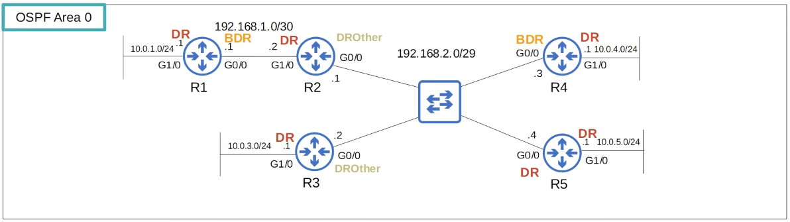

# Day 28 | OSPF Part 3

이 글은 Jeremy’s IT Lab의 유튜브 CCNA 200-301 과정을 참고하고 정리한 내용입니다.

[https://www.youtube.com/playlist?list=PLxbwE86jKRgMpuZuLBivzlM8s2Dk5lXBQ](https://www.youtube.com/playlist?list=PLxbwE86jKRgMpuZuLBivzlM8s2Dk5lXBQ)

# **OSPF Part 3**

이번 글에서 다룰 내용들

- OSPF 네트워크 유형
- OSPF neighbor/adjacency 요구사항
- OSPF LSA 유형

## Loopback Interfaces

- 라우터의 가상 인터페이스.
- 수동으로 종료하지 않는 한 항상 작동(up/up) 중이다.
- 루프백의 상태가 물리적 인터페이스에 의존하지 않는다는 것을 의미한다.
- 라우터에 도달하고 식별하는데 사용할 수 있는 일관된 IP 주소를 제공한다.

## OSPF Network Types

- OSPF 이웃간의 연결 유형을 나타내며 유형은 OSPF의  작동방식에 영향을 준다. 물론 최신 네트워크에서 가장 일반적인 연결 유형은  이더넷이다.
- 세 가지 주요 OSPF 네트워크 유형이 존재한다.
    1. Broadcast
        - **Ethernet** 및 **FDDI** 인터페이스에서 기본적으로 활성화되는 네트워크 유형
    2. Point-to-point 
        - **PPP** 및 **HDLC** 인터페이스에서 기본적으로 활성화되는 지점 간 네트워크 유형
    3. Non-broadcast
        - **Frame Relay** 및 **X.25** 인터페이스에서는 기본적으로 활성화 되어있다.

### Broadcast

- **특징**: 여러 라우터가 동일한 네트워크 세그먼트에서 서로 직접 통신할 수 있는 네트워크
- **예시**: 이더넷 네트워크.
- **LSA 유형**: Type 1 (Router LSA)와 Type 2 (Network LSA)가 사용
- **DR/BDR**: 드라우터(DR)와 백업 드라우터(BDR)가 필요하며, 네트워크의 트래픽 관리를 위해 사용

- 기본적으로 **Ethernet** 및 **FDDI** 인터페이스에서 기본적으로 활성화
- 먼저, 라우터는 멀티캐스트 주소 224.0.0.5를 사용해 OSPF Hello 메세지를 보내고 수신해 동적으로 이웃을 검색한다.
- 각 서브넷에서 **DR**(Designated router)과 **BDR**(Backup designated router)을 선택해야한다. 그러나 OSPF 이웃이 없는 R1, R3, R4 및 R5의 G1/0 인터페이스와 같은 경우에는 DR만 있고 BDR은 없다.
- 서브넷의 DR 또는 BDR이 아닌 라우터는 **DROther**가 된다.
    1. **DR(Designated Router)**:
        - 브로드캐스트 멀티액세스 네트워크에서 라우터 간의 라우팅 정보를 효율적으로 관리하기 위해 선정된다.
        - DR은 네트워크의 모든 라우터와 인접 관계를 형성하며, 라우팅 업데이트를 관리한다.
        - DR의 역할은 네트워크 트래픽을 줄이고, 라우팅 정보의 관리 및 교환을 단순화하는 것이다.
    2. **BDR(Backup Designated Router)**:
        - DR의 백업 역할을 수행하는 라우터이다.
        - DR이 장애가 발생하면, BDR이 자동으로 DR 역할을 대신한다.
        - BDR 역시 네트워크의 모든 라우터와 인접 관계를 형성한다.
- DR과 BDR이 선출되는 방식은 다음과 같다.
    - 먼저 서브넷에서 **OSPF 인터페이스 우선순위**가 가장 높은 라우터가 세그먼트의 DR이된다.
    - 그러나 모든 인터페이스는 기본적으로 동일한 우선순위를 가지므로 라우터는 OSPF 라우터 ID를 비교한다. **OSPF 라우터 ID**가 가장 높은 라우터가 승리한다.
    - First place는 서브넷에 대한 DR이 되고 2위는 BDR이 된다.
- 기본 OSPF 인터페이스 우선순위는 모든 인터페이스에서 1이다. 기본적으로 라우터는 ID가 가장 높은 라우터가 해당 세그먼트의 DR이 된다.
- 인터페이스의 OSPF 우선순위를 변경하는 명령은 `ip ospf priority [0~255]`
    - 참고로 OSPF 인터페이스 우선순위를 0으로 설정하면 라우터는 러떤 경우에도 서브넷 대한 DR/BDR이 될 수 없다.
- 현재 DR이 제거되면 BDR은 우선순위가 가장 높지 않더라도 DR이 된다. 또한 DROther는 다른 DROther와 완전한 인접성을 형성하지 않으므로 양방향 상태로 유지된다.
- 정리하자면
    - 브로드캐스트 네트워크 유형에서 라우터는 세그먼트의 DR 및 BDR과 함께 전체 OSPF 인접성을 형성한다.
    - 따라서 라우터는 DR 및 BDR과 만 lSA를 교환한다. DROther는 서로 LSA를 교환하지 않는다. 양방향 상태에서는 라우터가 아직 LSA를 서로 공유하지 않았다는 점을 기억하자.
    - 모든 라우터는 여전히 동일한 LSDB를 가지지만 이렇게하면 네트워크에 넘쳐나는 LSA의 양이 줄어든다.
- 예)
    
    
    
    - 6개의 라우터가 동일한 세그먼트에 연결되어 있고 모두 서로 LSA를 공유하면 다음과  같이 된다. 수많은 LSA가 범람하여 네트워크를 정체시킨다.
    - DR과 BDR을 사용하면 어떻게 될까?
        
        
        
        - 라우터가 DR 및 BDR과만 LSA를 교환하면 네트워크 주변에 플러딩되는 LSA 수가 줄어드는 것을 볼 수 있다.
        - 라우터가 DR 및 BDR에 메세지를 보내야할 때 멀티캐스트 주소 224.0.0.6을 사용한다.
        - 이는 OSPF ‘모든 라우터’멀티캐스트 주소 225.0.0.5와 다르다.

- DR 및 BR이 DROther를 포함해 서브넷의 모든 라우터와 완전한 인접성을 형성한다는 것을 의미한다.
- 그리고 DROthers는 DR/BDR로만 전체 인접성을 형성한다.

### Point-to-Point Network Type

- **특징**: 두 개의 라우터가 직접 연결된 네트워크
- **예시**: 시리얼 링크, 광섬유 연결.
- **LSA 유형**: Type 1 (Router LSA)와 Type 2 (Network LSA)는 생성되지 않는다.
- **DR/BDR**: 드라우터(DR)와 백업 드라우터(BDR)가 필요하지 않는다.

- 이 네트워크 유형은 기본적으로 **PPP** 또는 **HDLC** 캡슐화를 사용하는 직렬 인터페이스에서 활성화된다.
    - PPP와 HDLC는 모두 직렬연결에 사용된다는 점을 제외하면 이더넷과 유사한 레이어2 캡슐화이다.
- 브로드캐스트 네트워크 유형과 마찬가지로 라우터는 멀티캐스트 주소 224.0.0.5를 사용해 OSPF Hello 메세지를 전송/수신하여 동적으로 이웃을 검색한다.
- 그러나 여기에 차이점이 존재한다. DR과 BDR은 선택되지 않는다. 왜?
    - 이러한 캡슐화는 두 라우터 간의 지점 간 연결에 사용된다.
    - 따라서 DR과 BDR을 선택하는 것은 의미가 없다.
- 두 라우터는 DR과 BDR을 선택할 필요 없이 서로 완전 인접성을 형성한다.
- Serial Interfaces
    - 직렬 인터페이스의 기본 캡슐화는 HDLC이다.
    - 대신 `encapsulation ppp` 명령을 사용해 ppp캡슐화를 사용하도록 구성할 수 있다.
    - 한쪽의 캡슐화를 변경하는 경우 다른 쪽에서도 변경하는 것을 잊지말자,
    - 한쪽은 DCE이고 다른 쪽은 DTE이다.
        - **DTE (Data Terminal Equipment)**:
            - 데이터를 생성하거나 사용하는 장치
            - 컴퓨터, 라우터, 터미널 등이 DTE에 해당
            - 데이터를 전송하기 위해 DCE에 연결된다.
        - **DCE (Data Circuit-terminating Equipment)**:
            - 데이터 통신 회선을 설정하고 유지하는 장치
            - 모뎀, CSU/DSU, 프레임 릴레이 스위치 등이 DCE에 해당
            - DTE와 통신 회선을 통해 데이터를 송수신한다.
- Broacast vs Point-to-Point

## OSPF Neighbor Requirements

- 두 라우터가 OSPF 이웃이 되려면 영역번호가 일치해야한다.
- OSPF이웃이 되려면 인터페이스가 동일한 서브넷에 있어야한다.
- OSPF 프로세서는 종료되어서는 안된다.
- OSPF 라우터 ID가 고유해야한다.
- Hello 및 Dead 타이머가 일치해야한다.
- Authentication 설정이 일치해야한다.
    - OSPF 비밀번호를 구성하면 라우터는 OSPF 비밀번호와 일치하는 라우터만 인접하게 된다.
- IP MTU 설정이 일치해야한다.
    - IP MTU는 외부로 전송되는 IP 패킷의 최대 크기이다. 기본값은 일반적으로 1500바이트
    - 설정이 일치하지 않더라도 OSPF 이웃이 될 수 있지만 OSPF는 제대로 작동하지 않는다.
- OSPF 네트워크 유형이 일치해야한다.

## OSPF LSA Types

- **Type1 (Router LSA)**
    - 라우터 ID를 사용해 라우터를 식별
    - 라우터 LSA는 라우터의 OSPF 활성화 인터페이스에 연결된 네트워크도 나열
- **Type2 (Network LSA)**
    - 이는 각 ‘multi-access’넽워크의 DR에 의해 생성된다. (예: broadcast network type)
    - 다중 액세스 네트워크에 연결된 라우터를 나열한다.
- **Type 5 (AS-External LSA)**
    - 자율 시스템인 OSPF 도메인 외부의 대상에 대한 경로를 설명하기 위헤 ASBR에 의해 생성된다.

## Quiz 1

정답: b

## Quiz 2

정답: c

DR은 브로드캐스트 네트워크 세그먼트의 모든 이웃과 완전한 인접성을 형성하므로 c가 맞다. 자신과 전혀 이웃관계를 형성하지 않음.

## Quiz 3

정답: a, d

## Quiz 4

정답: b

## Quiz 5

정답: d, f

기본 OSPF 우선순위는 모든 인터페이스에서 1이므로 명령을 입력한 후 R1의 G0/0 인터페이스가 가장  높은 우선순위를 가지므로 c는 올바르지 않다. 여전히 DROther이지만 우선순위 문제가 되지 않는다. DR 및 BDR은 자동으로 위치를 포기하지 않으므로 R1은 DR 또는 BDR이 되지 않는다. 따라서 a와 b는 틀리고 f는 맞다. R4에서 clear ip ospf process 명령을 실행하면 현재 BDR인 R3이 자동으로 R1이 아닌 DR이 된다. 따라서 e는 틀렸다. 그러나 해당 명령을 실행하면 R3이 새 DR이 될 때 새 BDR에 대한 선택이 수행된다. R1은 가장 높은 우선순위를 가지므로 세그먼트의 새로운 BDR이 된다. 그러면 d가 맞다. 

## Quiz 6

정답: d

a - 라우터1의 상태는 DROther이다. 

b - 네트워크 유형은 Broadcast. 

c - 타이머는 기본 값으로 설정되어 있으면 라우터1에는 5개의 OSPF 이웃이 있으므로 라우터1의타이머 설정에는 문제가 없다고 생각한다. 

e - 라우터1의 우선순위는 50이고 DROther임을 알 수 있다. 그러나 BDR은 반드시 50보다 높은 우선순위를 가질 필요는 없다. 라우터1, 50과 동일한 우선순위를 가질 수 있지만 라우터 ID는 더 높을 수 있다. 

**d - 출력을 보면 이웃 개수는 5이고 인접 이웃 개수는 2이다. 따라서 라우터1에 OSPF 이웃이 5개 있더라도 그 중 2개만 인접이며 OSPF FULL 인정상태의 전체 인접이다. 5는 DR 및 BDR의 전체 인접성뿐만 아니라 라우터1의 DROther 인접성도 포함된다. DROther은 다른 DROther이랑만 양방향 상태에 도달한다는점을 기억하자.**