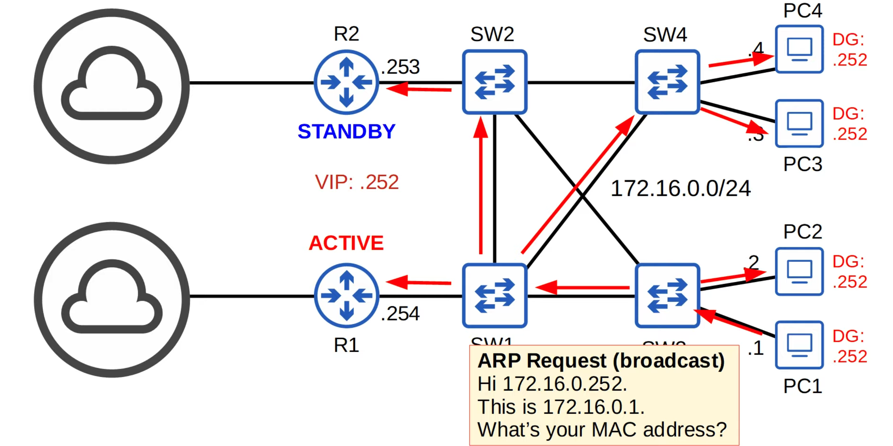

# Day 29 | First Hop Redundancy Protocols

이 글은 Jeremy’s IT Lab의 유튜브 CCNA 200-301 과정을 참고하고 정리한 내용입니다.

[https://www.youtube.com/playlist?list=PLxbwE86jKRgMpuZuLBivzlM8s2Dk5lXBQ](https://www.youtube.com/playlist?list=PLxbwE86jKRgMpuZuLBivzlM8s2Dk5lXBQ)

# **First Hop Redundancy Protocols**

이번 글에서 다룰 내용들

- FHRPs의 목적
    - 네트워크의 첫 번째 홉에서 라우터의 고가용성을 보장하기 위해 사용되는 프로토콜
    - 네트워크가 기본 게이트웨이 라우터의 장애로 인해 중단되지 않도록 여러 라우터가 하나의 가상 IP 주소를 공유하여 기본 게이트웨이 역할을 대신할 수 있게한다.
- HSRP(Hot Standby Router Protocol)
- VRRP(Virtual Router Redundancy Protocol)
- GLBP(Gateway Load Balancing Protocol)
- Basic HSRP Configuration

## First Hop Redundancy Protocols

- Gratuitous ARP: 요청없이 전송된 ARP 응답. ARP 요청을 수신하지 않고 응답 메세지가 전송된다.
    - Broadcast 프레임은 FFFF.FFFF.FFFF주소이다. (일반적인 ARP 응답은 unicast)
- FHRP는 비선점형이다. 이전 라우터가 반환되더라도 현재 Active 라우터는 자동으로 역할을 포기하지 않는다.

## First Hop Redundancy Protocols

- 두 라우터에 가상 IP가 구성되고 가상 IP에 대한 가상 MAC이 생성된다. (각 FHRP는 가상 MAC에 대해 서로 다른 형식을 사용)
- active 라우터와 standby 라우터가 선택된다. (FHRP마다 다른 용어를 사용)
- 네트워크의 최종 호스트는 가상 IP를 기본 게이트웨이로 사용하도록 구성된다.
- active 라우터는 가상 MAC 주소를 사용하여 ARP 요청에 응답하므로 다른 네트워크로 향하는 트래픽이 해당 라우터로 전송된다.
- active 라우터에 장애가 발생하면 대기 라우터가 다음 active 라우터가 된다. 새로운 active 라우터는 스위치가 MAC 주소 테이블을 업데이트하도록 불필요한 ARP 메세지를 보낸다.
- 이전 active 라우터가 다시 온라인 상태가 되면 기본적으로 active 라우터 역할을 다시 수행하지 않는다. standby 라우터가 된다.
- 그러나 FHRP에서는 선점을 구성해 이전 active 라우터가 다시 온라인 상태가되면 이전 역할을 다시 수행하도록 할 수 있다.

### HSRP(Hot Standby Router Protocol)

- 설명: Cisco에서 개발한 프로토콜로, 기본 라우터와 대기 라우터가 하나의 가상 IP 주소를 공유
- 작동 방식: 기본 라우터가 장애가 발생하면 대기 라우터가 자동으로 기본 라우터 역할을 수행
- 상태: Active, Standby, Listen 상태로 라우터가 작동
- 두 버전이 존재(version2에는 IPv6를 지원)
- Multicast IPv4 address:
    - v1 = 224.0.0.2
    - v2 = 224.0.0.102
- Virtual MAC address:
    - v1 = 0000.0c07.ac**XX** (**XX** = HSRP group number)
    - v2 = 0000.0c9f.f**XXX** (**XXX** = HSRP group number)
- 여러 서브넷/VLAN이 있는 상황에서는 로드 밸런싱을 위해 각 서브넷에 서로 다른 활성 라우터를 구성할 수 있다.

### VRRP(Virtual Router Redundancy Protocol)

- 설명: IETF 표준 프로토콜로, 여러 라우터가 하나의 가상 라우터를 구성하여 기본 게이트웨이 역할을 공유
- 작동 방식: 기본 라우터가 장애가 발생하면 우선 순위가 가장 높은 대기 라우터가 기본 라우터 역할을 수행
- 상태: Master, Backup 상태로 라우터가 작동
- Multicast IPv4 address: 224.0.0.18
- Virtual MAC addrtess: 0000.5e00.01**XX** (**XX** = VRRP group number)
- HSRP와 마찬가지로 단일 서브넷의 호스트에 대해 로드 밸런싱을 수행할 수 없지만 각 서브넷에 서로 다른 마스터 라우터를 구성해 서로 다른 서브넷 간의 로드 밸런싱을 수행할 수 있다.

### GLBP(Gateway Load Balancing Protocol)

- 설명: Cisco에서 개발한 프로토콜로, 로드 밸런싱 기능을 추가하여 여러 라우터가 동시에 트래픽을 처리할 수 있다.
- 작동 방식: 다수의 라우터가 활성 상태로 트래픽을 분산 처리하며, 장애 발생 시 다른 라우터가 역할을 대신한다.
- 상태: Active Virtual Gateway (AVG), Active Virtual Forwarder (AVF) 상태로 라우터가 작동
- 단일 서브넷 내의 여러 라우터 간에 로드 밸런싱이 이루어진다.
- AVG(Active Virtual Gateway)가 서브넷에 대해 선택된다.
- 그런다음 최대 4개의 AVFs(Active Virtual Forwarder)가 AVG에 의해 할당되며 AVG 자체도 AVF가 될 수 있다.
- AVF는 서브넷의 호스트 일부에 대한 기본 게이트웨이 역할을 한다. 따라서 로드 밸런싱은 단일 서브넷 내에서 이루어진다.
- Multicast IPv4 address: 224.0.0.102
- Virtual MAC addrtess: 0007.b400.**XXYY** (**XX** = GLBP group number, **YY** = AVF number)

### HSRP vs VRRP vs GLBP

## Configuring HSRP

## Quiz 1

정답: d

## Quiz 2

정답: a

## Quiz 3

정답: b, d

## Quiz 4

정답: b

## Quiz 5

정답: c

단일 서브넷의 호스트에 대해서는  부하분산을 제공하지 않는다. 이를 위해서는 게이트웨이 로드 밸런싱 프로토콜인 GLBP를 사용해야한다. 

## Quiz 6

정답: c, d