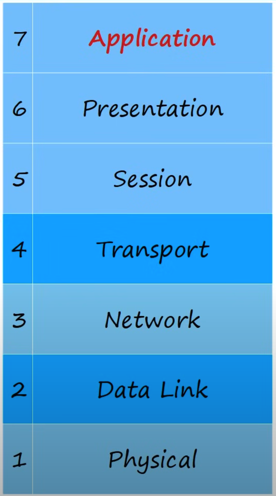

# Day 3 | OSI Model & TCP/IP Suite | OSI Model | Lab

이 글은 Jeremy’s IT Lab의 유튜브 CCNA 200-301 과정을 참고하고 정리한 내용입니다.

[https://www.youtube.com/playlist?list=PLxbwE86jKRgMpuZuLBivzlM8s2Dk5lXBQ](https://www.youtube.com/playlist?list=PLxbwE86jKRgMpuZuLBivzlM8s2Dk5lXBQ)

# OSI Model

- 네트워킹 모델이란?
    - 네트워킹 프로토콜과 표준에 대한 구조를 분류하고 제공한다.
- OSI Model

- Application 계층:  Brave, Firefox, Chrome 등 웹 브라우저와 같은 일부 통신 구성 요소가 있는 소프트웨어 애플리케이션션과 상호작용, HTTP나 HTTPS
- Presentation 계층: 애플리케이션과 네트워크 형식 사이으를 변환하는 것
- Session 계층: 통신 호스트 간의 대화(세션)를 제어

---

위 3개 계층을 개발하는 것은 개발자의 일이다.

- Transport 계층: 통신을 위해 데이터를 분할하고 재조립, host to host communication 제공
- Network 계층: 서로 다른 네트워크(예: LAN 외부)에 있는 최종 호스트 간의 연결을 제공, IP 주소 형태의 논리적 주소 지정을 제공, 라우터는 레이어3에서 작동
- Data Link 계층: 노드 간 연결 및 데이터 전송을 제공, 물리적 계층에서 발생하는 오류를 감지하고 수정, 스위치는 레이어2에서 작동
- Physical 계층: 장치 간 데이터 전송에 사용되는 매체의 물리적 특성을 정의(예: 전압 레벨, 최대 케이블 길이, 물리적 커넥터, 케이블 사양 등)

- OSI 7 계층 암기법

# TCP/IP Suite

OSI Model과 마찬가지로 개념적 모델이자 통신 프로토콜 집합이며 TCP/IP의 경우 인터넷 및 기타 네트워크에서 사용 

## Quiz 1

정답: b

a의 경우 인접 계층 상호 작용은 OSI 모델의 서로 다른 계층 간의 상호 작용을 나타낸다. 이 경우 YouTube의 웹 서버와 웹 브라우저는 모두 레이어 HTTP를 사용하는 7. c와 d의 경우 캡슐화와 캡슐화 해제가 여러번 발생했음은 분명하지만 YouTube와 브라우저 간의 상호 작용에 대한 설명은 아님. 

## Quiz 2

정답: c

## Quiz 3

정답: a

## Quiz 4

정답: d

## Quiz 5

정답: c

# OSI Model | Lab

G: 기가비트 이더넷(초당 1기가비트), F: Fast 이더넷(초당 100mb)

STP: 레이어2 프로토콜

OSPF: 레이어3 프로토콜로 다양한 네트워크에 대한 최상의 경로를 찾는데 사용된다. 

PC1은 DHCP(레이어 7 프로토콜)라는 프로토콜을 사용해 IP 주소를 자동으로 수신한다.