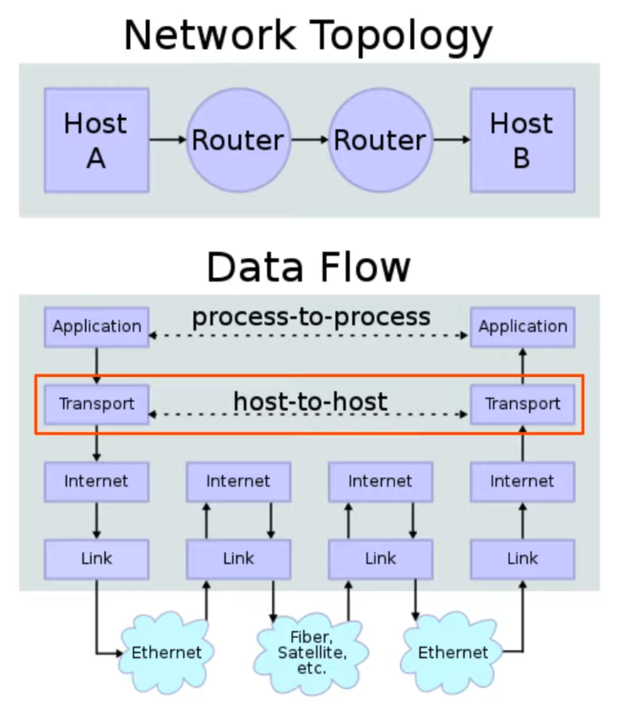

# Day 30 | TCP & UDP

이 글은 Jeremy’s IT Lab의 유튜브 CCNA 200-301 과정을 참고하고 정리한 내용입니다.

[https://www.youtube.com/playlist?list=PLxbwE86jKRgMpuZuLBivzlM8s2Dk5lXBQ](https://www.youtube.com/playlist?list=PLxbwE86jKRgMpuZuLBivzlM8s2Dk5lXBQ)

# TCP & UDP

이번 글에서 다룰 내용들

- Basics of Layer4
- TCP(Transmission Control Protocol)
- UDP(User Datagram Protocol)
- TCP & UDP 비교

## Functions of Layer 4 (Transport Layer)

- 최종 호스트 간의 투명한 데이터 전송을 제공

- 애플리케이션에 다양한 서비스를 제공하거나 제공하지 않는다.
    - TCP는 이러한 서비스를 애플리케이션에 제공하지만 UDP는 그렇지 않다.
        - 안전한 데이터 전송
        - 오류 복구
        - 데이터 시퀀싱(올바른 순서로 보장)
        - flow control
- 레이어4 주소지정(**port** numbers) ← 물리적인 인터페이스를 의미하는게 아님.
    - 사용 중인 애플리케이션 계층 프로토콜을 식별
    - session multiplexing 제공
    - 애플리케이션 계층 프로토콜이 사용하는 포트 번호는 IANA(Internet Assigned Numbers Authority)
        - Well-known port numbers: 0 ~ 1023
        - Registered port numbers: 1024 ~ 49151
        - Ephemeral/private/dynamic port numbers: 49152 ~ 66535
    
    
    
    
    

## TCP(Transmission Control Protocol)

- 연결 지향 프로토콜
- 대상 호스트에 데이터를 보내기 전에 두 호스트는 통신해 연결을 설정해야한다. 소스 호스트는 먼저 대상 호스트와 통신하고 이 연결을 설정하지 않고 데이터 전송을 시작하지 않는다.
- 안정적인 통신을 제공
    - 대상 호스트는 각 TCP 세그먼트를 수신했음을 확인해야 한다.
    - 소스 호스트가 세그먼트에 대한 승인을 받지 못하면 세그먼트가 다시 전송된다.
- TCP 시퀀싱 제공
    - TCP 헤더의 시퀀스 번호를 사용하면 대상 호스트가 세그먼트 순서가 맞지 않게 도착하더라도 올바른 순서로 세그먼트를 배치할 수 있다.
- 흐름제어 제공
    - 대상 호스트는 소스 호스트에게 데이터 전송 속도를 높이거나 낮추도록 지시할 수 있으므로 처리할 수 있는 것보다 더 빠르게 트래픽을 수신해 부담을 느끼지 않게 된다.
- TCP Header
    
    
    

### TCP가 연결을 설정하는데 사용하는 방법: **Three-Way Handshake**

- 두 호스트 간의 3개의 메세지가 전송되기 때문

- 먼저 PC1은 SYN 플래그가 설정된 SRV1에 TCP 세그먼트를 보낸다. 즉, 비트가 1로 설정
- 다음으로 SRV1은 SYN 및 ACK 플래그가 설정된 TCP 세그먼트를 PC1에 보내 응답한다. 따라서 두 비트 모두 1로 설정
- 마지막으로 PC1은 ACK 비트가 설정된 TCP 세그먼트를 보낸다.
- 3-way handshake가 완료되고 연결이 설정됨. (SYN, SYN-ACK, ACK 순)

### TCP가 연결을 종료하는 방법: **Four-Way Handshake**

- FIN 및 ACK 두 플래그를 사용

- 먼저 PC1은 FIN 플래그가 설정된 TCP 세그먼트를 SRV1로 보낸다.
- SRV1은 ACK로 응답
- 이후 SRV1은 자체 FIN을 보냄
- 마지막으로 PC1은 SRV1의 FIN에 대한 응답으로 ACK를 보내고 연결 종료

### TCP: Sequencing / Acknowledgment

- PC1이 3-way handshake의 SYN 메세지를 보낼 때 임의의 초기 시퀀스 번호를 설정한다. (이를 10으로 가정)
- 그런 다음 PC2가 SYN-ACK를 PC1에 보낼 때 자체 임의의 초기 시퀀스 번호를 설정한다. (예를들어 50) 뿐만 아니라 ACK 필드를 11로 설정해 시퀀스 번호가 10인 PC1 세그먼트를 수신했음도 승인.
- PC1은 최종 ACK를 보냄. (시퀀스 번호는 11이고 순방향 승인을 사용해 승인필드에 값 51을 설정)
- PC2는 시퀀스 번호 51로 응답하고 승인필드에 값 12를 설정해 SYN-ACK를 다시 사용
- 이렇게 교류가 계속된다.

### TCP Flow Control: Window Size

- 크기에 상관없이 모든 단일 세그먼트를 인식하는 것은 비효율적이다.
- 그러나 TCP 헤더의 Window Size 필드를 사용하면 승인이 필요하기 전에 더 많은 데이터를 보낼 수 있다.
- sliding window를 사용해 창 크기의 크기를 동적으로 조정한다.

## UDP(User Datagram Protocol)

- 연결 지향적이지 않다.
- TCP와 달리 UDP에서는 송신 호스트가 데이터를 보내기 전에 대상 호스트와 연결을 설정하지 않는다. 간단하게 전송된다.
- UDP는 안정적인 통신을 제공하지 않는다.
    - UDP를 사용하는 경우 수신된 세그먼트에 대한 승인이 전송되지 않는다.
    - 세그먼트가 손실되면 UDP에는 이를 재전송할 수 있는 메커니즘이 없다. 세그먼트는 best-effort으로 전송된다.
- UDP는 시퀀싱을 제공하지 않는다.
    - TCP와 달리 UDP에는 헤더에 시퀀스 필드가 없음.
- 흐름제어 제공 x
- UDP Header
    
    
    

## Comparing TCP & UDP

- TCP는 UDP보다 더 많은 기능을 제공하지만 더 큰 헤더로인해 추가 오버헤드가 발생한다.
- 또한, 승인 및 재전송으로 인해 데이터 전송 속도가 느려질 수 있다.
- 안정적인 통신이 필요한 애플리케이션의 경우 TCP가 선호된다.
- 실시간 음성 및 영상과 같은 애플리케이션은 UDP가 선호된다. 이러한 애플리케이션은 지연에 매우 민감하므로 TCP의 오버헤드로 인해 속도가 느려지는 것을 원하지 않는다.
- UDP를 사용하지만 애플리케이션 자체 내에서 안정성 등을 제공하는 일부 애플리케이션이 존재한다. (예: TFTP)
- 상황에 따라 TCP와 UDP를 모두 사용하는 일부 애플리케이션이 존재(예: DNS)

### Port Numbers

## Quiz 1

정답: a

## Quiz 2

정답: c

대상 포트 번호는 애플리케이션 계층 프로토콜에 따라 다르지만 소스 포트 번호는 임시 포트 범위에서 임의로 선택해야한다. 

## Quiz 3

정답: b, d, e

## Quiz 4

정답: a, c, f

## Quiz 5

정답: c

## Quiz 6

정답: 

