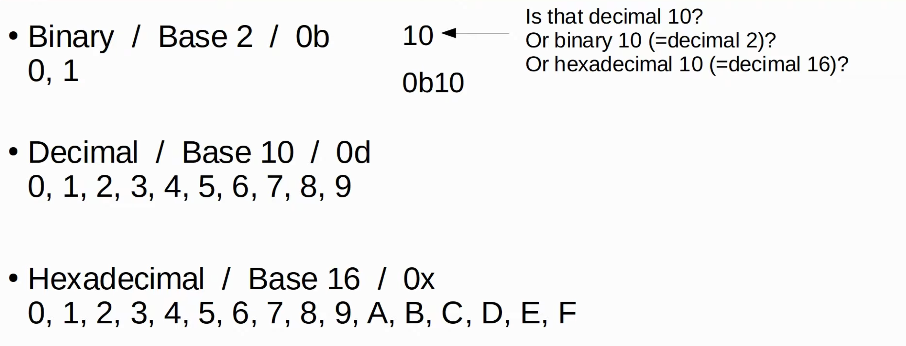

# Day 31 | IPv6 (Part 1)

이 글은 Jeremy’s IT Lab의 유튜브 CCNA 200-301 과정을 참고하고 정리한 내용입니다.

[https://www.youtube.com/playlist?list=PLxbwE86jKRgMpuZuLBivzlM8s2Dk5lXBQ](https://www.youtube.com/playlist?list=PLxbwE86jKRgMpuZuLBivzlM8s2Dk5lXBQ)

# IPv6 (Part 1)

이번 글에서 다룰 내용들

- Hexadecimal (16진수) - review
- Why IPv6?
- Basics of IPv6
- Configuring Ipv6 addresses

## Hexadecimal

## Why IPv6?

- 주된 이유는 사용 가능한 IPv4 주소가 충분하지 않기 때문
- VLSM, private IPv4 addresses, NAT은 IPv4 주소공간을 보존할 수 있는 기술. 이러한 기술들은 단기적인 솔루션
- 장기적인 해결책 → IPv6
- IANA에 의해 IPv4 주소 할당
- IANA는 IPv4 주소공간을 다양한 RIR, 즉 지역 인터넷 등록 기관에 배포한 후 필요한 회사에 할당

## IPv6

- 주소는 128비트
- 32비트는 약 40억 개의 주소, 34비트는 약 160억 개의 주소, 128비트는 약 340,282,366,920,938,463,463,374,607,431,768,211,456개
- IPv4는 10진수가 아닌 16진수로 쓰여진다.
    
    
    
    - IPv6 주소는 Cisco IOS CLI에서 주소를 구성하는 경우에도 ‘/’표기법을 사용해 접두사 길이를 나타냄. 서브넷마스크를 쓰지 않아도됨.

### Shortening IPv6 address

- IPv6 주소를 간략하게 하는방법
    - Leading 0s을 제거
        
        
        
    - 모두 0 으로 이루어진 연속적인 0s은 이중 콜론(::)으로 대체
        
        
        
    
    
    
    - 하지만 한계가 존재한다.
    - 연속되는 4개의 0은 IPv6주소에서 한 번만 축약될 수 있다.
    
    
    
- 예시
    
    
    

### Expanding shortened IPv6 address

- 단축된 IPv6 주소를 전체 IPv6 주소로 확장
    - 제거된 Leading 0s 를 다시 0으로
        
        
        
    - 이중콜론 확장
        
        
        
- 예시
    
    
    

### Finding the IPv6 prefix(global unicast addresses)

- 특정 호스트 주소에서 네트워크 주소인 IPv6 prefix를 찾는 방법
- 일반적으로 ISP에 IPv6 주소를 요청하는 기업은 /48 block을 받게된다.
- 또한 일반적으로 IPv6 서브넷은 /64 prefix 길이를 사용한다.
- 따라서 기업은 /48 block을 받았지만 일반적인 prefix 길이는 /64이다.
    - 이는 기업이 서브넷을 만드는데 사용할 수 있는 16비트가 있다는 것을 의미한다.
- 그리고 나머지 64비트는 호스트에 사용될 수 있다.

## Configuring IPv6 addresses

- 인터페이스를 활성화하려면 `no shutdown`

## Quiz 1

정답: a, b, e

## Quiz 2

정답: d

## Quiz 3

정답: b

## Quiz 4

정답: b

정적 경로 `ipv6 route <목적지 네트워크/프리픽스 길이> <다음 홉 주소> [옵션]`