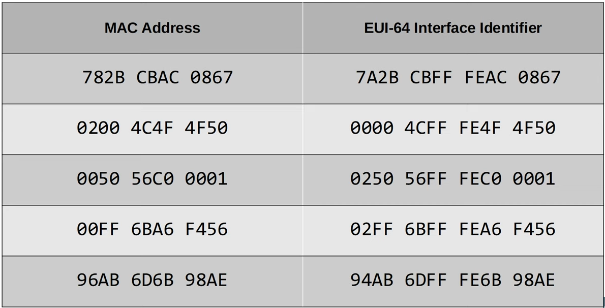

# Day 32 | IPv6 (Part 2)

이 글은 Jeremy’s IT Lab의 유튜브 CCNA 200-301 과정을 참고하고 정리한 내용입니다.

[https://www.youtube.com/playlist?list=PLxbwE86jKRgMpuZuLBivzlM8s2Dk5lXBQ](https://www.youtube.com/playlist?list=PLxbwE86jKRgMpuZuLBivzlM8s2Dk5lXBQ)

# IPv6 (Part 2)

이번글에서 다룰 내용들

- IPv6 address configuration
    - Modified EUI-64
- IPv6 address types
    - Global unicast
    - Unique local
    - Link local
    - Multicast
    - others…
    - 

## Configuring IPv6 address(EUI-64)

- 48비트 MAC 주소를 64 비트 인터페이스 식별자로 변환하는 방법이며 이 인터페이스 식별자는 /64 IPv6 주소의 호스트 부분이 될 수 있다.
- MAC 주소를 EUI-64 인터페이스 식별자로 변환하는 방법
    - MAC 주소를 반으로 나눔
        - 1234 5678 90AB → 1234 56 | 78 90AB
    - 중간에 16진수 FFFE 삽입
        - 1234 56FF FE78 90AB
    - 7번째 비트를 반전
        - 1234 56FF FE78 90AB → 1034 56FF FE78 90AB
    - 예제
        
        
        

- MAC 주소 확인
    
    
    
    
    

## IPv6 address types

### Global unicast address

- Global unicast IPv6 주소는 인터넷을 통해 사용할 수 있는 공개 주소이다.
- 글로벌 유니캐스트 주소를 사용하려면 등록해야한다. 공개주소이기 때문에 전역적으로 고유할 것으로 예상된다.
- 글로벌 유니캐스트 주소에 사용되는 주소 범위는 원래 2000::/3으로 정의되었었다.
- 이제 다른 목적으로 예약되지 않은 모든 주소는 전역 유니캐스트 주소이다.
    
    
    

### Unique local addresses

- 인터넷을 통해 사용할 수 없는 비공개 주소
- 사용하기 위해 등록할 필요는 없다. 내부 네트워크 내에서 자유롭게 사용할 수 있으며 전역적으로 고유할 필요는 없다.
- FC00::/7은 unique local 주소용으로 예약되어 있지만 이후 업데이트에서는 8번째 비트를 1로 설정해야 하므로 실제로 모든 고유한 로컬 주소는 FD로 시작한다.
    
    
    

### Link local address

- IPv6-enabled interfaces에서 자동으로 생성된다.
- `ipv6 enable` 명령을 사용하면 실제로 IPv6 주소를 구성하지 않고도 인터페이스에서 IPv6를 활성화할 수 있다.
- FE80::/10을 사용
- 그러나 FE80::/10 이후의 54비트는 모두 0이어야 하므로 실제로 FE9, FEA 또는 FEB로 시작하는 링크로컬 주소는 표시되지 않는다. FE8만 존재
- 그런다음 EUI-64 규칙을 이용해 인터페이스 ID가 생성된다.
    
    
    
- 링크 로컬은 단일 링크, 단일 서브넷 내 통신에 사용된다는 의미이다. 라우터는 링크-로컬 대상 IPv6 주소를 사용해 패킷을 라우팅하지 않으며 서브넷 간에 패킷을 전달하지 않는다.
- 실제 link-local 주소의 사용
    - routing protocol peerings (IPv6에 사용되는 OSPFv3은 neighbor adjacencies, LSA 전송 등에 대한 링크 로컬 주소를 사용)
    - static routes의 다음 홉 주소로 사용
    - ARP를 IPv6로 대체하는 Neighbor Discovery Protocol인 NDP는 링크 로컬 주소를 사용해 작동
    
    
    

### Multicast addresses

- 검토를 위해 unicast 주소는 one-to-one 통신에 사용된다.
    - 유니캐스트 패킷은 하나의 소스에서 하나의 대상으로 전달
- 브로드캐스트 주소는 one-to-all
    - 하나의 소스에서 모든 대상
- 멀티캐스트 주소는 one-to-many
    - 하나의 소스에서 여러 대상(특정 멀티캐스트 그룹에 가입된)
- FF00::/8 범위 사용
- IPv6는 브로드캐스트를 사용하지 않는다.
- 하지만 멀티캐스트를 사용해 서브넷의 모든 호스트에 메세지를 보내는 방법이 있음.

### Multicast address scopes

- IPv6은 멀티캐스트 패킷이 얼마나 멀리 전달되어야 하는지를 나타내는 여러 멀티캐스트 ‘scopes’(범위)를 정의한다.

### Anycast address

- IPv6의 새로운 기능
- Anycast 메세징은 one-to-one-of-many
    
    
    
- 여러 라우터가 동일한 IPv6 주소로 구성되어 있다. 이들은 라우팅 프로토콜을 사용해 주소를 advertise한다.
    - 따라서 호스트가 해당 대상 주소로 패킷을 보내면 다른 라우터는 해당 IP주소로 구성된 가장 가까운 라우터로 패킷을 전달한다. (가장 가까운은 가장 작은 라우팅 프로토콜 측정항목을 나타냄)
- 애니캐스트 주소에는 지정된 범위가 없음. 일반 유니캐스트 주소(global unicast, unique local)를 사용하고 이를 애니캐스트 주소로 지정한다.

### Other IPv6 address

- :: → 지정되지 않은 IPv6 주소
    - IPv4에서 0.0.0.0과 동일
- ::1 → The loopback address
    - 로컬 기기에서 프로토콜 스택을 테스트하는데 사용
    - 이 주소로 전송된 메세지는 로컬 기기 내에서 처리되지만 다른 기기로 전송되지 않는다.
    - IPv4에서 127.0.0.0/8 주소 범위

## Quiz 1

정답: d

## Quiz 2

정답: b

## Quiz 3

정답: d

## Quiz 4

정답: c

## Quiz 5

정답: 

## Quiz 6

정답: b, f