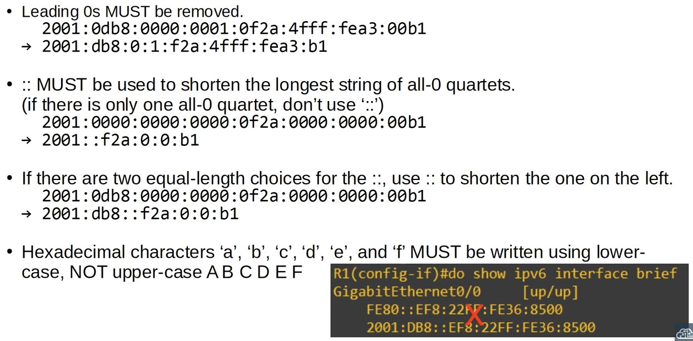

# Day 33 | IPv6 (Part 3)

이 글은 Jeremy’s IT Lab의 유튜브 CCNA 200-301 과정을 참고하고 정리한 내용입니다.

[https://www.youtube.com/playlist?list=PLxbwE86jKRgMpuZuLBivzlM8s2Dk5lXBQ](https://www.youtube.com/playlist?list=PLxbwE86jKRgMpuZuLBivzlM8s2Dk5lXBQ)

# Day 33 | IPv6 (Part 3)

이번 글에서 다룰 내용들

- IPv6 Header
- Neighbor Discovery Protocol(NDP)
- SLAAC
- IPv6 static routing

## 저번 IPv6 수정할 부분

## IPv6 Header

- IPv4 헤더에는 20 ~ 60 바이트의 가변 헤더 길이가 있다. 그러나 IPv6 헤더의 크기는 40바이트로 고정되어있다. → 더 간단하다.
- 라우터의 경우 IPv6 헤더 처리가 훨씬 쉽기 때문에 일반적으로 성능이 향상
- Version field
    
    
    
- Traffic Class field
    
    
    
- Flow Label field
    
    
    
- Payload Length field
    
    
    
- Next Header field
    
    
    
- Hop Limit field
    
    
    
- Source / Destination field
    
    
    

## Solicited-Node Multicast Address

- IPv6 요청 노드 멀티캐스트 주소는 유니캐스트 주소에서 계산된다.
    
    
    

## Neighbor Discovery Protocol

- IPv6와 함께 사용되는 프로토콜
- NDP의 ARP 유사 기능은 ICMPv6 및 요청된 노드 멀티캐스트 주소를 사용해 다른 호스트의 MAC 주소를 학습한다.
- 두 가지 메세지 유형이 사용된다.
    1. Neighbor Solicitation (NS) = ICMPv6 Type 135  
        - ARP 요청에 해당하는 NDP인 이웃 요청 메세지
    2. Neighbor Advertisement (NA) = ICMPv6 Type 136
        - ARP 응답에 해당하는 NDP인 이웃 광고 메세지
    - NS
        
        
        
    - NA
        
        
        
- NDP의 또 다른 기능을 통해 호스트는 로컬 네트워크에서 라우터를 자동으로 검색할 수 있다.
    - 두 개의 메세지 유형이 사용된다.
        1. Router Solicitation (RS) = ICMPv6 Type 133
            
            → 이는 모든 라우터 주소인 멀티캐스트 주소 FF02::2로 전송된다. 
            
            → 이 메세지는 로컬 링크, 즉 로컬 네트워크의 라우터에게 자신을 식별하도록 요청한다. 
            
            → 이 메세지는 인터페이스가 활성화되거나 호스트가 네트워크에 연결될 때 전송된다. 
            
        2. Router Advertisement (RA) = ICMPv6 Type 134
            
            → 모든 노드 주소인 멀티캐스트 주소 FF02::1로 전송된다. (all nodes)
            
            → 메세지를 사용해 라우터는 자신의 존재를 알리고 링크, 로컬 네트워크에 대한 기타 정보를 제공한다. 
            
            → 이 메세지는 RS 메세지에 대한 응답으로 전송된다. 
            
            → 라우터가 RS를 수신하지 못하더라도 주기적으로 RA를 보낸다. 
            
- NDP의 또 다른 기능인 DAD(Duplicate Address Detection)을 통해 호스트는 로컬 링크의 다른 장치가 동일한 IPv6 주소를 사용하고 있는지 확인할 수 있다.
    - 예를들어, `no shutdown` 명령을 통해 IPv6-enabled interface가 초기화되거나 수동 IPv6 주소 또는 SLAAC 주소와 같이 인터페이스에 IPv6 주소가 구성될 때마다 장치는 DAD를 수행한다.
    - NS와 NA를 사용
    - DAD를 수행하기위해 호스트는 자체 IPv6 주소, 자체 요청 노드 멀티캐스트 주소를 NS로 보낸다. 응답을 받지 못하면 주소가 고유한 것으로 간주된다.
    - 그러나 이웃 광고 메세지라는 응답을 받으면 네트워크의 다른 호스트가 이미 해당 주소를 사용하고 있음을 의미한다.
    

## SLAAC

- Stateless Address Auto-configuration (무상태 주소 자동 구성)
- IPv6 주소를 구성하는 또 다른 방법
- SLAAC를 사용할 때 호스트는 RS 및 RA 메세지를 사용해 로컬 링크의 IPv6 접두사(예: 2001:db8::/64)를 학습한다. 그런 다음 해당 prefix를 사용해 IPv6 주소를 자동으로 생성한다.
- `ipv6 address eui-64` 명령을 사용할 때 prefix를 수동으로 입력해야 한다.
- 그러나 SLAAC 명령인 `ipv6 address autoconfig` 에는 prefix가 필요하지 않다.
- 그런 다음 장치는 EUI-64를 사용해 인터페이스 ID를 생성하거나 장치 및 제조업체에 따라 임의로 생성될 수 있다.

## IPv6 Static Routing

- IPv6 라우팅은 IPv4 라우팅과 동일하게 작동
- IPv6 라우팅은 동일하게 작동하지만 라우터에서 두 프로세스가 분리되어 있고 두 개의 라우팅 테이블도 분리되어있다.
- IPv4 라우팅은 기본적으로 활성화 되어있다.
- IPv6 라우팅은 기본적으로 비활성화 되어있으며 `ipv6 unicast-routing` 명령을 사용해 활성화해야한다.
- IPv6 라우팅이 비활성화된 경우 라우터는 IPv6 트래픽을 주고받을 수 있지만 IPv6 트래픽을 ‘라우팅’ 하지 않는다. 즉, 네트워크 간에 트래픽을 전달하지 않는다.

## Quiz 1

정답: b

R1은 R2의 MAC 주소를 알아내기 위해 R2에 NS를 보냈을 것이다. 이에 대한 응답으로 R2는 NA를 R1에 보내 R1에게 인터페이스의 MAC 주소를 알려준다. 

## Quiz 2

정답: d

## Quiz 3

정답: c

IPv6 라우터는 RA 메세지를 보내 로컬 링크에 있는 모든 장치에 라우터의 존재와 로컬 네트워크에 대한 기타 정보를 알린다. 

## Quiz 4

정답: a, b

## Quiz 5

정답: c

recursive static 경로는 다음 홉 주소만 지정한다. 

a - Directly attached 정적 경로 

b - Fully specified 정적 경로  

d - recursive 정적 경로지만 호스트가 아닌 네트워크 경로이다. 

## Quiz 6

정답: c