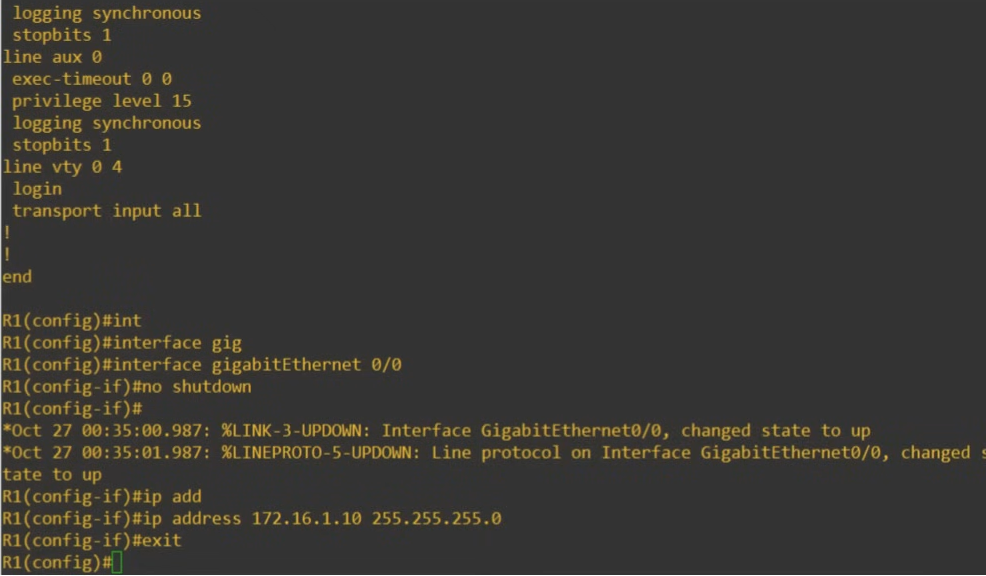

# Day 4 | Intro to the CLI | Basic Device Security | Lab

이 글은 Jeremy’s IT Lab의 유튜브 CCNA 200-301 과정을 참고하고 정리한 내용입니다.

[https://www.youtube.com/playlist?list=PLxbwE86jKRgMpuZuLBivzlM8s2Dk5lXBQ](https://www.youtube.com/playlist?list=PLxbwE86jKRgMpuZuLBivzlM8s2Dk5lXBQ)

# Intro to the CLI

- Ciscon IOS 란?
    - PC의 Windows나 MAC 의 macOS와 같은 Cisco 장치에서 사용되는 운영체제
- CLI란?
    - Command-line interface(명령줄 인터페이스)
    - 라우터, 스위치, 방화벽과 같은 Cisco 장치를 구성하는데 사용하는 인터페이스
        
        
        

- Cisco 장비에서 CLI를 어떻게 사용?
    
    
    
    둘 중 하나에 연결해 사용 
    
    
    
    기본설정: 초당 9600비트의 속도, 8개의 데이터 비트, 1개의 정지 비트 , 패리티 없음 , 흐름 제어 없음. ㅊㅊ
    
- CLI 명령어
    - `?` → 사용가능한 명령어를 볼 수 있음
    - Tab → 자동으로 완성
    - `enable` → 특권모드 진입
- Global Confiiguration Mode
    - 시스코 장치의 구성을 변경할 때 사용
    - `enable` 후 → `configure terminal` (conf t)
    
    
    
    - 띄어쓰기 후 `?` → 사용가능한 옵션을 보여줌
    - <cr> → 더 이상 옵션이 없음
- Running-config & Startup-config
    - 장치에 보관된 두 가지 구성 파일
    - Running-config: 현재 활성 구성 파일, CLI에 명령을 입력하면 활성 구성이 편집됨.
        
        
        
    - Startup-config: 장치를 다시 시작할 때 로드되는 구성 파일, 장치를 다시 로드하거나 장치를 종료했다가 나중에 켜면 시작 구성이 로드됨.
        
        
        
        - 시작 구성파일 저장방법은 아래 3가지(주황색 박스)
        
        
        
    - 비밀번호 암호화 명령 → `service password-encryption`
    - 입력한 명령어를 취소하는 명령은 앞에 `no` 를 붙이면 됨.
- 요약
    
    
    
    
    
    
    
    
    
    
    

## Quiz1

정답: a

Crossover cable은 이더넷을 통해 두 장치를 연결하는데 사용,

USB 케이블을 사용해 Cisco 장치의 콘솔에 연결할 수 있지만 USB 콘솔 포트는 RJ45 콘솔 포트와 별개임 

## Quiz2

정답: c

비밀번호는 대소문자를 구분하므로 c의 경우가 큼. 

## Quiz3

정답: a(더 안전한 암호화 형태인 MD5를 사용) 

b의 경우 활성화 비밀번호 명령을 쉽게 읽을 수 있음.(그냥 비밀번호 설정 명령어) 

c는 서비스 비밀번호 암호화를 사용하면 활성화 비밀번호를 암호화해 더 안전하게 만들 수 있지만 이는 약한 암호화 형태임. (단순히 영어랑 숫자를 섞어서 만드는 명령어) 

## Quiz4

정답: c

활성화 비밀은 항상 활성화 비밀번호보다 우선하며 두 가지를 모두 입력하라는 메세지는 절대 표시되지 않음. 

## Quiz5

정답: b 

# Basic Device Security | Lab

hostname [name] → 장치 이름 변경