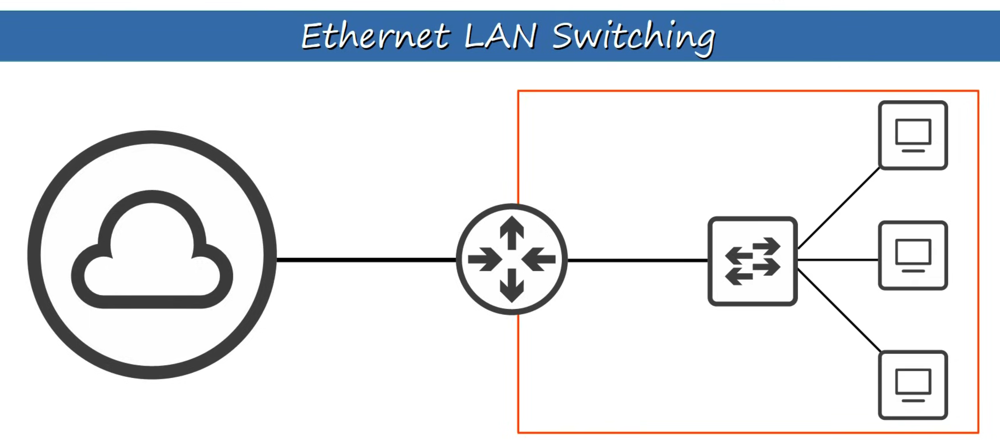
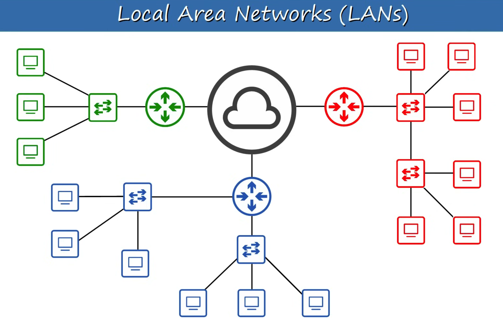

# Day 5 | Ethernet LAN Switching (Part 1)

이 글은 Jeremy’s IT Lab의 유튜브 CCNA 200-301 과정을 참고하고 정리한 내용입니다.

[https://www.youtube.com/playlist?list=PLxbwE86jKRgMpuZuLBivzlM8s2Dk5lXBQ](https://www.youtube.com/playlist?list=PLxbwE86jKRgMpuZuLBivzlM8s2Dk5lXBQ)

# **Ethernet LAN Switching**

스위치와 연결된 최종 호스트 사이에서 데이터가 어떻게 이동하는지 살펴볼 것이다. 

`LAN`은 기본적으로 사무실이나 홈 네트워크와 같이 비교적 작은 영역에 포함된 네트워크

- 라우터는 별도의 LAN을 연결하는데 사용
- 위 그림에서 LAN은 몇개일까? → 4개
    
    
    
    - 빨간색을 보면 스위치는 2개이지만 LAN을 분리하지 않음. 스위치를 추가하면 기존 LAN을 확장할 수 있음.
    - 파란색을 보면 빨간색과 같이 스위치가 2개지만 서로 연결되어 있지않고 서로 다른 라우터 인터페이스에 연결된 것을 볼 수 있음.

- 이더넷 프레임
    
    
    
    - SFD(Start Frame Delimiter): 동기화에 사용되며 수신장치가 프레임의 나머지 데이터를 수신할 수 있도록 준비하는데 사용
    - FCS(Frame Check Sequence): 수신장치에서 전송 중에 발생할 수 있는 오류를 감지하는데 사용
    - Preamble & SFD
        
        
        
    - Destination & Source
        
        
        
    - Type / Length
        
        
        
    - FCS
        
        
        
        - Cyclic은 순환코드를 의미하고 Redundancy는 메세지 끝에 있는 4바이트가 새로운 정보를 추가하지 않고 메세지를 확대하므로 중복된다는 사실을 나타내며 check는 CHECK라는 사실을 나타낸다
    - 각 필드의 길이 (단위: 바이트)
        
        
        

- MAC Address
    - MAC 주소는 장치가 만들어질 때 장치에 할당되는 6바이트(즉 48비트)의 물리적 주소
    - 이는 장치를 구성할 때 CLI에서 할당하는 IP 주소와 다름
    - A.K.A Burned-In Address(BIA) - 이는 주소가 장치가 만들어질 때 장치에 ‘burned in’되기 때문
    - MAC 주소는 전 세계적으로 고유함
    - MAC 주소의 처음 3바이트는 OUI(조직 고유 식별자) 장치를 만드는 회사에 할당. 주소의 후반부인 마지막 3바이트는 장치 자체에 고유
    - MAC 주소는 일련의 12자리 16진수 문자로 작성됨
    
    
    
    Unicast frame: 단일 대상을 향하는 프레임 
    
    
    
    
    
    - 동적으로 학습된 MAC 주소 or 동적 MAC 주소라고함
    - 이는 스위치가 프레임의 소스 MAC 주소를 확인해 네트워크의 각 장치가 어디에 있는지 동적으로 학습하는 방법
    - 프레임의 목적지는 AAAA.AA00.0002인데 SW1으 어디있는지 모름 → Unknown Unicast frame → Flood(수신한 인터페이스를 제외한 모든 인터페이스에서 프레임을 전달하는 것) 아래와 같아짐
    
    
    
    - SW1은 프레임을 복사해 F0/2 및 F0/3 인터페이스로 보냄(Flood), F0/1은 수신한 인터페이스라 보내지 않음
    
    
    
    - 이후에 PC2가 PC1에 데이터를 보내려고함(PC1이 보낸 것에 대한 응답). 목적주소와 소스주소가 바뀜
    
    
    
    - 목적지가 이미 MAC Address Table에 있기 때문에 Known Unicast frame → Forward
    - PC1은 캡슐화 해제를 통해 프레임을 처리
    - Cisco 스위치에서는 이러한 MAC 주소가 5분 동안 활동이 없으면 MAC 주소 테이블에서 제거된다.
- MAC Address(두 개의 스위치가 있는 예)
    
    
    
    
    
    - 이후 SW2는 MAC Address Table을 동적으로 학습
    
    
    
    
    
    - 다시 PC3 → PC1으로 전송
    
    
    
    
    
    - SW1에는 AAAA.AA00.0001에 대한 정보가 있으니 Forward
    
    ## Quiz 1
    
    
    
    정답: a
    
    Preamble는 수신 장치가 수신 클록을 동기화할 수 있도록 하는 일련의 1과 0이다. 
    
    ## Quiz 2
    
    
    
    정답: d
    
    1바이트는 8비트이므로 48 바이트는 384비트와 같다. 물리적 장치에서 할당된 MAC 주소는 바이트가 아닌 48비트. (IP주소의 길이는 32비트)
    
    ## Quiz 3
    
    
    
    정답: b
    
    OUI는 MAC 주소의 전반부(24비트)
    
    ## Quiz 4
    
    
    
    정답: c
    
    스위치는 소스 MAC 주소 필드를 사용해 MAC 주소 테이블을 채운다. 소스 MAC 주소를 프레임이 수신된 인터페이스와 연결함 
    
    ## Quiz 5
    
    
    
    정답:  a