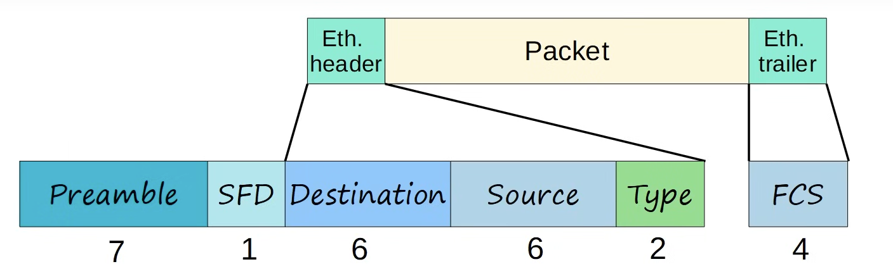

# Day 6 | Ethernet LAN Switching (Part 2)

이 글은 Jeremy’s IT Lab의 유튜브 CCNA 200-301 과정을 참고하고 정리한 내용입니다.

[https://www.youtube.com/playlist?list=PLxbwE86jKRgMpuZuLBivzlM8s2Dk5lXBQ](https://www.youtube.com/playlist?list=PLxbwE86jKRgMpuZuLBivzlM8s2Dk5lXBQ)

# **Ethernet LAN Switching**

- 이더넷 프레임
    
    
    
    - Preamble + SFD는 모든 이더넷 프레임과 함께 전송되지만 일반적으로 이더넷 헤더의 일부로 간주되지 않는다.
    - 따라서 이더넷 헤드는 세 가지 필드인 Destination, Source, Type으로 구성된다.
    - 따라서 이더넷 헤더 + 트레일러의 크기는 18 바이트 (Preamble + SFD 포함 안할 경우)
    
    
    
    - 이더넷 프레임에도 최소 크기가 존재한다. 캡슐화된 페이로드인 패킷을 포함해 최소 크기는 64바이트임.
    - 64바이트에서 헤더의 18바이트를 빼면 46바이트가 됨. 따라서 최소 페이로드의 크기는 46바이트.
    - 46바이트 미만의 페이로드가 추가될 경우 0바이트의 패딩을 추가
    - 

- 위 그림에서 MAC 주소의 OUI는 모두 동일하므로 동일 회사의 제품인 것을 볼 수 있다.
- 다른 컴퓨터로 데이터를 보낼 때는 MAC 주소가 아닌 IP 주소를 입력한다.

- 따라서 사용자는 목적지로 IP주소 192.168.1.3을 입력했지만 PC1은 PC3의 MAC 주소를 찾아야함.
- 이러한 스위치는 레이어 2 장치이며 레이어 3에서 작동하지 않으므로 IP주소가 아닌 MAC 주소를 사용해야한다. → 이를 위해 ARP 프로토콜 사용
- ARP
    
    
    
    - ARP 요청은 broadcast 이더넷 프레임으로 전송됨.
    - 브로드캐스트는 네트워크의 모든 호스트에 전송된다는 의미
    - ARP 응답은 unicast

- FFFF.FFFF.FFFF는 브로드캐스트 MAC 주소
    
    
    
    - ARP응답
- ARP 테이블
    
    
    

- Ping
    - 두 컴퓨터가 서로 연결할 수 있는지 테스트하기 위해 연결 가능성을 테스트 하는데 사용되는 네트워크 유틸리티 (예: PC1에서 PC3로 갔다가다시 PC1로 돌아오는 시간과 같은 왕복 시간을 측정)
    - ARP와 마찬가지로 ping은 ICMP 에코요청과 ICMP 에코 응답 두 메세지를 사용
    - ARP 요청/응답과 유사하지만 PC는 ICMP 에코 요청을 브로드캐스트하지 않고 특정 호스트로 전송한다.
    
    
    
    - 위 CLI를 보면 .!!!! 를 볼 수 있는데 `.`은 핑 실패 `!`는 핑 성공을 의미. 여기서는 5개 중 4개 성공
    - 첫번째 핑이 실패한 이유는 ARP때문. PC12은 목적지 MAC 주소를 모르기 때문에 ARP를 사용

- MAC Address Table
    
    
    
    - Vlan: 가상 근거리 통신망을 의미
    
    
    
    - 동적 MAC 주소에서는 5분동안 사용안하면 제거된다고 했음 → `Aging`
    - MAC Address Table에서 수동으로 제거할 수도 있음 → `clear mac address-table dynamic`
    - 특정 주소 제거 → `clear mac address-table dynamic [mac-address]`
    - 특정 인터페이스에 해당하는 장치 제거 → `clear mac address-table dynamic [인터페이스 id]`

## Quiz 1

정답: b

전송한 ping은 36바이트지만 최소 이더넷 페이로드 크기는 46바이트이므로 최소 페이로드 크기를 맞추기위해 패딩 바이트를 추가했다. 

## Quiz 2

정답: a

ARP reply - 유니캐스트 

ICMP echo request - 다른 특정 호스트의 연결 가능성을 테스트하는데 사용되는 유니캐스트 메세지 

ICMP echo reply - 요청에 대한 유니캐스트 응답 

## Quiz 3

정답: c

d의 경우 arp -a 명령의 출력 

## Quiz 4

정답: a

## Quiz 5

정답: d