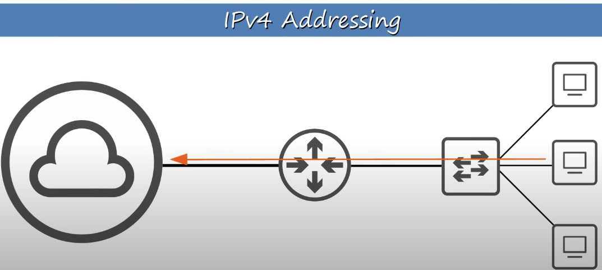

# Day  | 7 | IPv4 Addressing (Part 1)

이 글은 Jeremy’s IT Lab의 유튜브 CCNA 200-301 과정을 참고하고 정리한 내용입니다.

[https://www.youtube.com/playlist?list=PLxbwE86jKRgMpuZuLBivzlM8s2Dk5lXBQ](https://www.youtube.com/playlist?list=PLxbwE86jKRgMpuZuLBivzlM8s2Dk5lXBQ)

# IPv4 Addressing

지난시간까지 스위치에 연결된 소규모 PC 네트워크 내에서 이더넷 LAN 스위칭에 대해 이야기했지만 트래픽이 LAN 내부가 아닌 서로 다른 LAN 간에 전달되는 방식을 살펴보겠다. 

- 레이어2는 장치가 만들어질 때 장치에 할당되는 MAC 주소를 사용하는 반면, IP주소는 장치를 구성할 때 할당하는 논리 주소이다.
- 레이어 3은 소스와 대상간의 경로 선택을 제공한다.

위 네트워크에서 SW1과 SW2사이에 라우터를 놓으면 어떻게 될까? 

→ 하나의 네트워크가 두 개의 네트워크로 분할 

- `192.168.1` , `192.168.2` 는 네트워크 자체를 나타내고 뒤 숫자는 최종 호스트인 PC를 나타낸다.
- `/24` → 처음 3개의 숫자 그룹이 네트워크를 나타냄을 의미함.
- 위 네트워크 다이어그램에는 한 가지가 빠짐. 라우터는 IP 주소가 필요함. 실제로 IP 주소만이 아니라 연결된 각 네트워크마다 IP 주소가 필요하다.
- 따라서 R1의 G0/0 인터페이스에 IP주소 192.168.1.254를 부여하고, G0/1 인터페이스에 IP주소 192.168.2.254를 부여한다.

- 브로드캐스트는 로컬 네트워크로 제한되며 라우터를 통과하지 않고 SW2, PC3, PC4로 이동한다.

- IPv4 Header
    
    
    
    - IP 주소의 길이는 32비트, 즉 4바이트
- IPv4 Address
    
    
    
    
    
    옥텟이라고 함(32비트 = 4개의 옥텟)
    
- Decimal → Binary
    
    
    
    
    
    
    

- IP주소 끝에 `/24`가 의미하는거?
    
    
    
    - `192.168.1` 은 네트워크 부분이고 `254` 는 호스트 부분
    
    
    
- IP주소 끝에 `/16` 이면?
    
    
    
    - `/16` 이면 두 옥텟에 해당하는 부분이 네트워크 부분 → `154.78`
    - `111.32` → 호스트 부분
- `/8` 은?
    
    
    

- IPv4 Address Classes
    - IPv4주소는 5개의 서로 다른 클래스로 분할됨.
    
    
    
    - 첫번째 옥텟에 의해 클래스가 정해짐
    - Class D의 주소는 멀티캐스트용으로 사용함.
    - Class E는 실험용
    - Class A에서 범위 끝은 일반적으로 127이 아닌 126임. → Loopback Address용으로 예약되어있어서
    
    
    
    
    
    - Class A의 경우 네트워크 주소가 적지만 호스트 부분이 길기 때문에 많은 호스트가 있을 수 있음.
    - Class C의 경우는 반대.
    
    
    
    - 각 네트워크의 첫번째 주소는 호스트에 할당할 수 없으며 마지막 주소는 브로드캐스트용이므로 할당할 수 없다.

- Netmask

- 두 개는 동일한 것이며 다른 방식으로 작성된 것뿐이다.

## Quiz 1

정답: 63.56.231.19

## Quiz 2

정답: 243.127.98.1

## Quiz 3

정답: 111.6.89.199

## Quiz 4

정답: 207.198.47.76

## Quiz 5

정답: 100.201.33.253

## Quiz 6

정답: 01011000 00101110 01011010 01011011

## Quiz 7

정답: 11011101 11101010 11110110 10100011

## Quiz 8

정답: 00000011 00101001 10001111 11011110

## Quiz 9

정답: 00001010 11001000 11100111 01011011

## Quiz 10

정답: 11111000 01010111 11111111 10011000