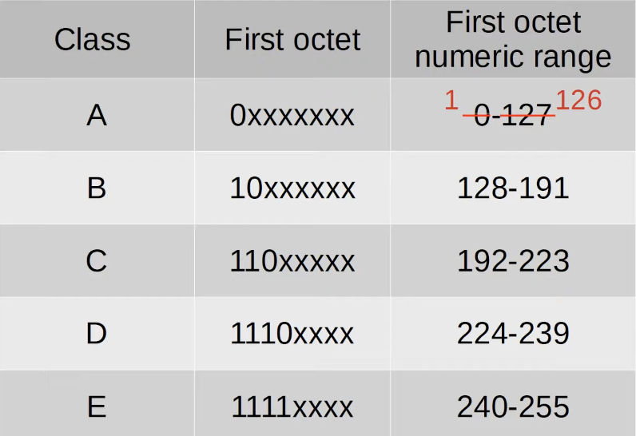

# Day 8 | IPv4 Addressing (Part 2)

이 글은 Jeremy’s IT Lab의 유튜브 CCNA 200-301 과정을 참고하고 정리한 내용입니다.

[https://www.youtube.com/playlist?list=PLxbwE86jKRgMpuZuLBivzlM8s2Dk5lXBQ](https://www.youtube.com/playlist?list=PLxbwE86jKRgMpuZuLBivzlM8s2Dk5lXBQ)

# IPv4 Addressing (Part 2)

- Maximum Hosts per Network
    
    Class C
    
    
    
    - 호스트 부분이 0부터 255까지 가능하다는 것을 의미(256개)
    - 호스트 부분이 다 0 → 네트워크 주소
    - 호스트 부분이 다 1 → 브로드캐스트용 주소
    
    Class B
    
    
    
    Class A
    
    
    
    - 네트워크의 호스트 수를 결정하는 공식은 2^n - 2
        
        
        

- First/Last Usable Address
    
    Class C
    
    
    
    Class B
    
    
    
    Class A
    
    
    
- IP주소로 Cisco 라우터를 구성하는 방법
    
    
    
    CLI에서 en 명령어를 이용해 특권 실행 모드 진입 
    
    
    
    
    
    - `show ip interface brief`
    - Status는 레이어1 상태를 나타냄. (예: 인터페이스 종료, 케이블이 연결되어 있는지 등)
    - Protocol은 레이어2 상태(예: 이더넷이 네트워크 간에 올바르게 작동하는지 여부)
    - conf t를 통해 전역 구성 모드로 진입
    
    
    
    - 인터페이스 자체를 구성하려면 인터페이스 구성 모드로 들어가야함. `interface [인터페이스 이름]`
    
    
    
    - `no shutdown` → 인터페이스를 활성화하는데 사용하는 명령어
    
    gigabitethernet0/1
    
    
    
    gigabitethernet0/2
    
    
    

## Quiz 1

정답:

Network address: 43.0.0.0

Maximum number of hosts in the network: 16,777,214

Network broadcast address: 43.255.255.255

First usable address of the network: 43.0.0.1

Last usable address of the network: 43.255.255.254

## Quiz 2

정답: 

Network address: 129.221.0.0

Maximum number of hosts in the network: 65,534

Network broadcast address: 129.221.255.255

First usable address of the network: 129.221.0.1

Last usable address of the network: 129.221.255.254

## Quiz 3

정답: 

Network address: 209.211.3.0

Maximum number of hosts in the network: 254

Network broadcast address: 209.211.3.255

First usable address of the network: 209.211.3.1

Last usable address of the network: 209.211.3.254

## Quiz 4

정답: 

Network address: 2.0.0.0

Maximum number of hosts in the network: 16,777,214

Network broadcast address: 2.255.255.255

First usable address of the network: 2.0.0.1

Last usable address of the network: 2.255.255.254

## Quiz 5

정답: 

Network address: 155.200.0.0

Maximum number of hosts in the network: 65,534

Network broadcast address: 155.200.255.255

First usable address of the network: 155.200.0.1

Last usable address of the network: 155.200.255.254