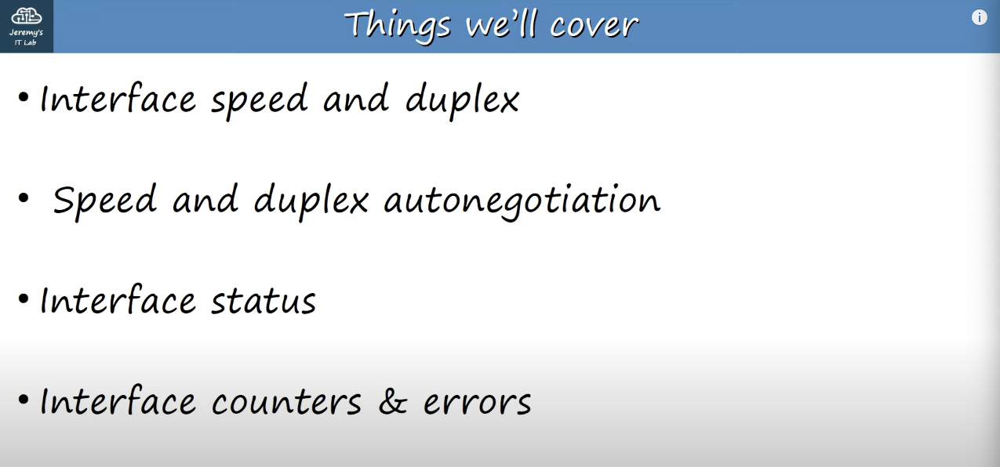

# Day 9 | Switch Interfaces

이 글은 Jeremy’s IT Lab의 유튜브 CCNA 200-301 과정을 참고하고 정리한 내용입니다.

[https://www.youtube.com/playlist?list=PLxbwE86jKRgMpuZuLBivzlM8s2Dk5lXBQ](https://www.youtube.com/playlist?list=PLxbwE86jKRgMpuZuLBivzlM8s2Dk5lXBQ)

# Switch Interfaces

- 이전에 레이어1 및 레이어2 상태를 확인하기 위해 `show ip 인터페이스 브리프` 명령어를 사용했음.
- 또한 `shoutdown` 명령어를 사용해 라우터 인터페이스가 비활성화되는 방법을 알았음.
- 이번 챕터에서는 스위치 인터페이스를 살펴보고 라우터 인터페이스와 어떻게 다른지, 어떤게 동일한지 살펴보겠음. (특히 속도, 이중화 등 이러한 인터페이스의 레이어1 특성을 구성하는 방법에 대해 설명 )

- Duplex: 장치가 동시에 데이터를 보내고 받을 수 있는지 여부를 나타냄.
- 수동으로 구성할 필요 없이 두 장치가 속도와 이중 설정을 협상할 수 있게 해주는 속도 및 이중 자동 협상
- 인터페이스 상태
- 인터페이스 카운터와 에러 (Cisco 장치는 발생한 오류 수 등 장치를 통과하는 트래픽과 관련해 다양한 카운터를 유지한다.)

- Cisco ASR 1000-x 라우터 & Cisco Catalyst 9200 스위치
- 라우터에는 광섬유 케이블용 SFP 인터페이스 8개와 콘솔 포트용 RJ45 인터페이스 몇 개가 있다.
- 반면 스위치에는 4개의 SFP 인터페이스와 48개의; RJ45 인터페이스가 있음. → 스위치를 사용해 최종 호스트를 연결하기 때문

- 라우터 1개(R1), 스위치 2개(SW1, SW2), PC 4개, 단일 LAN(192.168.1.0/24)
- SW1에는 F0/1, F0/2, F0/3, F0/4 등 연결된 네트워크 인터페이스와 연결되지 않은 나머지 인터페이스를 구성함.
    
    
    
    - SW1의 CLI
    - show ip interface brief
    - 장치에 연결된 4개의 인터페이스를 볼 수 있음. (F0/1, F0/2, F0/3, F0/4)
    - 우리는 호스트 이름설정을 제외하고는 아직 SW1에서 어떤 구성도 수행하지 않음. → 따라서 이미 Cisco 라우터와 스위치의 차이점을 볼 수 있음.
        - 라우터 인터페이스는 기본적으로 관리상 비활성화된 상태임. 즉, `shoutdown` 명령이 적용된다는 의미
        - 그러나, 스위치 인터페이스는 다름. `shoutdown` 명령이 적용되지 않으므로 다른 장치에 연결하면 일반적으로 구성이 필요하지 않은 up/up 상태가 됨.
    - 이제 IP주소는 할당 해제되었으며 레이어2 스위치 포트이기 때문에 그대로 유지되며 IP주소가 필요하지 않음.
    - 위 4개 인터페이스를 제외한 나머지는 연결상태가 아니므로 down/down(인터페이스가 종료되었음을 의미하는 것이 아니라 인터페이스가 다른 장치에 연결되지 않았음을 의미)
    - **요약하면, 라우터 인터페이스는 기본적으로 `shoutdown` 명령이 적용되므로 down/down 상태가 된다. 스위치 인터페이스는 기본적으로 `shutdown` 명령이 적용되지 않으므로 다른 장치에 연결된 경우 up/up 상태, 연결되지 않은 경우 down/down**
    
- 스위치 인터페이스를 사용하는 또 다른 명령어 → `show interfaces status`
    
    
    
    - Name: 인터페이스에 대한 설명
    - Status: 연결됬는지 여부
    - Vlan: 자체 비디오를 가져오며 기본적으로 LAN을 더 작은 LAN으로 나누는데 사용할 수 있음. (기본 Vlan은 1)
    - Duplex: 장치가 동시에 데이터를 보내고 받을 수 있는지 여부를 나타내는 전이중(full-duplex) 또는 그렇지 않은 경우 half-duplex
    - Speed: 초당 100MB의 속도를 의미
    - Type: 모두 구리 UTP 케이블용 RJ45 인터페이스지만 소형 폼 팩터 플러그형 또는 SFP 모듈인 경우 여기서 볼 수 있음
    
    
    
    - 스위치 인터페이스가 기본적으로 활성화되어 있다는 점은 편리하지만 장치를 연결하고 바로 사용할 수 있으므로 보안 문제가 될 수 있음 → 실제로 인터페이스를 비활성화 해야함.
    - 8개의 인터페이스를 모두 한번에 구성할 수 있는 방법이 존재
        - 전역 구성 모드에서 `interface range` 를 입력
        - 이 후 인터페이스 구성 모드가 아닌 인터페이스 범위 구성 모드로 이동하여 설명을 입력하고 인터페이스 종료
        
        
        
        - 예를들어 F0/5 ~ F0/12 사이에 7과 8의 종료는 원하지 않는 경우 아래처럼 명령어 작성
            
            
            
        
        
        
        - 인터페이스를 종료하면 위에서 notconnect → disabled
    
- **Full Duplex** vs **Half Duplex**
    - Half Duplex: 장치가 동시에 데이터를 보내고 받을 수 없음을 의미, 프레임을 수신하는 경우 프레임을 보내기 전에 기다려야함.
    - Full Duplex: 장치가 동시에 데이터를 보내고 받을 수 있음을 의미, 기다릴 필요가 없음
    - 스위치를 사용하는 최신 네트워크에서는 모든 장치가 인터페이스에서 전이중을 사용할 수 있음.
    - 그렇다면 반이중 방식은 어디에 사용? → 글쎄, 현대 네트워크에서는 거의 어디에도 없음.
    - 아래는 반이중 방식의 예
        
        
        
        - 허브는 스위치보다 훨씬 간단하며 실제로는 단순한 중계기
        - 수신하는 모든 프레임은 마치 스위치가 브로드캐스트 또는 알 수 없는 유니캐스트 프레임을 처리하는 것처럼 플러딩 된다.
        
        
        
        - 위 경우 허브는 하나를 먼저 보낸 다음 다른 것을 보내지 않고 두 프레임을 동시에 플러딩 하려고 시도하며 이로 인해 인터페이스 충돌이 발생하고 PC2는 두 프레임 중 하나를 그대로 수신하지 못한다.
        - 허브에 연결된 모든 장치는 충동 도메인의 일부
        - 반이중 상황에서 충돌을 처리하기위해 이더넷 장치는 `CSMA/CD` 라는 메커니즘을 사용
    
- CSMA/CD
    - **C**arrier **S**ense **M**ultiple **A**ccess with **C**ollision **D**etection
    - 충돌 감지를 통한 캐리어 감지 다중 액세스를 의미
    - 반이중 상황에서 장치가 충돌을 피하는 방법과 충돌이 발생할 경우 장치가 어떻게 반응하는지 설명
    - 다음과 같이 동작
        - 프레임을 보내기 전에 장치는 다른 장치가 프레임을 보내지 않는다는 것을 감지할 때까지 충돌 도메인을 수신
        - 잘못된 타이밍 등으로 충돌이 발생할 수 있는 경우 장치는 재밍 신호를 보내 다른 장치에 충돌이 발생했음을 알림
        - 그런 다음 각 장치는 프레임을 전송하기 전에 임의의 시간 동안 기다림
        - 이후 각 장치가 자신의 프레임을 보내기 전에 다른 장치가 프레임을 보내고 있는지 확인하기 위해 수신 대기하면서 프로세스가 반복
    
    
    
    - 스위치는 허브보다 더 정교
    - 허브는 레이어1에서 작동하여 수신되는 모든 신호를 반복하는 간단한 중계기
    - 스위치는 레이어2 주소 지정, MAC 주소를 사용해 레이어2에서 작동해 특정 호스트에 프레임을 보냄. 또한 한 번에 두 개의 프레임을 동일한 호스트로 보내려고 시도하지 않음.
    - 따라서 허브에 연결될 때 하나의 충돌 영역이였던 이 네트워크는 이제 1, 2, 3개의 충돌영역이 됨.
        
        
        
    - 스위치는 향상된 기능으로 인해 이러한 장치는 이제 전이중으로 작동할 수 있음.
    - 즉, 다른 장치가 동시에 데이터를 보내고 있는지 여부에 대해 걱정할 필요가 없으며 자유롭게 데이터를 보낼 수 있음.
    - 충돌과 같은 문제가 여전히 발생하기는 하지만 이는 드물며 일반적으로 반이중 네트워크에서 처럼 정기적으로 발생하는 것이 아니라 잘못된 구성과 같은 문제의 징후

- Speed/Duplex Autonegotiation
    - 이는 라우터와 스위치 모두에 적용
    - 다양한 속도로 실행될 수 있는 인터페이스에는 기본 속도 자동 및 이중 자동이 설정이 있음.
    - 인터페이스는 자신의 기능을 이웃들에게 알리고 그들은 가능한 최고의 속도와 이중 설정을 협상한다.
    
    
    
    - E(이더넷 인터페이스)는 초당 10MB
    - F(Fast 이더넷 인터페이스)는 초당 10MB or 100MB
    - G(기가비트 이더넷 인터페이스)는 초당 10MB or 100MB or 1000MB
    - 따라서 위와같은 속도와 전이중으로 자동 협상
    - 스위치와 연결된 장치에서 자동 협상이 비활성화된 경우는 어떻게 하나? → 스위치는 자동 협상을 시도하지만 다른 장치는 응답하지 않음.
    - 속도의 경우 스위치는 다른 장치가 작동하는 속도를 감지하려고 시도함. 속도 감지에 실패하면 지원되는 가장 느린 속도를 사용
    - Duplex의 경우 10Mbps 또는 100Mbps를 사용하게 되면 스위치는 반이중 방식을 사용하게 됨. 1000Mbps 이상인 경우 전이중 사용
    
    
    
    - 위 예시의 경우 파란색 PC에 연결된 G0/3는 100Mbps의 속도를 감지하지만 Duplex의 경우 파란색 PC는 전이중을 사용하고 있고 자동 협상이 없으면 스위치가 이를 감지할 수 없다. 따라서 스위치는 반이중 방식을 사용한다. → 이로 인해 Duplex 불일치 = 충돌 발생 → 네트워크 성능 저하
    - 따라서 실제로 네트워크의 모든 장치에서 자동 협상을 사용해야 한다.
    

## Quiz 1

정답: b

반이중 측에서는 동시에 데이터를 주고받을 수 없다. 그런데 전이중 측에서 이를 인식하지 못하고 반이중 측에서 데이터를 수신할 준비가 되어있지 않은 경우에도 데이터를 전송하므로 충돌이 발생한다. 

## Quiz 2

정답: a

`CSMA/CD`는 충돌 감지 기능이 있는 캐리어 감지 다중 액세스를 나타냄. 반이중을 사용하는 장치가 네트워크 세그먼트의 활동을 수신한 다음 다른 장치가 전송하지 않을 때만 데이터를 보내는 방법. 또한, 충돌이 발생할 때 장치가 어떻게 반응하는지 설명 

`CSMA/CA`는 충돌 방지 기능이 있는 반송파 감지 다중 액세스

## Quiz 3

정답: a

- a
    
    
    
    각 인터페이스에 제공되는 정보가 너무 많기 때문에 이 명령을 사용해 모든 인터페이스를 한번에 볼 수는 없고 개별 인터페이스를 지정하여 확인할 수 있음. 카운터의 경우 출력의 맨 아래 있음 
    
- b
    
    
    
    IP주소 확인, 종료 여부 등을 확인하는데 유용한 명령어 
    
- c
    
    
    
    설명, 상태, duplex 및 속도와 같은 인터페이스에 대한 정보 제공 
    
- d
    
    
    
    실제 명령이 아니기 때문에 오류 메세지
    

## Quiz 4

정답: d

b와c의 이름은 인터페이스에서 발생할 수 있는 실제 오류가 아님. a의 브로드캐스트는 오류가 아니며 정상적인 네트워크 작업의 일부

- Runts: 너무 작은 프레임
- Giant: 너무 큰 프레임
- CRC: 이더넷 프레임 트레일러의 프레임 검사 시퀀스에서 수행되는  CRC 검사에 실패한 프레임 수를 계산

## Quiz 5

정답: b

원격 장치에서 자동 협상이 비활성화 되어있지만 로컬 장치에서는 활성화된 경우 로컬 장치는 원격 장치가 사용하는 속도를 감지하려고 시도하므로 SW1은 인터페이스 속도를 SW2와 일치하도록 초당 100MB로 올바르게 설정할 수 있다. 그러나 SW2 인터페이스의 duplex mode를 감지할 수 없으므로 속도가 초당 10MB 또는 100MB인 경우 반이중을 사용하고 그렇지 않으면 전이중을 사용하는 것이 규칙이므로 이 경우 반이중이 사용된다. 이로 인해 두 장치간의 이중 불일치가 발생하고 충돌이 발생해 둘 사이의 링크 성능이 저하될 수 있다.